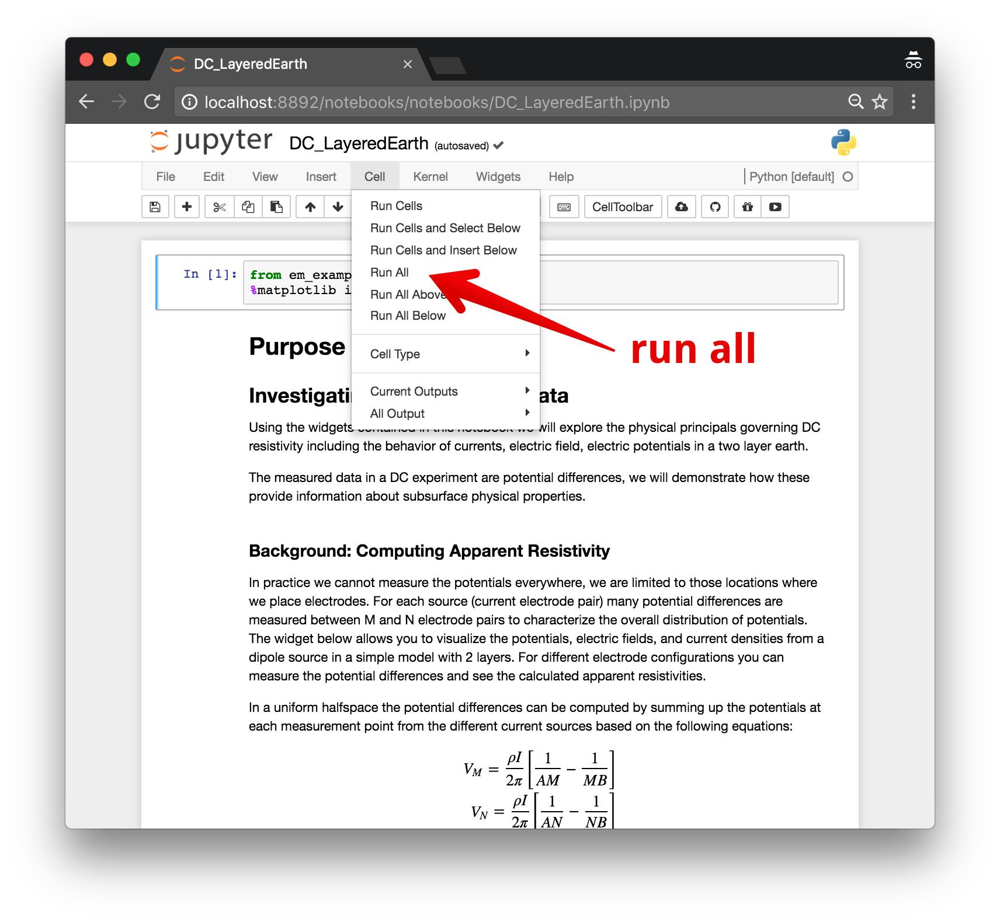
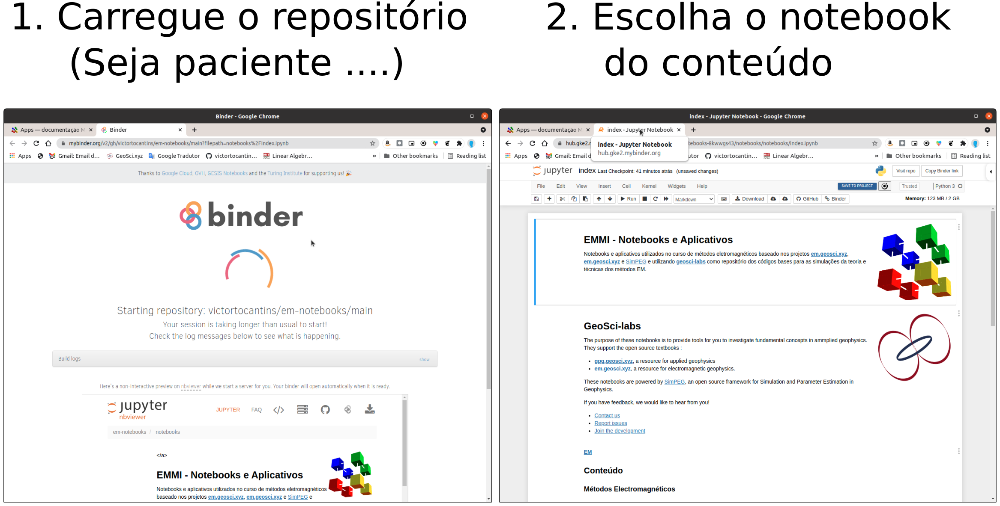

.. _apps_index:

Apps
====

.. _ft-apps:

FT Apps
-------

.. image:: https://mybinder.org/badge.svg
    :target: https://mybinder.org/v2/gh/geoscixyz/em-apps/master?filepath=index.ipynb
    :alt: Binder

- :ref:`Binder <binder>` (free, no login required)

Como alternativa, eles podem ser baixados do GitHub e executados localmente.

.. _jupyter_notebooks:

Jupyter Notebooks
^^^^^^^^^^^^^^^^^

Within the Jupyter Notebook environment, you can use :code:`shift + enter` to run
each cell of code, or from the menu, select :code:`cell, run all`

.. _binder:

Binder
^^^^^^

.. image:: https://mybinder.org/badge.svg
    :target: https://mybinder.org/v2/gh/geoscixyz/em-apps/master?filepath=index.ipynb
    :alt: Binder

1. Launch the binder by clicking on the badge above or going to: https://mybinder.org/v2/gh/geoscixyz/em-apps/master?filepath=index.ipynb.
   This can sometimes take a couple minutes, so be patient...

2. Select the notebook of interest from the contents

3. :ref:`Run the Jupyter notebook <jupyter_notebooks>`

