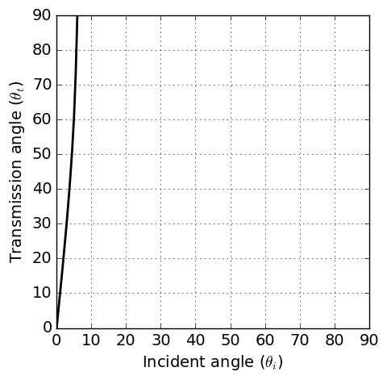
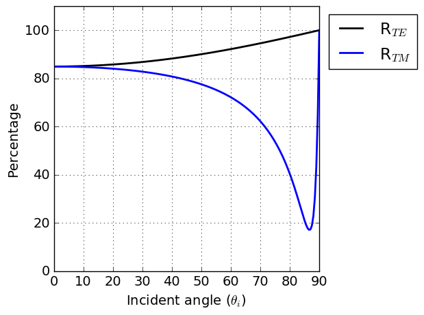
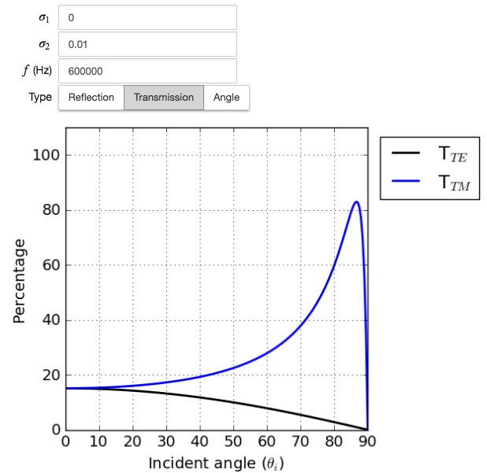

.. _totalrefl_and_brewsterangl:

Reflexão e Ângulo de Brewster
=============================

.. note::

    Primeiro identificamos a reflexão total e o ângulo de Brewster para um meio dielétrico e, em seguida, os relacionamos com o meio condutor.

Reflexão Total
--------------

Para um meio dielétrico perfeito, a condutividade é zero e a permeabilidade é a do espaço livre isto é, :math:`\mu_1=\mu_2=\mu_0`. Neste caso, A lei de Snell se reduz para:

.. math::
    \frac{\text{sin} \theta_i}{\text{sin} \theta_t} = \frac{k_1}{k_2} = \Big(\frac{\epsilon_2}{\epsilon_1}\Big)^{1/2} = n_{12}
    :label: snells_law2_dielectric

onde :math:`n_{12}` é o índice relativo de refração. Se :math:`\epsilon_2 > \epsilon_1` então :math:`n_{12} > 1`. Nesta situação, para qualquer ângulo de incidência :math:`\theta_i` existe um ângulo real de transimissão :math:`\theta_t`. Por outro lado, se :math:`\epsilon_2 < \epsilon_1` então :math:`\theta_t` é real apenas quando :math:`n_{12}\text{sin}\theta_t\leq 1`. A reflexão total ocorre quando :math:`n_{12} \text{sin}\theta_t > 1`, e indica que a onda não pode passar e é totalmente refletida. Para a reflexão de uma superfície condutora, uma reflexão total ocorre quando :math:`\sigma_1 > \sigma_2`. :numref:`totalreflection_angle` ilustram isso.

    
   Ângulo de transmissão :math:`\theta_t` em função do ângulo de incidência :math:`\theta_i` quando :math:`\sigma_1` = 1 S/m e :math:`\sigma_2` = 0,1 S/m. A permeabilidade magnética e a permissividade dielétrica são assumidas como sendo aquelas de espaço livre (:math:`\epsilon = \epsilon_0` e :math:`\mu = \mu_0`)

Ângulo de Brewster
------------------

A partir de coeficientes de reflexão derivados para o modo TE em :ref:`fresnel_equations`, o coeficiente de reflexão para dielétrico perfeito pode ser escrito como

.. math::
    r_{TE} = \frac{(\epsilon_1)^{1/2} \text{cos} \theta_i - (\epsilon_2)^{1/2} \text{cos} \theta_t}{(\epsilon_1)^{1/2} \text{cos} \theta_i + (\epsilon_2)^{1/2} \text{cos} \theta_t}

Com a lei de refração de Snell mostrada na Equação :eq:`snells_law2_dielectric`, a equação acima pode ser modificada como

.. math::
    r_{TE} = \frac{\text{cos} \theta_i \text {sin} \theta_t - \text{cos} \theta_t \text {sin} \theta_i}{\text{cos} \theta_i \text {sin} \theta_t + \text{cos} \theta_t \text {sin} \theta_i}
           = \frac{\text {sin} (\theta_t - \theta_i)}{\text {sin}(\theta_t + \theta_i)}

Similarmente, o coeficiente de rflexão para o modo TM pode ser obtido como

.. math::
    r_{TM} = \frac{\text {tan} (\theta_t - \theta_i)}{\text {tan}(\theta_t + \theta_i)}

A energia dos coeficiente de reflexão para o modo TE e TM podem ser escritos como

.. math::
    R_{TE} \equiv |r_{TE}|^2 = \frac{\text {sin}^2 (\theta_t - \theta_i)}{\text {sin}^2(\theta_t + \theta_i)}

.. math::
    R_{TM} \equiv |r_{TM}|^2 = \frac{\text {tan}^2 (\theta_t - \theta_i)}{\text {tan}^2(\theta_t + \theta_i)}

Consequentemente, a energia do coeficiente de transmissão será

.. math::
    T_{TE} \equiv 1-|r_{TE}|^2

.. math::
    T_{TM} \equiv 1-|r_{TM}|^2

Se :math:`(\theta_t + \theta_i) \rightarrow \pi/2`, então :math:`\text{tan}(\theta_t + \theta_i) \rightarrow \infty`, e :math:`r_{TM} \rightarrow 0`. As ondas refletidas e refratadas são normais uma a outra, e

.. math::
    \text {sin} \theta_t = \text {sin} (\pi/2 - \theta_i) = \text {cos} \theta_i

tal que a Equação :eq:`snells_law2_dielectric` torna-se

.. math::
    \text {tan} \theta_i = \Big(\frac{\epsilon_2}{\epsilon_1}\Big)^{1/2} = n_{12}

O ângulo que essa equação satisfaz é conhecido como ângulo de Brewster. A reflexão de uma superfície condutora, haverá um mínimo em :math:`R_{TM}`, análogo ao ângulo de Brewster, para algum ângulo de incidência particular. Esse mínimo não ocorre em :math:`R_{TE}`. :numref:`WHfig3_3` ilustram isso.

   
   A potência do coeficiente de reflexão :math:`R_{TE}` e :math:`R_{TM}` versus ângulo de incidência para onda plana na interface ar-terra. A condutividade e a permissividade dielétrica da terra são consideradas 0,01 S/m, e :math:`\epsilon = \epsilon_0`, respectivamente. A frequência é 6 x 10:sup:`5` Hz.
   

App
---

:numref:`totalreflection_angle` e :numref:`WHfig3_3` são gerados pelo aplicativo Reflexão e Refração que permite ajustar a condutividade de cada meio e obter o ângulo de transmissão correspondente, a potência  de reflexão e os coeficientes de transmissão em função do ângulo de incidência. O link abaixo direcionará você para o aplicativo:

.. image:: http://mybinder.org/badge.svg
   :target: https://mybinder.org/v2/gh/geoscixyz/em_apps/main?filepath=%2Fnotebooks%2FFDEM_Planewave_Reflection.ipynb
   :align: center

