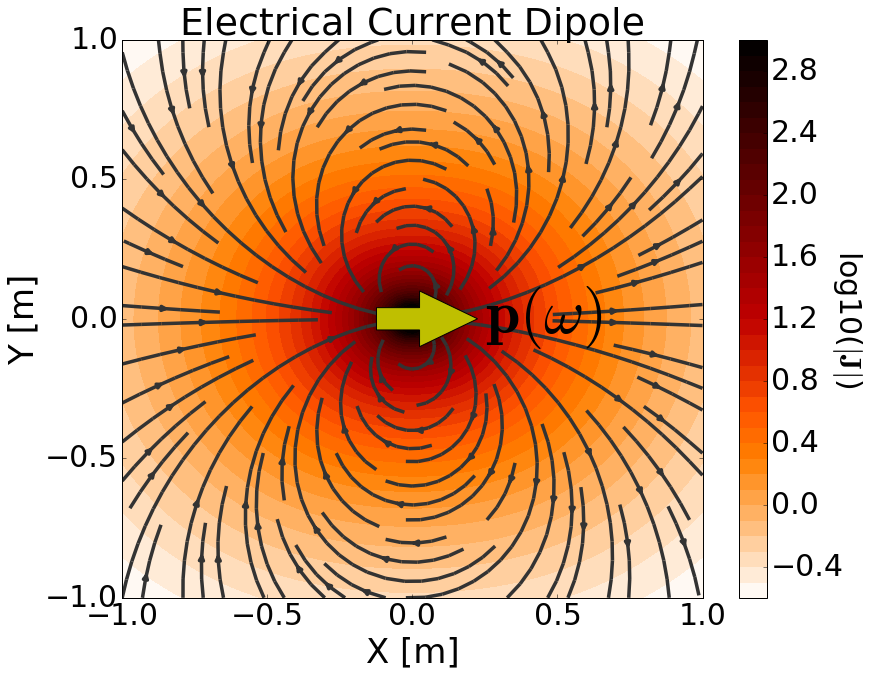

.. _definition_electric_dipole_index:

Definindo o Dipolo de Corrente Elétrico
=======================================

.. Purpose::

    Aqui, fornecemos uma descrição física do dipolo de corrente elétrica. 
    Isso é usado para desenvolver uma expressão matemática que pode ser usada para substituir o termo de fonte elétrica nas equações de Maxwell.
    

**Definição Geral**

    Representação física fonte de dipolo de corrente elétrica onde :math:`\mathbf{p}` = 1 Am.

O dipolo de corrente elétrica pode ser considerado um comprimento infinitesimal de fio que carrega uma corrente.
A força da fonte é definida por seu momento de dipolo (:math:`\mathbf{p}`).
Isso leva a um termo de fonte elétrica da forma:

.. math::
	\mathbf{J_e^s} = \mathbf{p} \delta (x) \delta (y) \delta (z)
	:label: eq_Je_def

onde :math:`\delta (x)` é a função delta de Dirac.
A fonte é responsável por gerar uma densidade de corrente primária (:math:`\mathbf{J}`) na região circundante; campos elétricos e magnéticos secundários são discutidos mais tarde.
Isso é ilustrado em :numref:`ElecDipole`.
Em muitos casos, o termo 'fonte de dipolo elétrico' é usado em seu lugar.
No entanto, um verdadeiro dipolo elétrico representa a polarização de cargas elétricas de sinal oposto.

**Modelo de fio para um dipolo de corrente elétrica**

Para desenvolver uma definição mais detalhada para o dipolo da corrente elétrica, vamos primeiro considerar a corrente da fonte de um fio de comprimento finito. Suponha que o fio tenha comprimento :math:`\Delta s` e carregue uma corrente :math:`I` que flui na direção :math:`\mathbf{\hat x}` ao longo do fio. A densidade de corrente de origem :math:`\mathbf{J_e^s}` para o segmento de fio é dada por:

.. math::
	\mathbf{J_e^s} = \mathbf{\hat x} I \Delta s \Bigg [ \frac{\textrm{u}\big (x + \frac{\Delta s}{2} \big ) - \textrm{u} \big ( x - \frac{\Delta s}{2} \big )}{\Delta s} \Bigg ] \delta (y) \delta (z)
	:label: eq_Je_wire

onde :math:`u(x)` é a função degrau uintária.
Nas equações de Maxwell, :math:`\mathbf{J_e (r)}` define o termo fonte elétrico e tem unidade :math:`\mathrm{A/m}^2`.

Como podemos ver em :numref:`FiniteWire`, a fonte gera uma densidade de corrente primária (:math:`\mathbf{J}`) na região circundante.
Observe como a corrente flui por uma extremidade do fio e para a outra (:numref:`FiniteWire` à esquerda). No entanto, quando o segmento de fio é muito menor do que a escala de observação (:math:`\Delta s \ll r`), então parece que a densidade de corrente converge para um único ponto; veja 
:numref:`FiniteWire` (direita). O objetivo do dipolo de corrente elétrica é aproximar um segmento finito do fio quando as escalas de observação são muito maiores do que o comprimento do fio. O dipolo de corrente elétrica faz isso definindo um termo fonte que existe em um único ponto no espaço.

.. figure:: images/E_source_finte_wire.png
    :align: center
    :figwidth: 100%
    :name: FiniteWire
    
    Densidade de corrente elétrica devido a um fio condutor de corrente finito. Fio longo (à esquerda). Fio curto (direita). Para ambos os fios, a corrente foi ajustada de modo que :math:`I\Delta s` = 1 Am.

A fonte de dipolo de corrente elétrica é definida fazendo :math:`\Delta s \rightarrow ds` na equação anterior; tornando-o um fio de comprimento infinito.
Como resultado, a densidade de corrente de origem para um dipolo de corrente elétrica harmônica na direção :math:`\mathbf{\hat x}` é dada por:

    Densidade de corrente elétrica primária devido a um dipolo de corrente elétrica com :math:`\mathbf{p}` = 1 Am.

.. math::
	\mathbf{J_e^s} = \mathbf{\hat x} I ds \delta (x) \delta (y) \delta (z)
	:label: eq_Je_xdip

Examinando :numref:`CurrentDipole`, vemos que a densidade de corrente na região circundante converge para um único ponto; assim como em :numref:`FiniteWire` (direita). No entanto, como um segmento de fio finito, a corrente ainda flui para fora de um lado da fonte para o outro.

Se considerarmos um dipolo de corrente elétrica orientado em uma direção arbitrária, a fonte de corrente se torna um vetor :math:`\mathbf{I}`.
Assim, a densidade de corrente de fonte para um dipolo de corrente elétrica é dada por:

.. math::
	\mathbf{J_e^s} = \mathbf{I}ds \, \delta (x) \delta (y) \delta (z)
	:label: eq_Je_xdipI

A força da fonte de dipolo de corrente elétrica é definida por seu momento de dipolo (:math:`\mathbf{p}`).
Como podemos ver na equação anterior, o termo fonte depende do produto :math:`\mathbf{I} ds`.
Assim, o momento de dipolo para uma fonte de dipolo de corrente elétrica é dado por:

.. math::
	\mathbf{p} = \mathbf{I}ds
	:label: eq_Je_p_def

onde

.. math::
	\mathbf{J_e^s} = \mathbf{p} \, \delta (x) \delta (y) \delta (z)
	:label: eq_Je_rdip

De nossa definição de dipolo de corrente elétrica, :math:`\mathbf{p}` tem unidades Am, cada uma das funções delta de Dirac carregam unidades 
:math:`\mathrm{m}^ {-1}`, e assim :math:`\mathbf{J_e^s}` tem unidades :math:`\mathrm{A/m}^ 2`.

