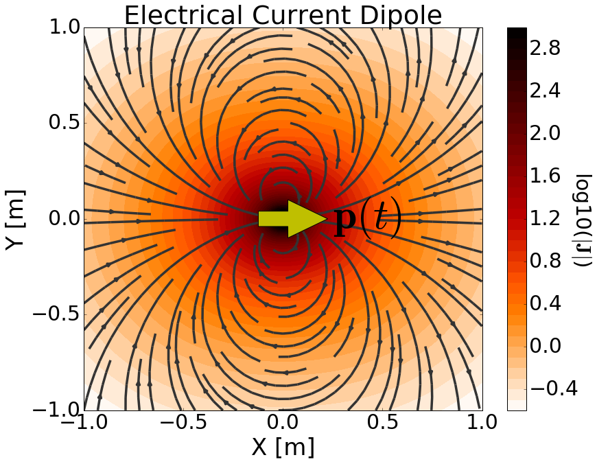

.. _time_domain_electric_dipole_index:

Dipolo Elétrico Transiente
==========================

.. Purpose::

    Aqui, fornecemos uma descrição física do dipolo de corrente elétrica dependente do tempo.
    Isso é usado para desenvolver uma expressão matemática que pode ser usada para substituir o termo de fonte elétrica nas equações de Maxwell.
    Em seguida, consideramos um dipolo de corrente elétrica transiente; que representa uma fonte geofísica mais comumente usada.
 

**Definição Geral**

        	Represntação física da fonte dipolo de corrente elétrica dependente do tempo.

O dipolo de corrente elétrica dependente do tempo pode ser pensado como um comprimento infinitesimal de fio que carrega uma corrente dependente do tempo. A força da fonte é, portanto, definida por um momento de dipolo dependente do tempo :math:`\mathbf{p}(t)`.
Para um dipolo de corrente dependente do tempo definido por comprimento :math:`ds` e vetor de corrente :math:`\mathbf{I}(t)`, o momento de dipolo é dado por:

.. math::
	\mathbf{p}(t) = \mathbf{I}(t) ds

Como um resultado, o termo fonte para o dipolo de corrente elétrica dependente do tempo é dado por:

.. math::
	\mathbf{j_e^s} = \mathbf{I}(t) ds \, \delta (x) \delta (y) \delta (z)

onde :math:`\delta (x)` é a função delta de Dirac.
Incluindo o termo fonte, as equações de Maxwel no domínio do tempo são dadas por:

.. math::
	\begin{split}
	&\nabla \times \mathbf{e_e} + \mu \dfrac{\partial  \mathbf{h_e} }{\partial t} = 0  \\
	\nabla \times \mathbf{h_e} - \sigma \mathbf{e_e} & - \varepsilon \dfrac{\partial \mathbf{e_e} }{\partial t} = \mathbf{I}(t)ds \, \delta(x) \delta(y) \delta(z)
	\end{split}

onde o subescrito :math:`_e` lembra-nos que estamos considerando uma fonte elétrica.
A fonte de corrente é responsável por gerar uma densidade de corrente primária (e, portanto, um campo elétrico) na região circundante
(:numref:`ElecDipoleTime`).
A :ref:`equação de Ampere-Maxwell<ampere_maxwell_differential_time>` afirma que os campos elétricos variáveis no tempo e o movimento da corrente livre geram campos magnéticos.
Além disso, a natureza dependente do tempo desses campos magnéticos deve produzir campos elétricos secundários de acordo com :ref:`lei de Faraday<faraday_differential_time>`.

**Transiente do dipolo de corrente elétrica**

A resposta transitória representa a resposta de um sistema à excitação ao desligamento da função degrau.
Para o transiente do dipolo de corrente elétrica com comprimento infinitesimal :math:`ds`, a resposta eletromagnética resulta do desligamento de uma corrente da forma :math:`\mathbf{I}(t) = \mathbf{I}u(-t)`.
Assim, o momento de dipolo é dado por:

.. math::
	\mathbf{p}(t) = \mathbf{I}u(-t) ds

onde :math:`u(t)` é a função degrau unitária.

O termo fonte para o dipolo de corrente elétrica correspondente é dado por:

.. math::
	\mathbf{j_e^s} = \mathbf{I}u(-t) ds \, \delta (x) \delta (y) \delta (z)

onde :math:`\delta (x)` é a função delta de Dirac.

Ao incluir o termo fonte, as equações de Maxwell no domínio do tempo são dadas por:

.. math::
	\begin{split}
	&\nabla \times \mathbf{e_e} + \mu \dfrac{\partial  \mathbf{h_e} }{\partial t} = 0  \\
	\nabla \times \mathbf{h_e} - \sigma \mathbf{e_e} & - \varepsilon \dfrac{\partial  \mathbf{e_e} }{\partial t} = \mathbf{I}u(-t)ds \, \delta(x) \delta(y) \delta(z)
	\end{split}

É possível resolver este sistema para obter soluções analíticas para os campos elétricos e magnéticos transitórios.
No entanto, vamos aplicar uma abordagem diferente usando a transformada de Laplace inversa.

**Organização**

Na seção seguinte, resolvemos as equações de Maxwell para uma fonte dipolo de corrente elétrica transitória e fornecemos expressões analíticas para os campos elétrico e magnético em um meio homogêneo.
Expressões assintóticas são então fornecidas para vários casos.
Ferramentas de modelagem numérica são disponibilizadas para investigar a dependência dos campos elétricos e magnéticos em vários parâmetros.

.. toctree::
    :maxdepth: 2

    analytic_solution
    asymptotics
    fields

