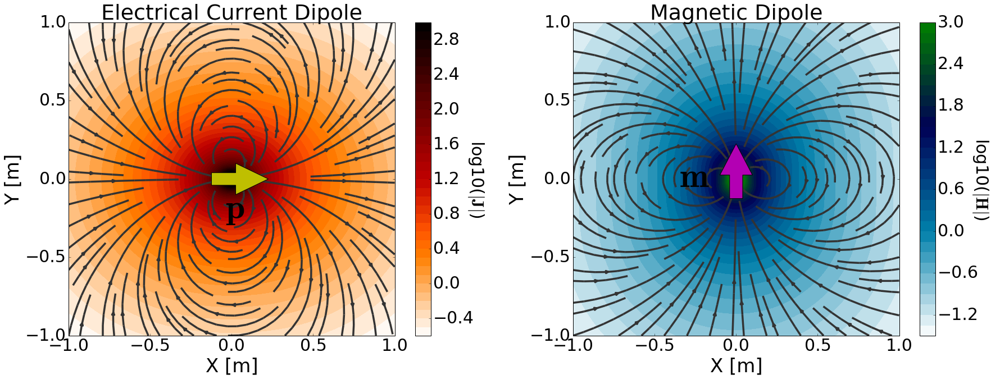

.. _dipole_sources_in_homogeneous_media_index:

Fontes Dipolares num Meio Homogêneo
===================================

.. Purpose::

    Nesta seção, você aprenderá sobre as fontes dipolo e os campos que elas geram em meios homogêneos.
    Para cada fonte de dipolo:

        - Um modelo físico é fornecido e usado para formular o termo fonte correspondente nas equações de Maxwell.
        - Expressões analíticas para o campo elétrico, campo magnético e potencial vetorial são então fornecidas tanto no domínio da frequência quanto no domínio do tempo.
        - Expressões assintóticas são fornecidas para vários casos.
        - Ferramentas de modelagem numérica são disponibilizadas para investigar a dependência dos campos elétricos e magnéticos em vários parâmetros.

**Introdução**

As fontes dipolares (tipos dipolo) são fontes eletromagnéticas fundamentais que existem em um único ponto do espaço.
Embora verdadeiras fontes dipolares não existam na natureza, elas sãoo apropriadas para aproximar as fontes eletromagnéticas usadas para muitas aplicações geofísicas.
Em geofísica, existem dois tipos de fontes dipolo: fontes dipolo de corrente elétrica e fontes dipolo magnéticas.

Na matéria, o dipolo de corrente elétrica (:math:`\mathbf{p}`) gera uma densidade de corrente primária na região circundante; a corrente livre não 
flui no espaço livre.
Isso é ilustrado em :numref:`DipolesFig` (à esquerda).
Um dipolo magnético, por outro lado, gera um campo magnético primário na região circundante.
Isso é ilustrado em :numref:`DipolesFig` (direita).
Observe como as linhas do campo convergem em um único ponto no espaço para qualquer uma das fontes.
Discutiremos os campos elétricos e magnéticos secundários gerados por cada dipolo no material subsequente.

		(Esquerda) Dipolo de corrente elétrica (:math:`\mathbf{p}`) orientado na direção :math:`\hat x` e a densidade de corrente primária 
		(:math:`\mathbf{J}`) que produz. (Direita) Dipolo magnético (:math:`\mathbf{m}`) orientado na direção :math:`\hat y` e o campo magnético primário (:math:`\mathbf{H}`) que ele produz.

Ambos os dipolos de corrente elétrica e dipolos magnéticos podem ser representados como termos de fonte nas equações de Maxwell.
Para o dipolo de corrente elétrica, o termo fonte (:math:`\mathbf{J_e^s}`) representa uma densidade de corrente elétrica e tem unidades 
:math:`\mathrm{A/m}^2`. Para o dipolo magnético, a fonte resulta de uma magnetização (:math:`\mathbf{M}`). No entanto, o termo fonte magnética 
(:math:`\mathbf{J_m^s} = - i\omega\mu\mathbf{M}`) é geralmente representado por uma densidade de corrente magnética, onde 
:math:`\mathbf{J_m^s}` tem unidades :math:`V/m^2`.
Detalhes sobre as densidades de corrente elétrica e magnética foram fornecidos junto com a :ref:`Equação Ampere-Maxwell<ampere_maxwell>`.

Na presença de uma fonte eletromagnética, as equações de Maxwell no domínio da frequência são dadas por:

.. math::
	\begin{split}
	\nabla \times \mathbf{E} + i \omega & \mu \mathbf{H} = \pm \, \mathbf{J_m^s}  \\
	\nabla \times \mathbf{H} - (\sigma + & i \omega \varepsilon ) \mathbf{E} = \pm \, \mathbf{J_e^s}
	\end{split}
    :label: eq_Maxwells_frequency

onde :math:`\pm` depende da escolha na convençaõ do sinal.
Equaivalentemente, as Equações de Maxwell no domínio do tempo são dadas por:

.. math::
	\begin{split}
	\nabla \times \mathbf{e} \, + \, &\mu \dfrac{\partial  \mathbf{h} }{\partial t} = \pm \mathbf{j_m^s} \\
	\nabla \times \mathbf{h} - \sigma \mathbf{e} &  - \varepsilon \dfrac{\partial \mathbf{e} }{\partial t} = \pm \mathbf{j_e^s}
	\end{split}
    :label: eq_Maxwells_time

    
onde :math:`\mathbf{j_e^s}` e :math:`\mathbf{j_m^s}` são termos de fonte elétrica e magnética dependentes do tempo, respectivamente.
Em última análise, o lado direito de :ref:`Lei de Faraday<faraday_differential_frequency>` torna-se diferente de zero na presença de uma fonte magnética. E o lado direito da :ref:`Lei de Ampere-Maxwell<ampere_maxwell_differential_frequency>` torna-se diferente de zero na presença de uma fonte de corrente elétrica.

**Organização**

Para cada fonte do tipo dipolo, começamos apresentando um modelo físico.
Isso é usado para substituir termos de fonte dependentes de frequência ou dependentes do tempo nas equações de Maxwell.
Expressões analíticas e assintóticas junto com ferramentas de modelagem numérica são então fornecidas.
Links rápidos para o conteúdo subsequente são fornecidos abaixo.

**Dipolo de Corrente Elétrica**

.. toctree::
    :maxdepth: 2

    electric_dipole_definition/index
    electric_dipole_frequency/index
    electric_dipole_time/index

**Dipolo Magnético**

.. toctree::
    :maxdepth: 2

    magnetic_dipole_definition/index
    magnetic_dipole_frequency/index
    magnetic_dipole_time/index

