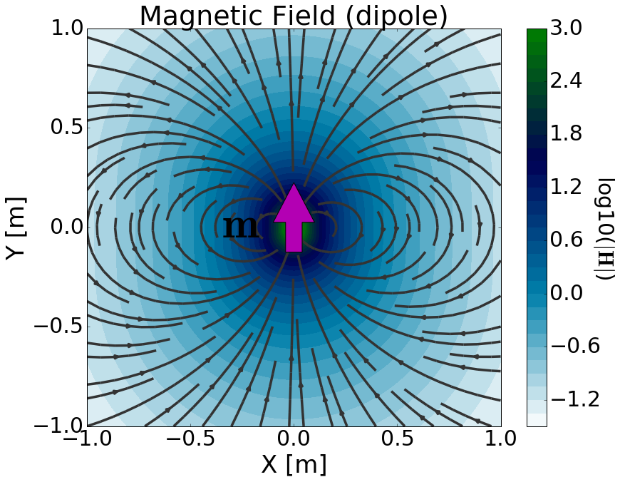

.. _definition_magnetic_dipole_index:

Definindo o Dipolo Magnético
============================

.. Purpose::

    Aqui, fornecemos uma descrição física do dipolo magnético.
    Isso é usado para desenvolver uma expressão matemática que pode ser usada para substituir o termo da fonte magnética nas equações de Maxwell.
    

**Descrição Geral**

		Represntação física da fonte do tipo dipolo magnéticao onde :math:`\mathbf{m}` = 1 Am :math:`\!^2`.

Existem dois modelos comumente usados para o dipolo magnético.
O primeiro modelo descreve o dipolo magnético como um volume infinitamente pequeno de material magnetizado (ou seja, uma barra magnética muito pequena).
O segundo modelo descreve o dipolo magnético usando um loop de corrente infinitamente pequeno.
Em ambos os casos, a força da fonte de dipolo magnético é definida por um momento de dipolo (:math:`\mathbf{m}`).
Isso leva a um termo de fonte magnética (:math:`\mathbf{J_m^s}`) da forma:

.. math::
	\mathbf{J_m^s} = - i\omega \mu \mathbf{m} \delta (x) \delta (y) \delta (z)
	:label: Jm_def

onde :math:`\delta (x)` é a função delta de Dirac.
A fonte dipolo magnética é responsável por gerar um campo magnético primário na região circundante; campos elétricos e magnéticos secundários são discutidos mais tarde.
Isso é ilustrado em :numref:`MagDipole_index`.

**Modelo de Volume Magnetizado**

Este modelo deriva a fonte dipolo magnética considerando um volume de material uniformemente magnetizado; em outras palavras, um ímã de barra.
Vamos supor que o volume tenha magnetização uniforme (:math:`\mathbf{M}`) e tenha dimensões :math:`\Delta x`, :math:`\Delta y` e :math:`\Delta z`; dando a ele um volume de :math:`\Delta V`.
O termo da fonte magnética resultante (:math:`\mathbf{J_m^s}`) é dado por:

.. math::
	\mathbf{J_m^s} = - i\omega \mu \mathbf{M (r)}
	:label: Jm_M

onde

.. math::
	\begin{split}
	\mathbf{M (r)}\!=\!\mathbf{M} \Delta V & \!\Bigg [ \! \frac{u \big ( x \! +\!\frac{\Delta x}{2} \big ) \! - \! u \big ( x \! -\!\frac{\Delta x}{2} \big )}{\Delta x} \! \Bigg ] ... \\
	& \;\;\;\;\;\;\;\;\;\;\;\;\;\;\;\;\;\;\;\;\;\; \! \Bigg [ \! \frac{u \big ( y \! +\!\frac{\Delta y}{2} \big ) \! - \! u \big ( y \! -\!\frac{\Delta y}{2} \big )}{\Delta y} \! \Bigg ] \!\! \Bigg [ \! \frac{u \big ( z \! +\!\frac{\Delta z}{2} \big ) \! - \! u \big ( z \! -\!\frac{\Delta z}{2} \big )}{\Delta z} \! \Bigg ]
	\end{split}
	:label: M_def

e :math:`u(x)` é a função degrau unitário.
Lembre-se de que :math:`\mathbf{J_m^s}` define uma :ref:`densidade de corrente magnética<ampere_maxwell_differential_frequency>` e tem unidades V/m :math:`\!^ 2`.
Assim :math:`\mathbf{J_m^s}` pode ser usado para substituir o termo de fonte magnética nas equações de Maxwell por um bloco magnetizado uniformemente.

Na :numref:`BarMagnet_def`, consideramos um volume uniformemente magnetizado onde :math:`\mathbf{M}= M\mathbf{\hat y}`.
Como podemos ver, a magnetização contida no volume gera um campo magnético primário na região circundante.
Observe como as linhas de campo parecem começar na extremidade norte do volume magnetizado e terminar no sul (:numref:`BarMagnet_def` esquerda).
No entanto, quando o volume é muito menor do que a escala de observação (:math:`\Delta x, \Delta y, \Delta z \ll r`), então parece que as linhas do campo magnético convergem em um único ponto; veja :numref:`BarMagnet_def` (direita).

.. figure:: images/H_source_bar_magnet.png
	:align: center
	:name: BarMagnet_def
	:figwidth: 100%

        Magnetic field due to a uniformly magnetized volume. Large volume (left). Small volume (right). For both volumes, the magnetization was adjusted such that :math:`M \Delta V` = 1 Am :math:`\!^2`.

Dipolos magnéticos podem ser usados para aproximar campos devido a volumes magnetizados muito pequenos quando a escala de observação é suficientemente grande.
Isso é realizado definindo um termo de origem que existe em um único ponto no espaço.
Da expressão anterior, a fonte de dipolo magnético é obtida fazendo :math:`\Delta x, \, \Delta y, \, \Delta z \rightarrow dx, \, dy, \, dz`; em outras palavras, permitindo :math:`\Delta V \rightarrow dV`.
Assim, o termo fonte para um dipolo magnético é dado por:

.. math::
	\mathbf{J_m^s} = - i \omega \mu \mathbf{M} dV \delta (x) \delta (y) \delta (z)
	:label: Jm_dip_bar

A força da fonte de dipolo magnético é definida por seu momento de dipolo (:math:`\mathbf{m}`).
Como podemos ver na expressão anterior, o termo fonte depende do produto :math:`\mathbf{M} dV`.
Assim, o momento de dipolo que define a fonte de dipolo magnético é dado por:

.. math::
	\mathbf{m} = \mathbf{M} dV
	:label: dip_moment_def

Da nossa definição de dipolo magnético, :math:`\mathbf {m}` tem unidades Am :math:`\!^2`.
Cada função delta de Dirac carrega unidades m :math:`\!^{-1}`, :math:`\omega` tem unidades s :math:`\!^{-1}` e :math:`\mu` tem unidades H/m.
Onde 1 H = 1 V :math:`\!\cdot\!` s/A, o termo de fonte magnética (:math:`\mathbf{J_m}`) tem unidades V/m :math:`\!^2`.

Para um bloco retangular magnetizado (:numref:`BarMagnet_def` esquerda), o campo magnético fora da região de origem pode ser calculado de acordo com Sharma (1966); uma formulação mais limpa pode ser encontrada em Varga.
Ao tomar o limite como :math:`\Delta x, \, \Delta y, \, \Delta z \rightarrow dx, \, dy, \, dz`, o campo magnético gerado por um bloco retangular magnetizado reduz a (:numref:`BarMagnet_def` direita):

.. math::
	\mathbf{H_{dip}(r)} = \frac{1}{4\pi} \Bigg [ \frac{3 \mathbf{r (m \cdot r)} }{r^5} - \frac{\mathbf{m}}{r^3} \Bigg ]
	:label: dip_field_bar

**Modelo Loop de Corrente**

Os campos magnéticos são gerados pelo movimento de cargas elétricas (ou seja, corrente elétrica). Por causa disso, um volume magnetizado em si 
não representa uma fonte física. Aqui, vamos demonstrar como o momento de dipolo magnético pode ser representado por um loop infinitamente pequeno de corrente.

Primeiro, vamos considerar um grande loop circular de corrente com radius :math:`a` e current :math:`I` (:numref:`CurrentLoop` à esquerda).
Para obter o campo magnético primário do loop, podemos usar a :ref:`Lei de Biot-Savart<biot_savart>`:

.. math::
	\mathbf{H (r)} = \frac{1}{4\pi} \int_C \frac{I \, d\mathbf{l} \times \mathbf{\hat r}}{r^2}
	:label: Biot_Savart

A solução analítica para a lei de Biot-Savart neste caso é bastante complicada e contém várias funções integrais elípticas; para solução veja aqui (link).
Se o raio do loop for muito menor do que a escala de observação (:math:`a \ll r`), o campo magnético primário devido ao loop pode ser simplificado para:

.. math::
	\mathbf{H(r)} = \frac{1}{4\pi} \Bigg [ \frac{3 \mathbf{r} (\pi a^2 I \mathbf{\hat n} \cdot \mathbf{r)} }{r^5} - \frac{\mathbf{\pi a^2 I \mathbf{\hat n}}}{r^3} \Bigg ]
	:label: dip_field_loop

onde :math:`\mathbf{\hat n}` é o vetor unitário normal à área dentro do loop.
O campo magnético primário para um pequeno loop é mostrado em :numref:`CurrentLoop` (direita).

.. figure:: images/H_source_current_loop.png
		:align: center
		:figwidth: 100%
		:name: CurrentLoop

        	Campo magnético devido a um loop de corrente. Grande loop de corrente (esquerda). Loop de corrente pequeno (direita). Para ambos os loops, a corrente é ajustada de modo que :math:`IS` = 1 Am :math:`\!^2`.

Observe como o campo primário para um pequeno loop é efetivamente idêntico ao de uma fonte de dipolo magnético.
Além disso, a intensidade do campo depende do produto da corrente do loop e sua área (:math:`S = \pi a^2`).
Portanto, se definirmos o momento de dipolo do loop como:

.. math::
	\mathbf{m} = I \mathbf{S}
	:label: dip_moment_loop

onde :math:`\mathbf{S} = \pi a^2 I \mathbf{\hat n}`, então o campo magnético primário devido a um pequeno loop de corrente é dado por:

.. math::
	\mathbf{H_{dip}(r)} = \frac{1}{4\pi} \Bigg [ \frac{3 \mathbf{r (m \cdot r)} }{r^5} - \frac{\mathbf{m}}{r^3} \Bigg ]
	:label: dip_field_loop2

A expressão anterior nos diz que se a escala de observação for significativamente maior do que o raio do loop, o loop pode ser representado por uma fonte dipolo magnética.
Deve-se também concluir que o loop pode ser representado por um termo fonte dipolo magnético correspondente (:math:`\mathbf{J_m^s}`) igual a:

.. math::
	\mathbf{J_m^s} = - i \omega \mu I \mathbf{S} \delta (x) \delta (y) \delta (z)
	:label: Jm_def_loop

Aqui, escolhemos um tratamento muito simples do modelo de loop de corrente para uma fonte de dipolo magnético.
Uma derivação mais completa do momento de dipolo a partir das equações de Maxwell pode ser encontrada em Griffiths (:cite:`griffiths1999`).

