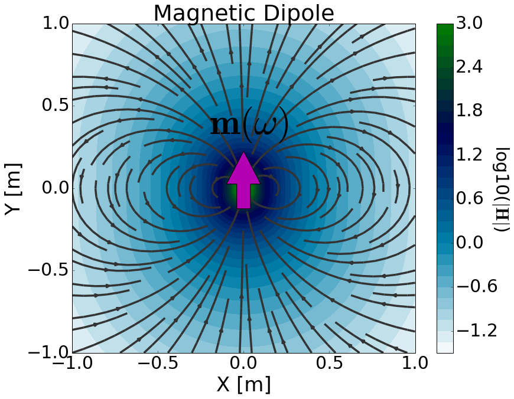

.. _frequency_domain_magnetic_dipole_index:

Dipolo Magnético Harmônico
==========================

.. Purpose::

    No domínio da frequência, consideramos os campos elétricos e magnéticos harmônicos.
    Aqui, fornecemos uma descrição física do dipolo magnético harmônico.
    Isso é usado para desenvolver uma expressão matemática que pode ser usada para substituir o termo da fonte magnética nas equações de Maxwell.

**Definição Geral**

O dipolo magnético harmônico pode ser pensado como um loop infinitamente pequeno que carrega uma corrente harmônica.
A força da fonte é, portanto, definida por um momento de dipolo harmônico :math:`\mathbf{m}(\omega)`.
Para um dipolo magnético harmônico definido pela área de superfície vetorial :math:`\mathbf{S}` e corrente harmônica :math:`I(\omega)=I e^{i\omega t}`, o momento de dipolo é dado por:

		Physical representation of the magnetic dipole source where :math:`\mathbf{m}` = 1 Am :math:`\!^2`.

.. math::
	\mathbf{m} (\omega) = \mathbf{m} \, e^{i\omega t} = I \mathbf{S} \, e^{i\omega t}
	:label: m_harmonic_def

onde :math:`\mathbf{m} = I \mathbf{S}` é a amplitude do vetor do momento de dipolo.
Ao formular as equações de Maxwell no domínio da frequência, :math:`e^{i \omega t}` é geralmente suprimido.
Como resultado, o termo fonte para o dipolo magnético harmônico é dado por:

.. math::
	\mathbf{J_m^s} = -i\omega \mu I\mathbf{S} \, \delta (x) \delta (y) \delta (z)
	:label: Jm_harmonic_def

onde :math:`\delta (x)` é a função delta de Dirac.
Ao incluir o termo fonte, as equações de Maxwell no domínio da frequência são dadas por:

.. math::
	\begin{split}
	\nabla \times \mathbf{E_m} & + i \omega  \mu \mathbf{H_m} = - i \omega \mu I \mathbf{S} \, \delta(x) \delta(y) \delta(z)  \\
	&\nabla \times \mathbf{H_m} - ( \sigma + i \omega \varepsilon ) \mathbf{E_m} = 0
	\end{split}
	:label: Maxwells_harmonic_Jm

onde subscritos :math:`_m` nos lembram que estamos considerando uma fonte magnética.
A fonte é responsável por gerar um campo magnético primário na região circundante (:numref:`MagDipole_freq`).
De acordo com :ref:`Lei de Faraday<faraday_differential_frequency>`, a natureza harmônica do campo magnético primário gera campos elétricos rotacionais.
Na matéria, isso leva a uma densidade de corrente induzida que produz campos magnéticos secundários de acordo com a :ref:`Equação Ampere-Maxwell<ampere_maxwell_differential_frequency>`.

**Organização**

Na seção seguinte, resolvemos as equações de Maxwell para uma fonte dipolo magnética harmônica e fornecemos expressões analíticas para os campos elétricos e magnéticos em um meio homogêneo.
Expressões assintóticas são então fornecidas para vários casos.
Ferramentas de modelagem numérica são disponibilizadas para investigar a dependência dos campos elétricos e magnéticos em vários parâmetros.

.. toctree::
    :maxdepth: 2

    analytic_solution
    asymptotics
    fields
