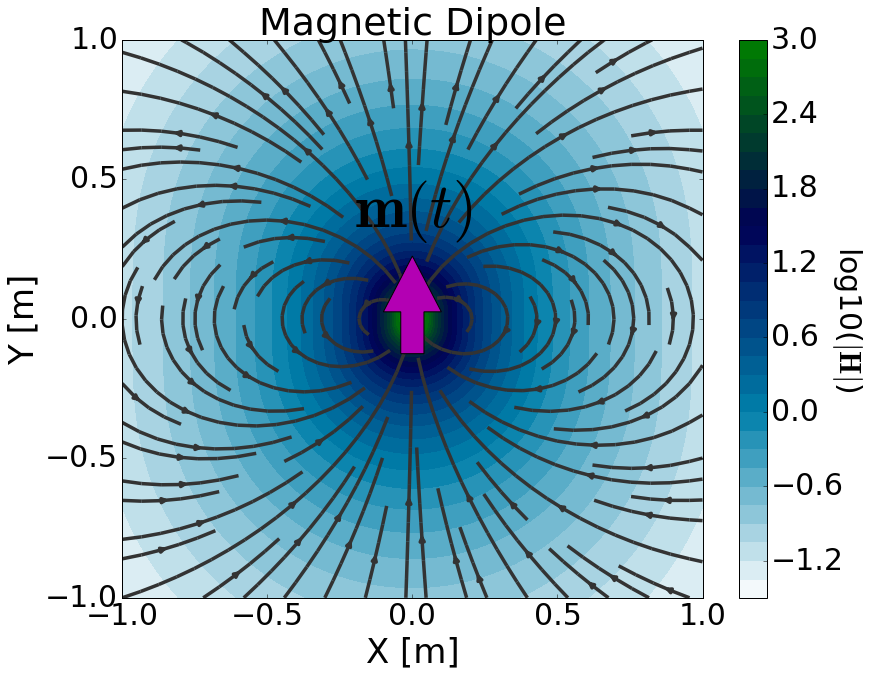

.. _time_domain_magnetic_dipole_index:

Transiente do Dipolo Magnético
==============================

.. Purpose::

    Aqui, fornecemos uma descrição física do dipolo magnético dependente do tempo.
    Isso é usado para desenvolver uma expressão matemática que pode ser usada para substituir o termo da fonte magnética nas equações de Maxwell.
    Em seguida, consideramos um dipolo magnético transiente; que representa uma fonte geofísica mais comumente usada.

**Definição Geral**

        	Representação física da fonte dipolo magnético dependente do tempo.

O dipolo magnético dependente do tempo pode ser pensado como um loop infinitesimalmente pequeno que carrega uma corrente dependente do tempo.
A força da fonte é, portanto, definida por um momento de dipolo dependente do tempo :math:`\mathbf{m}(t)`.
Para um dipolo magnético dependente do tempo definido pelo vetor de área de superfície :math:`\mathbf{S}` e corrente :math:`I(t)`, o momento de dipolo é dado por:

.. math::
	\mathbf{m}(t) = I(t)\mathbf{S}

Como resultado, o termo fonte para o dipolo magnético dependente do tempo é dado por:

.. math::
	\mathbf{j_m (r)} = - \dfrac{\partial I}{\partial t} \mathbf{S} \, \delta (x) \delta (y) \delta (z)

onde :math:`\delta (x)` é a função delta de Dirac.
Observe como o termo de origem contém uma derivada no tempo da corrente do loop.
Ao incluir o termo fonte, as equações de Maxwell no domínio do tempo são dadas por:

.. math::
	\begin{split}
	\nabla \times \mathbf{e_m} + \mu \dfrac{ \mathbf{h_m} }{\partial t} &= - \dfrac{\partial I(t)}{\partial t} \mathbf{S} \, \delta (x) \delta (y) \delta (z)  \\
	\nabla \times \mathbf{_m} - & \sigma \mathbf{e_m}  - \varepsilon \dfrac{\partial  \mathbf{e_m} }{\partial t} = 0
	\end{split}

onde os subescritos :math:`_m` lembra-nos de que estamos considerando uma fonte magnética.
A fonte é responsável por gerar um campo magnético primário na região circundante (:numref:`MagDipoleTime`).
De acordo com a :ref:`Lei de Faraday <faraday_differential_time>`, campos magnéticos variáveis no tempo geram campos elétricos rotacionais.
Na matéria, isso leva a uma densidade de corrente induzida que produz campos magnéticos secundários de acordo com a :ref:`Equação Ampere-Maxwell <ampere_maxwell_differential_time>`.

**Transiente do Dipolo de Corrente Elétrica**

A resposta transitória representa a resposta de um sistema à excitação escalonada.
Para um transinete do dipolo magnético com vetor de área de superfície :math:`\mathbf{S}`, a resposta eletromagnética resulta de uma corrente de saída da 
forma :math:`I(t)=I u(-t)`.
Assim, o momento de dipolo é dado por:

.. math::
	\mathbf{m}(t) = I u(-t) \mathbf{S}

onde :math:`u(t)` é a função degrau unitária e :math:`I` é a amplitude da corrente em :math:`t \leq 0`.
O termo fonte para o dipolo magnético de corrente é dado por:

.. math::
	\mathbf{j_m^s} = I \delta(t) \mathbf{S} \, \delta (x) \delta (y) \delta (z)

onde :math:`\delta (x)` é a função delta de Dirac.
Ao incluir o termo fonte, as equações de Maxwell no domínio do tempo são dadas por:

.. math::
	\begin{align}
	\nabla \times \mathbf{e_m} + \mu \dfrac{\partial  \mathbf{h_m} }{\partial t} &= I \delta(t) \mathbf{S} \, \delta (x) \delta (y) \delta (z)  \\
	\nabla \times \mathbf{h_m} - &\sigma \mathbf{e_m}  - \varepsilon \dfrac{\partial \mathbf{e_m} }{\partial t} = 0
	\end{align}

É possível resolver este sistema para obter soluções analíticas para o transiente dos campos elétricos e magnéticos.
No entanto, vamos aplicar uma abordagem diferente que usa a transformada de Laplace inversa.

**Organização**

Na seção seguinte, resolvemos as equações de Maxwell para o transiente de uma fonte dipolo magnética e fornecemos expressões analíticas para os campos elétricos e magnéticos em um meio homogêneo.
Expressões assintóticas são então fornecidas para vários casos.
Ferramentas de modelagem numérica são disponibilizadas para investigar a dependência dos campos elétricos e magnéticos em vários parâmetros.

.. toctree::
    :maxdepth: 2

    analytic_solution
    asymptotics
    fields
