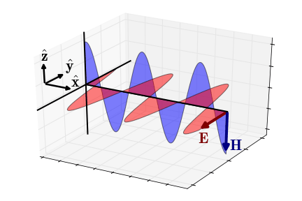

.. _harmonic_planewaves_homogeneous_impedancephase:

Impedância de Onda e Fase
=========================

Impedância de Onda
------------------

A impedância de onda define a relação entre os componentes transversais dos campos elétricos e magnéticos suportados por uma onda plana EM. Para a propagação descendente da ondas planas EM mostrada em :numref:`planewavedown_impedance_1`, a impedância é dada por:

.. figure:: images/planewavedown.png
   :align: right
   :figwidth: 50%
   :name: planewavedown_impedance_1

   Geometria de uma onda plana EM propagando-se para baixo.

.. math::
	Z_{xy} = -\frac{E_x}{H_y} = \frac{\omega \mu}{k}

onde :math:`\mu` é a :ref:`permeabilidade magnética<magnetic_permeability_index>` e :math:`k` é o :ref:`número de onda complexo<harmonic_planewaves_homogeneous_wavenumber>`. Pela equação anterior, vemos que a impedância da onda depende da frequência e das propriedades físicas do meio. Assim, em um meio isotrópico homogêneo, uma impedância de onda única pode ser usada para caracterizar as ondas EM que se propagam em qualquer direção. No entanto, se as propriedades físicas são :ref:`anisotrópicas<physical_properties_index>` (dependente da direção), as ondas que se propagam em diferentes direções são caracterizadas por impedâncias separadas.

Fase
----

A impedância de onda pode ser usada para obter a diferença de fase entre os campos elétricos e magnéticos suportados por uma onda plana. A diferença de fase entre os campos elétrico e magnético mostrado em :numref:`planewavedown_impedance_1`:

.. math::
    \phi_{Z_{xy}} = \textrm{tan}^{-1} \Bigg ( \frac{\textrm{Im}[Z_{xy}]}{\textrm{Re}[Z_{xy}]} \Bigg )

onde :math:`0 \leq \phi_{xy} \leq \pi/4`. De acordo com a expressão acima, o campo elétrico está atrasado em relação ao campo magnético.

Aproximações
------------

   Campos elétricos e magnéticos de uma onda EM propagando-se na direção :math:`x` (regime quase estático).

Aproximação Quase Estático
^^^^^^^^^^^^^^^^^^^^^^^^^^

No regime quase estático (:math:`\epsilon \omega \ll \sigma`), o número de onda torna-se :math:`\sqrt{-i\omega\mu\sigma}` e a impedância simplifica para:

.. math::
    Z_{xy} = \frac{\omega \mu}{\sqrt{-i\omega\mu\sigma}}
    = \sqrt{\frac{i \omega \mu}{\sigma}}

A fase da impedância é dado por:

.. math::
    \phi_{Z_{xy}} = \textrm{tan}^{-1} \Bigg ( \frac{\textrm{Im}[Z_{xy}]}{\textrm{Re}[Z_{xy}]} \Bigg ) = \frac{\pi}{4}

Neste caso, o campo elétrico atrasa o campo magnético em :math:`\pi/4` radianos.

.. figure:: images/EHwave.gif
   :align: right
   :figwidth: 50%
   :name: waves_homogeneous_freq_EHwave
   
   Campos elétricos e magnéticos de uma onda EM propagando-se na direção :math:`x` (regime de onda).

Aproximação de Regime de Onda
^^^^^^^^^^^^^^^^^^^^^^^^^^^^

No regime de onda (:math:`\epsilon\omega\gg\sigma`), o número de onda simplifica para :math:`\omega\sqrt{\mu\epsilon}` e a impedância simplifica para:

.. math::
    Z_{xy} = \frac{\omega \mu}{\omega \sqrt{\mu\epsilon}}
    = \sqrt{\frac{\mu}{\epsilon}}

onde a fase é igual a:

.. math::
    \phi_{Z_{xy}} = \textrm{tan}^{-1} \Bigg ( \frac{\textrm{Im}[Z_{xy}]}{\textrm{Re}[Z_{xy}]} \Bigg ) = 0

Neste caso, os campos elétrico e magnético estão em fase um com o outro.

