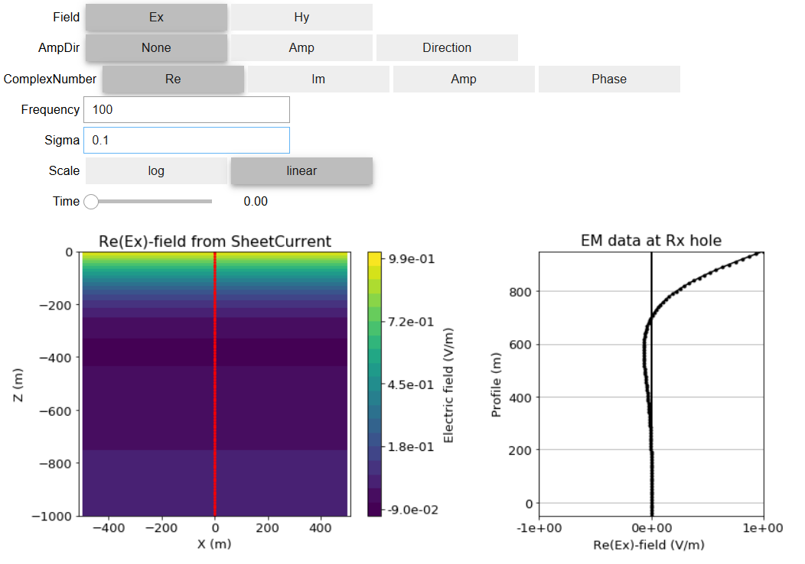

.. _harmonic_planewaves_homogeneous_index:

Ondas Planas Harmônicas num Meio Homogêneo
==========================================

.. purpose::

    Já mostramos que, que num meio homogêneo, os sinais eletromagnéticos no domínio da frequência se comportam de acordo com a equação :ref:`Helmholtz<frequency_domain_equations>`. Aqui, discutimos as propriedades das soluções de ondas planas harmônicas no domínio da frequência. O conteúdo educacional é aumentado usando :ref:`aplicativos interativos<apps_index>` fornecidos para responder a um conjunto de questões fundamentais. Também discutimos as relações entre os campos elétricos e magnéticos transportados por ondas planas. O conteúdo aqui é paralelo aos materiais fornecidos em muitos fontes de teoria eletromagnética (EM) (consulte :cite:`ward1988, griffiths1999, stratton1941`).

**Introdução**

Mostramos anteriormente que em meios homogêneos, a propagação de sinais eletromagnéticos no domínio da frequência é governada pela :ref:`equação de Helmholtz<frequency_domain_equations>`. Uma solução para essa equação é uma onda plana, onde os campos elétricos e magnéticos ficam em um plano 2D e a onda se propaga em uma direção perpendicular a esse plano. Fisicamente, as soluções de ondas planas oferecem boas aproximações para o que está acontecendo longe de fontes eletromagnéticas. Como resultado, as ondas planas formam uma base primária para a compreensão dos comportamentos fundamentais de muitos fenômenos eletromagnéticos.

.. figure:: images/planewavedown.png
   :align: right
   :figwidth: 50%
   :name: planewavedown_index_freq_1

   Geometria de uma onda plana EM porpagando-se para baixo.
   
Aqui, exploramos a propagação de ondas planas no domínio da frequência (para sinais harmônicos). O conteúdo fornecido aqui se assemelha a materiais de muitos recursos EM (consulte [WH88] [Gri99] [Str41]). Um aplicativo é fornecido para permitir que você explore os conceitos de comprimento de onda, atenuação e outros aspectos dos campos EM propagados. Para complementar o aplicativo, :ref:`questões<harmonic_planewaves_homogeneous_questions>` são fornecidas para promover a aprendizagem interativa. O recurso é ampliado com derivações e equações que quantificam as informações aprendidas com o uso dos aplicativos.

**Links Rápidos**

    - :ref:`Derivando a solução de ondas planas<harmonic_planewaves_homogeneous_derivation>`
    - :ref:`Suporte Matemático<harmonic_planewaves_homogeneous_derivation_app>`
    - :ref:`Questões para ser respondidas usando o app<harmonic_planewaves_homogeneous_questions>`

**Tópicos em Ondas Planas**

Existem inúmeras propriedades que podem ser usadas para entender a propagação de ondas planas no domínio da frequência. Compreender essas propriedades é muito importante, pois elas podem ser usadas para descrever o comportamento das ondas EM em casos mais gerais. Aqui, discutiremos as seguintes propriedades:

    - :ref:`Número de onda<harmonic_planewaves_homogeneous_wavenumber>`: Uma constante fundamental que caracteriza as ondas planas em uma determinada frequência.
    - :ref:`Atenuação<harmonic_planewaves_homogeneous_skindepth>`: A amplitude perdida de uma onda plana  quando ela se propaga.
    - :ref:`Skin Depth<harmonic_planewaves_homogeneous_skindepth>`: A distância de uma onda EM viaja antes de  experimentar uma perda de amplitude de :math:`1/e`.
    - :ref:`Comprimento de onda<harmonic_planewaves_homogeneous_wavelength>`: O comprimento de onda de uma onda plana.
    - :ref:`Velocidade de fase<harmonic_planewaves_homogeneous_phasevelocity>`: A velocidade em que as ondas planas em uma determinada frequência viaja.
    - :ref:`Impedância<harmonic_planewaves_homogeneous_impedancephase>`: Uma propriedade média que caracteriza a relação entre as componentes perpendiculares dos campos elétricos e magnéticos suportados pelas ondas EM.
    - :ref:`Resistividade aparente<harmonic_planewaves_homogeneous_apparentresistivity>`: Uma aproximação da resistividade elétrica de um meio com base na relação entre os campos elétrico e magnético.

.. _harmonic_planewaves_homogeneous_index_app:

.. geosciapp::
    Ao navegar pelas ondas planas em meios materiais e homogêneos, sugere-se que você abra o
    `Aplicativo de ondas planas num meio hogêneo<https://hub.gke2.mybinder.org/user/victortocantins-em-notebooks-8kwwgs43/notebooks/notebooks/em/FDEM_Planewave_Wholespace.ipynb>`_
    
    
Uma compreensão fundamental da propagação das ondas planas no domínio da frequência pode ser obtida usando o 
(:numref:`FDEM_planewaves_wholespace_app`); que permite ao usuário simular os campos elétricos e magnéticos suportados por uma 
onda plana de propagando-se para baixo. O aplicativo permite que o usuário explore os efeitos de diferentes parâmetros 
(por exemplo, condutividade, localização do observador, frequência) e responda a um conjunto de questões fundamentais. Por exemplo, 

suponha que você esteja enviando um sinal de onda plana EM harmônica para a Terra e que o solo tenha uma condutividade de 0,1 S / m.

    - Para um sinal harmônico em uma determinada frequência (100 Hz, por exemplo), qual a profundidade do sinal que penetra na Terra 
    - antes de perder 90% de sua amplitude?
    - Ao escolher uma frequência diferente para o sinal, posso alterar a profundidade da penetração do sinal na Terra?
    
Uma série de perguntas adicionais que podem ser respondidas usando o aplicativo são encontradas :ref:`aqui<harmonic_planewaves_homogeneous_questions>`.    

   Screen shot do appr do FDEM planewaves wholespace app.

**Conteúdo**

.. toctree::
    :maxdepth: 1

    derivation
    wavenumber
    skindepth
    wavelength
    phasevelocity
    impedancephase
    apparentresistivity
    questions
