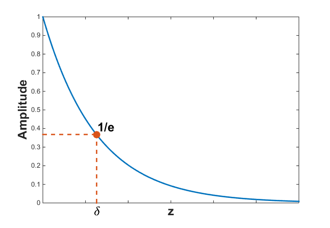

.. _harmonic_planewaves_homogeneous_skindepth:

Atenuação e Skin Depth (Profundidade de penetração)
===================================================

        Skin depth é definido como a profundiade na qual a amplitude  da onda é reduzida por :math:`1/e`.

Atenuação
---------

A atenuação define a taxa de perda de amplitude que uma onda EM experimenta ao se propagar (:numref:`sd`). 
A atenuação de uma onda EM é definida pelo parâmetro :math:`\beta`. Para uma onda plana descendente, a fórmula de atenuação é dada por:

.. _harmonic_planewaves_homogeneous_attenuation_formula:

.. math::
	A(z) = A_0 e^{\beta z}
	
onde valor absoluto :math:`A` é a amplitude, :math:`A_0` é a amplitude absoluta em :math:`z` = 0 m e:

.. math::
	\beta = \omega \left ( \frac{\mu\epsilon}{2} \left [ \left ( 1 + \frac{\sigma^2}{\epsilon^2 \omega^2} \right)^{1/2} - 1 \right ] \right ) ^{1/2} \geq 0

Skin Depth
----------

A profundidade da penetração define a distância que uma onda deve percorrer antes que sua amplitude diminua por um fator de :math:`1/e`. A profundidade da penetração é a recíproco da constante de decaimento :math:`\beta`. Assim:

.. _harmonic_planewaves_homogeneous_skindepth_formula:

.. math:: \delta = \frac{1}{\beta} = \frac{1}{\omega} \left ( \frac{\mu\epsilon}{2} \left [ \left ( 1 + \frac{\sigma^2}{\epsilon^2 \omega^2} \right)^{1/2} - 1 \right ] \right ) ^{1/2}

Uma vez que :math:`\beta` depende da frequência e das propriedades físicas do meio, o mesmo acontece com a profundidade de penetração. Para um caso geral, a profundidade de penetração 
pode ser considerada uma função bastante complicada. No entanto, existem aproximações nos regimes quase estático e de onda.

Skin Depth pra Vários Materiais
^^^^^^^^^^^^^^^^^^^^^^^^^^^^^^^

A tabela abaixo mostra a profundidade de penetração para certas rochas em várias frequências. Isso serve como um guia geral, já que os tipos de rocha são classificados por uma gama de valores de propriedades físicas que podem levar a diferenças de ordem de magnitude na profundidade de penetração.

+----------------------+-------------------+-------------+------------------+--------------------+---------------------+---------------------+---------------------+
|Tipo                  |:math:`\sigma`     |:math:`\mu_r`|:math:`\epsilon_r`|:math:`\delta` (1Hz)|:math:`\delta` (1kHz)|:math:`\delta` (1MHz)|:math:`\delta` (1GHz)|
+======================+===================+=============+==================+====================+=====================+=====================+=====================+
|Ar                    | 0 S/m             | 1           | 1                |:math:`\infty`      | :math:`\infty`      |:math:`\infty`       |:math:`\infty`       |
+----------------------+-------------------+-------------+------------------+--------------------+---------------------+---------------------+---------------------+
|àgua do mar           | 3.3 S/m           | 1           | 80               | 277 m              | 8.76 m              | 0.277 m             | 0.015 m             |
+----------------------+-------------------+-------------+------------------+--------------------+---------------------+---------------------+---------------------+
|Ígnea                 |:math:`10^{-4}` S/m| 1           | 5                | 50,300 m           | 1,590 m             | 121 m               | 119 m               |
+----------------------+-------------------+-------------+------------------+--------------------+---------------------+---------------------+---------------------+
|Sedimentares (seca)   |:math:`10^{-3}` S/m| 1           | 4                | 15,900 m           | 500 m               | 18 m                | 11 m                |
+----------------------+-------------------+-------------+------------------+--------------------+---------------------+---------------------+---------------------+
|Sedimentares (molhada)|:math:`10^{-2}` S/m| 1           | 25               | 5,000 m            | 160 m               | 5.4 m               | 2.6 m               |
+----------------------+-------------------+-------------+------------------+--------------------+---------------------+---------------------+---------------------+
|Sulfetos Silicatos    |:math:`10^{2}` S/m | 1           | 5                | 50 m               | 1.6 m               | 0.05 m              | 0.002 m             |
+----------------------+-------------------+-------------+------------------+--------------------+---------------------+---------------------+---------------------+
|Magnetita Silicatos   |:math:`10^{2}` S/m | 2           | 5                | 36 m               | 1.1 m               | 0.04 m              | 0.001 m             |
+----------------------+-------------------+-------------+------------------+--------------------+---------------------+---------------------+---------------------+

Aproximações
^^^^^^^^^^^^

.. _harmonic_planewaves_homogeneous_skindepth_formula_quasi:

**Aproximação Quase Estática**

No regime quase estático (:math:`\epsilon\omega \ll \sigma`), o skin depth é aproximadamente igua a:

.. math:: \delta = \frac{1}{\beta} = \sqrt{\frac{2}{\omega \mu \sigma}}.

Assumindo a Terra não magnética (:math:`\mu = \mu_0 = 4\pi \times 10^{-7}` H/m) e substituindo :math:`\omega=2\pi f`, uma forma mais simples  para o skin depth é dado por:

.. math:: \delta \approx 503 \sqrt{\frac{1}{f \sigma}} = 503 \sqrt{\frac{\rho}{f}}.

onde :math:`\rho = 1 / \sigma` é a resistividade. Assim, a partir das duas equações anteriores, vemos que o skin depth diminui à medida que a condutividade :math:`\sigma`, permeabilidade magnética :math:`\mu` e frequência :math:`\omega` aumenta. Na maioria dos casos, entretanto, as propriedades magnéticas são desprezíveis como :math:`\mu\sim\mu_0`.

**Aproximação Regime de Onda**

No regime de onda (:math:`\epsilon\omega \gg \sigma`), o skin depth é aproximadamente igual a:

.. math:: \delta = \frac{1}{\beta} = \frac{2}{\sigma} \sqrt{\frac{\epsilon}{\mu}}

Assumindo que a Terra é não magnética (:math:`\mu = \mu_0 = 4 \pi \times 10^{-7}` H / m) e usando a :ref:`permissividade relativa <dielectric_permittivity_index>` 
:math:`\epsilon_r = \epsilon / \epsilon_0`, uma forma mais simples da profundidade da pele é dada por:

.. math:: \delta \approx 0.0053 \frac{\sqrt{\epsilon_r}}{\sigma}

Assim, a partir das duas equações anteriores, vemos que o skin depth diminui proporcionalmente :math:`\sqrt{\epsilon_r}/ \sigma`; desde que as propriedades magnéticas sejam desprezíveis 
(:math:`\mu \sim\mu_0`). O abaixo mostra a profundidade da penetração para algumas rochas e frequências representativas no regime de ondas. Para ver como as propriedades físicas e frequências afetam a profundidade de penetração, verifique o aplicativo.

