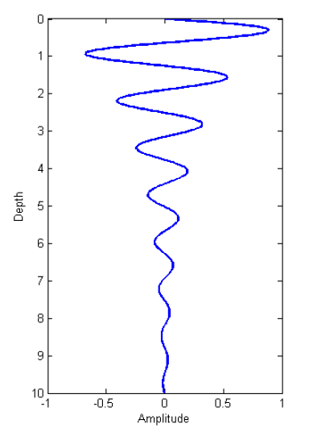

.. _harmonic_planewaves_homogeneous_wavelength:

Comprimento de Onda
===================

        Uma onda plana hramônica quando ela se propaga dentro da Terra.

O comprimento de onda define a distância física que uma onda viaja durante uma única oscilação. Acontece que o comprimento de onda das ondas EM depende do componente real do número de onda 
(:math:`\alpha`) e é dado por:

.. math::
	\lambda = \frac{2\pi}{\alpha} = \frac{2\pi}{\omega} \left ( \frac{\mu \epsilon}{2} \left [ \left ( 1 + \frac{\sigma^2}{\epsilon^2 \omega^2} \right )^{1/2} + 1 \right ] \right )^{-1/2}

Como podemos ver na equação anterior, as frequências mais altas correspondem às ondas com comprimentos de onda mais curtas.

Comprimentos de Onda EM para Vários Materiais
---------------------------------------------

A tabela abaixo mostra os comprimentos de onda das ondas EM viajando em determinadas rochas em várias frequências. Isso serve como um guia geral, já que os tipos de rocha são classificados por uma gama de valores de propriedades físicas que podem levar a diferenças de ordem de magnitude no comprimento de onda.

+----------------------+-------------------+-------------+------------------+---------------------+----------------------+----------------------+----------------------+
|Tipo                  |:math:`\sigma`     |:math:`\mu_r`|:math:`\epsilon_r`|:math:`\lambda` (1Hz)|:math:`\lambda` (1kHz)|:math:`\lambda` (1MHz)|:math:`\lambda` (1GHz)|
+======================+===================+=============+==================+=====================+======================+======================+======================+
|Ar                    | 0 S/m             | 1           | 1                |    299,800 km       |   299,800 m          |  299.8 m             |  0.2998 m            |
+----------------------+-------------------+-------------+------------------+---------------------+----------------------+----------------------+----------------------+
|Água do mar           | 3.3 S/m           | 1           | 80               | 1.7 km              |  55 m                | 1.7 m                | 0.032 m              |
+----------------------+-------------------+-------------+------------------+---------------------+----------------------+----------------------+----------------------+
|Ígneas                |:math:`10^{-4}` S/m| 1           | 5                | 316 km              | 10,000 m             | 132 m                | 0.13 m               |
+----------------------+-------------------+-------------+------------------+---------------------+----------------------+----------------------+----------------------+
|Sedimentares (seco)   |:math:`10^{-3}` S/m| 1           | 4                | 100 km              | 3,200 m              | 90 m                 | 0.15 m               |
+----------------------+-------------------+-------------+------------------+---------------------+----------------------+----------------------+----------------------+
|Sedimentares (molhado)|:math:`10^{-2}` S/m| 1           | 25               |  32 km              | 1,000 m              | 30 m                 | 0.06 m               |
+----------------------+-------------------+-------------+------------------+---------------------+----------------------+----------------------+----------------------+
|Sulfetos silicatos    |:math:`10^{2}` S/m | 1           | 5                | 0.32 km             | 10 m                 | 0.32 m               | 0.01 m               |
+----------------------+-------------------+-------------+------------------+---------------------+----------------------+----------------------+----------------------+
|Magnetita silicatos   |:math:`10^{2}` S/m | 2           | 5                | 0.22 km             | 7 m                  | 0.22 m               | 0.007 m              |
+----------------------+-------------------+-------------+------------------+---------------------+----------------------+----------------------+----------------------+

Aproximações
------------

Aproximação Quase Estática
^^^^^^^^^^^^^^^^^^^^^^^^^^

.. _harmonic_planewaves_homogeneous_wavelength_formula:

No regime quase estático (:math:`\epsilon\omega \ll \sigma`), o comprimento de onda simplifica para:

.. math:: \lambda = 2\pi\sqrt{ \frac{2}{\omega \mu \sigma} } = 2\pi\delta

Aproximação de Regime de Onda
^^^^^^^^^^^^^^^^^^^^^^^^^^^^^

No regime de onda ( :math:`\epsilon \omega \gg \sigma` ), o comprimento de onda simplifica para^:

.. math:: \lambda = \frac{1}{\omega \sqrt{\mu \epsilon}}

