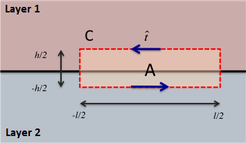

.. _maxwell1_fundamentals_interface_conditions_derivation:

Derivação das Condições de Interfaces
=====================================

Aqui, derivamos as condições de interface para os campos :math:`\mathbf{e}` e :math:`\mathbf {h}`, bem como para fluxos :math:`\mathbf{j}`, :math:`\mathbf{d}` e :math:`\mathbf{b}` 
de acordo com Griffiths :cite:`griffiths1999`. Isso pode ser realizado usando as equações de Maxwell na forma integral no domínio do tempo, onde:

.. math::
  \oint_S \mathbf{d} \cdot d \mathbf{a} = Q_f
  :label: GaussEint

.. math::
  \oint_S \mathbf{b}\cdot d \mathbf{a} = 0
  :label: GaussMint

.. math::
  \oint_C \mathbf{e} \cdot d\mathbf{l} = - \int_S \frac{\partial \mathbf{b}}{\partial t} \cdot d\mathbf{a}
  :label: FaradayInt

.. math::
  \oint_C \mathbf{h} \cdot d\mathbf{l} = \int_S \bigg ( \mathbf{j} + \frac{\partial \mathbf{d}}{\partial t} \bigg ) \cdot d\mathbf{a}
  :label: AmpMaxInt

Lembrando que :math:`Q_f` e :math:`\mathbf{j}` são as cargas livres totais incluídas e a densidade de corrente livre, respectivamente. Os campos e fluxos estão relacionados através das seguintes relações constitutivas:

.. math::
  \mathbf{j} = \sigma \mathbf{e},
  :label: JsigE

.. math::
  \mathbf{d} = \varepsilon \mathbf{e},
  :label: DepsE

.. math::
  \mathbf{b} = \mu \mathbf{h},
  :label: BmuH

em que :math:`\sigma` denota a condutividade elétrica, :math:`\varepsilon` representa a permissividade dielétrica e :math:`\mu` denota a permeabilidade magnética.

Componente Normais as Interfaces
================================

Consideramos as componentes dos campos e fluxos que são normais a interface.

Deslocamento Elétrico
^^^^^^^^^^^^^^^^^^^^^

.. figure:: images/pillbox.png
    :align: right
    :figwidth: 35%
    :name: pillbox

    Caixa Gaussiana.

Embora possa parecer contra-intuitivo, primeiro derivaremos a condição de interface para componentes normais do deslocamento elétrico. Considere uma caixa gaussiana extremamente pequena de altura :math:`h` e área da seção transversal :math:`S_{\text{top}} = \pi r_{\text{top}}^2` (:numref:`pillbox`). Ao aplicar a Equação :eq:`GaussEint` para nossa caixa gaussiana, obtemos:    

.. math::
  \int_0^{2\pi}\int_0^{r_{\text{top}}} d_1^\perp ~drd\theta - \int_0^{2\pi}\int_0^{r_{\text{top}}} d_2^\perp ~ dr d \theta + \int\limits_{-h/2}^{h/2}\int\limits_0^{2\pi} d^\parallel ~ d \theta dz = Q_f

onde :math:`d_{1}^\perp` e :math:`d_{2}^\perp` são as componentes do deslocamento elétrico
normal para a parte superior e inferior da caixa, respectivamente. A componente radial (paralelo à interface) é denotado por :math:`d^\parallel`. Uma vez que a caixa é extremamente pequena, podemos assumir que :math:`d_{1}^\perp` e :math:`d_{2}^\perp` são constantes no topo e na base da caixa, respectivamente. Partindo desse pressuposto, a expressão anterior pode ser simplificada para:

.. math::
  d_{1}^\perp S_{\text{top}} - d_{2}^\perp S_{\text{top}} + \int\limits_{-h/2}^{h/2}\int\limits_0^{2\pi} d^\parallel ~ d \theta dz = Q_f.
  :label: eq_d_perp_pillbox

Se tomarmos o limite como :math:`h\rightarrow 0` enquanto deixamos :math:`S_{\text{top}}` permanecer
fixo, o termo da integral no lado esquerdo da Equação :eq:`eq_d_perp_pillbox` desaparece. Além disso, como a dimensão vertical da caixa vai para zero, a carga livre total incluída
:math:`Q_f` torna-se o produto de uma densidade de carga de superfície livre :math:`\tau_f` e a área do topo da caixa; assumindo que a distribuição das cargas superficiais é constante. 
Isso resulta na seguinte expressão:

.. math::
  d_{1}^\perp S_{\text{top}} - d_{2}^\perp S_{\text{top}} = \tau_f S_{\text{top}}

Dividindo os dois lados pela área superior da caixa, a condição de interface para as componentes normais do deslocamento elétrico é dada por:

.. math::
  d_{1}^\perp - d_{2}^\perp = \tau_f
  :label: interface_d_n

Assim, a componente normal do deslocamento elétrico é descontínuo na interface. Além disso, a descontinuidade está associada ao acúmulo de cargas elétricas.

Campo Elétrico
^^^^^^^^^^^^^^

Para obter a condição de interface para as componentes normais do campo elétrico, podemos combinar as Equações :eq:`DepsE` e :eq:`interface_d_n`. Assim:

.. math::
  \varepsilon_1 e_{1}^\perp -\varepsilon_2 e_{2}^\perp = \tau_f
  :label: interface_e_n

Densidade de Corrente
^^^^^^^^^^^^^^^^^^^^^

Para obter a condição de interface para as componentes normais da densidade de corrente elétrica, podemos combinar as Equações :eq:`JsigE` e :eq:`interface_e_n`. Assim:

.. math::
  \frac{\varepsilon_1}{\sigma_1} j_{1}^\perp - \frac{\varepsilon_2}{\sigma_2} j_{2}^\perp = \tau_f
  :label:

No caso onde não exista dirença nas propriedades dielétricas através da interface, esta equação simplifica para a seguinte:

.. math::
  \frac{j_{1}^\perp}{\sigma_1}  - \frac{j_{2}^\perp}{\sigma_2}  = \frac{\tau_f}{\varepsilon_0}
  :label:

**Casos especiais: Corrente em estado estacionário**

Para examinar este caso, considermos a equação da continuidade para :ref:`conservação da carga<conservation_of_charge>`:

.. math::
  \int_A \mathbf{j} \cdot d\mathbf{a} = -\frac{dQ_f}{dt}
  :label:

No estado estacionário, a densidade de carga livre na interface é estática no tempo. Portanto, o lado direito da equação anterior é zero. Se usarmos a caixa gaussiana de 
:numref:`pillbox` e seguirmos os mesmos argumentos usados para derivar as condições de interface para :math:`d^\perp`, descobrimos que:

.. math::
  j_1^\perp = j_2^\perp
  :label:
  
Assim, no estado estacionário, da componente normal da densidade da corrente é contínuo na interface. Se deixarmos :math:`j_1^\perp = j_2^\perp = j^\perp`, a condição de interface para a densidade de corrente elétrica na ausência de dielétricos simplifica para:

.. math::
  \bigg ( \frac{1}{\sigma_1}  - \frac{1}{\sigma_2} \bigg ) j^\perp = \big ( \rho_1 - \rho_2 \big ) j^\perp = \frac{\tau_f}{\varepsilon_0}
  :label:

onde :math:`\rho = 1 / \sigma` é a resistividade elétrica. Embora o acúmulo de carga elétrica seja completo neste caso, é importante observar que a diferença nas propriedades elétricas na interface é responsável pelo acúmulo de carga elétrica.

Densidade de Fluxo Magnético
^^^^^^^^^^^^^^^^^^^^^^^^^^^^
A condição de interface para a componente normal da densidade de fluxo magnético é derivada da Equação :eq:`GaussMint`; ou seja, a lei de Gauss para campos magnéticos. Para isso, podemos seguir exatamente o mesmo argumento utilizado para obter as condições de interface para o deslocamento elétrico. No entanto, como o lado direito da Equação :eq:`GaussMint` é sempre zero, a condição de interface para o componente normal da densidade de fluxo magnético é dada por:

.. math::
  b_{1}^\perp - b_{2}^\perp = 0
  :label: interface_b_n

Desta forma, as componentes normais da densidade de fluxos magnéticos são contínuas através das interfaces.

Campo Magnético
^^^^^^^^^^^^^^^
Para obter a condição de interface para as componentes normais do campo magnético, podemos combinar as Equações :eq:`BmuH` e :eq:`interface_b_n`. Assim:

.. math::
  \mu_1 h_{1}^\perp -\mu_2 h_{2}^\perp = 0

Componentes Tangenciais a Interface
===================================

Aqui, consideramos as componentes dos campos e fluxos que são tangenciais à interface.

Campo Elétrico
^^^^^^^^^^^^^^

    Retângulo Gaussiano.

Embora possa parecer estranho, dada a ordem anterior, primeiro derivaremos a condição de interface para as componentes tangenciais do campo elétrico. Considere um retângulo gaussiano de altura :math:`h`, largura :math:`l` e área :math:`A` (:numref:`rectangle`). A superfície deste retângulo é perpendicular à interface.

Começamos aplicando a Equação :eq:`FaradayInt` ao nosso retângulo. Supondo que o retângulo seja pequeno o suficiente, de modo que o campo elétrico tangencial seja constante ao longo de ambas as bordas horizontais, obtemos o seguinte:

.. math::
  \oint_C \!\mathbf{e}\cdot d\mathbf{l} = e_{1}^\parallel \, l - e_{2}^\parallel \, l + \int_{-h/2}^{h/2} e^\perp (x \! =\! -l/2) ~dz - \int_{-h/2}^{h/2} e^\perp (x \! = \! l/2) ~dz = - \!\int_A \frac{\partial \mathbf{b}}{\partial t}\cdot d \mathbf{a}
  :label: eq_e_para_rectangle

onde :math:`e_{1}^\parallel` e :math:`e_{2}^\parallel` são as componentes tangenciais do campo elétrico nas bordas superior e inferior do retângulo gaussiano, respectivamente. As componentes normais do campo elétrico são denotados por :math:`e^\perp`.

Se tomarmos o limite :math:`h\rightarrow 0`, deixando a largura :math:`l` fixa, as integrais no lado esquerdo da Equação :eq:`eq_e_para_rectangle` vai para zero. Além disso, esse limite faz com que a área da superfície do retângulo vá para zero, portanto, a integral no lado direito da Equação :eq:`eq_e_para_rectangle` também é zero. Assim:

.. math::
   e_{1}^\parallel \, l - e_{2}^\parallel \, l = 0
   :label:

Dividindo a equação anteior por :math:`l`, obtemos as condições de interface para as componentes tangenciais do campo elétrico:

.. math::
  e_{1}^\parallel - e_{2}^\parallel = 0.
  :label: interface_e_t

A componente tangencial do campo elétrico é contínua ao longo da
interface. Como resultado, as componentes tangenciais do campos elétricos não são responsáveis por qualquer acúmulo de cargas elétricas na interface.

Deslocamento Elétrico
^^^^^^^^^^^^^^^^^^^^^

Para obter a condição de interface para as componentes tangenciais do deslocamento elétrico, podemos combinar as Equações :eq:`DepsE` e :eq:`interface_e_t`. Assim:

.. math::
  \frac{ d_{1}^\parallel}{\varepsilon_1} - \frac{d_{2}^\parallel}{\varepsilon_2} = 0
  :label:

Densidade de Corrente
^^^^^^^^^^^^^^^^^^^^^

Para obter a condição de interface para as componentes tangenciais da densidade de corrente elétrica, podemos combinar as Equações :eq:`JsigE` e :eq:`interface_e_t`. Assim:

.. math::
  \frac{ j_{1}^\parallel}{\sigma_1} - \frac{j_{2}^\parallel}{\sigma_2} = \rho_1 j_1^\parallel - \rho_2 j_2^\parallel = 0
  :label:

onde :math:`\rho = \sigma^{-1}` é a resistividade elétrica.

Campo Magnético
^^^^^^^^^^^^^^^

A condição de interface para a componente tangencial do campo magnético é derivada da Equação :eq:`AmpMaxInt`; ou seja, a equação Ampère-Maxwell. Aqui, podemos seguir exatamente os mesmos argumentos usados para obter as condições de interface para o campo elétrico. Neste caso, no entanto, devemos também abordar o termo integral que contém a densidade de corrente livre, de modo que:

.. math::
  I_f = \int_S \mathbf{j} \cdot d \mathbf{a}
  :label:

onde :math:`I_f` é a corrente livre total encerrada. Tomando o limite :math:`h \rightarrow 0`, a equação de Ampere-Maxwell aplicada ao loop Gaussiano torna-se:

.. math::
  \oint_C \mathbf{h}\cdot \mathbf{d}\mathbf{l} = h_{1}^\parallel \, l - h_{t}^\parallel \, l = I_f
  :label:
  
Como o lado direito da Equação :eq:`eq_e_para_rectangle`, o termo de fluxo contendo o deslocamento elétrico vai para zero conforme a área do loop vai para zero. 
No entanto, este não é o caso da corrente livre fechada. Como :math:`h \rightarrow 0`, ainda há corrente livre que flui ao longo da interface. A corrente de superfície livre é o produto de uma densidade de corrente de superfície :math:`K_f` e a largura do loop; assumindo :math:`K_f` é constante ao longo da interface. Assim:

.. math::
  h_{1}^\parallel \, l - h_{2}^\parallel \, l = K_f l
  :label:

Dividindo a expressão anterior pela largura do loop, a condição de interface para a componente tangencial do campo magnético é dada por:

.. math::
  h_{1}^\parallel - h_{t}^\parallel = K_f
  :label: interface_h_t

Portanto, a componente tangencial do campo magnético é descontínuo na
interface. Além disso, a descontinuidade do campo magnético está relacionada a uma densidade de corrente de superfície livre que flui ao longo da interface.

Densidade de Fluxo Magnético
^^^^^^^^^^^^^^^^^^^^^^^^^^^^

Para obter a condição de interface para as componentes tangenciais da densidade do fluxo magnético, podemos combinar as Equações :eq:`BmuH` e :eq:`interface_h_t`. Assim:

.. math::
  \frac{b_{1}^\parallel}{\mu_1} - \frac{h_{t}^\parallel}{\mu_2} = K_f
  :label:

