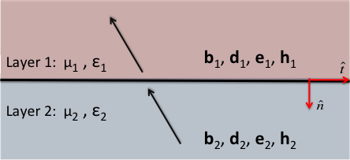

.. _maxwell1_fundamentals_interface_conditions_index:

Condições de Interfaces
=======================
.. purpose::
    Aqui, definimos as condições de interface para os campos :math:`\mathbf{e}` e :math:`\mathbf{h}`, bem como para os fluxos 
    :math:`\mathbf{j}`, :math:`\mathbf{d}` e :math:`\mathbf{b}` de acordo com Griffiths (:cite:`griffiths1999`). 
    Como mostraremos, as condições de interface em cada caso podem ser derivadas diretamente das equações de Maxwell em :ref:`na forma integral<integral_equations_time>`.

    Campos e fluxos através de uma interface horizontal de propriedades físicas. 

**Introdução**

Os campos e fluxos eletromagnéticos são descontínuos nas interfaces de propriedades físicas. Antes de resolver as equações de Maxwell para casos gerais, devemos ter condições de interface apropriadas para :math:`\mathbf{e}`, :math:`\mathbf{h}`, :math:`\mathbf{j}`, :math:`\mathbf{d}` e :math:`\mathbf{b}`. Aqui, mostramos as representações mais gerais das condições de interfaces para campos e fluxos eletromagnéticos. Eles estão tabulados abaixo e são válidos tanto no domínio do tempo quanto no domínio da frequência. As propriedades físicas em cada camada são permissividade dielétrica :math:`\varepsilon`, permeabilidade magnética :math:`\mu` e resistividade elétrica :math:`\rho`, que é o recíproco da condutividade elétrica 
(i. e. :math:`\rho = 1 / \sigma`).

+---------------------------------+------------------------------------------------------------+---------------------------------------------------------------+
|Propriedade                      | Componente normal                                          | Componente tangencial                                         |
+=================================+============================================================+===============================================================+
|:math:`\mathbf{e}`               |:math:`\varepsilon_1e_1^\perp-\varepsilon_2e_2^\perp=\tau_f`|:math:`e_1^\parallel-e_2^\parallel=0`                          |
+---------------------------------+------------------------------------------------------------+---------------------------------------------------------------+
|:math:`\mathbf{d}`               | :math:`d_1^\perp-d_2^\perp=\tau_f`                         |:math:`\varepsilon_2d_1^\parallel-\varepsilon_1d_2^\parallel=0`|
+---------------------------------+------------------------------------------------------------+---------------------------------------------------------------+
|:math:`\mathbf{j}` (steady-state)| :math:`j_1^\perp=j_2^\perp`                                |:math:`\rho_1j_1^\parallel-\rho_2 j_2^\parallel=0`             |
+---------------------------------+------------------------------------------------------------+---------------------------------------------------------------+
|:math:`\mathbf{h}`               |:math:`\mu_1h_1^\perp-\mu_2h_2^\perp=0`                     |:math:`h_1^\parallel-h_2^\parallel=K_f`                        |
+---------------------------------+------------------------------------------------------------+---------------------------------------------------------------+
|:math:`\mathbf{b}`               | :math:`b_1^\perp-b_2^\perp=0`                              |:math:`\mu_1^{-1} b_1^\perp- \mu_2^{-1}b_2^\perp=K_f`          |
+---------------------------------+------------------------------------------------------------+---------------------------------------------------------------+

	- **Componente normal** (:math:`\perp`): Componentes de campos ou fluxos perpendiculares a interface.
	- **Componente tangencial** (:math:`\parallel`): Componentes de campos ou fluxos tangenciais a interface.
	- **Densidade de carga de superfície livre** (:math:`\tau_f`): A carga de superfície livre por unidade de área na interface. Ocorre devido a descontinuidades na componente normal do deslocamento elétrico através da interface.
	- **Densidade de corrente de superfície** (:math:`K_f`): A corrente de superfície livre por unidade de área na interface. Ocorre devido a descontinuidades no componente tangencial do campo magnético na interface.

**Conteúdo**

.. toctree::
    :maxdepth: 2

    derivation
    

