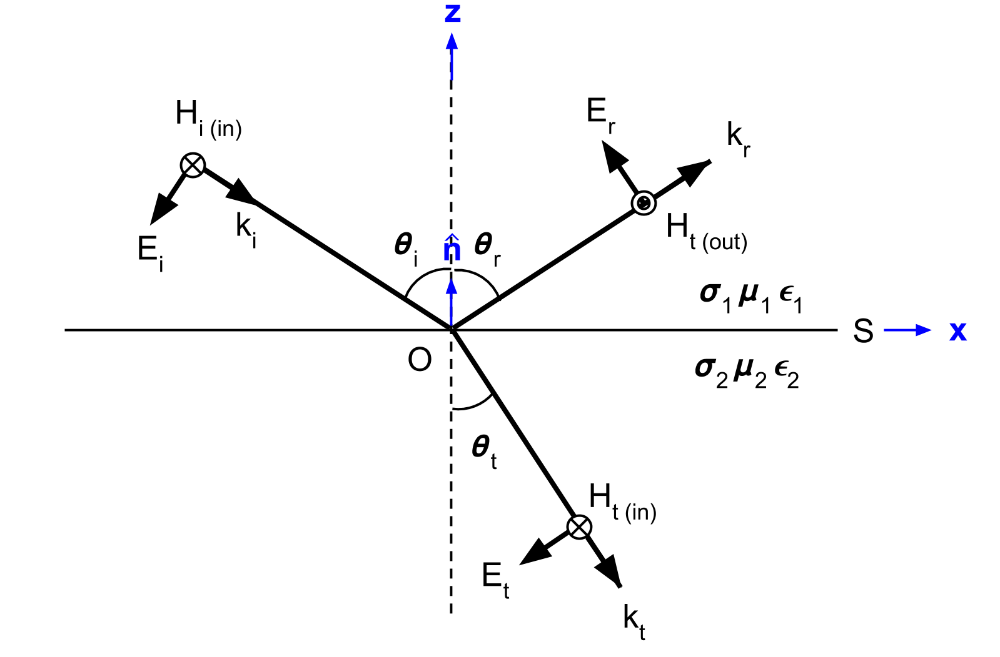

.. _Fresnel_equations:

Equações de Fresnel
===================

.. purpose::

    Aqui, apresentamos expressões matemáticas que relacionam a geometria e amplitudes das ondas EM nas interfaces. Isso é feito separando o
    onda incidente em dois modos: o modo TE e o modo TM.Uma descrição física de cada modo é apresentada junto com uma derivação subsequente.
    Como as equações de Fresnel permitem nos permitir inter-relacionar como as amplitudes fazem :math:`\mathbf{E}` e :math:`\mathbf{H}` através da interface.

Setup
-----

Aqui, vamos considerar uma reflexão e transmissão de uma onda plana uniforme, linearmente polarizada homogênea em uma interface horizontal

Aqui, consideraremos a reflexão e a transmissão de uma onda plana uniforme, linearmente polarizada e homogênea em uma interface horizontal (:numref:`fresnel_law_setup`). A onda incidente está confinada ao plano xz. A interface é denotada por :math:`S`, tem um vetor normal :math:`\mathbf{\hat n}` e separa dois meios homogêneas com propriedades físicas 
:math:`\sigma_1`, :math:`\mu_1`, :math:`\epsilon_1` e :math:`\sigma_2`, :math:`\mu _2`, :math:`\epsilon_2`.

Para a configuração em :numref:`fresnel_law_setup`, a onda incidente (:math:`k_i`) chega no ângulo :math:`\theta_i`. Uma vez que esta onda atinge a interface, ela se divide em duas partes, uma onda refletida (:math:`k_r`) e uma onda transmitida (:math:`k_t`). As ondas refletidas e transmitidas viajam em direções caracterizadas por ângulos :math:`\theta_r` e 
:math:`\theta_t`, respectivamente.

.. figure:: images/snellslaw_setup.png
   :align: center
   :figwidth: 70%
   :name: fresnel_law_setup

   Geometria da lei de Snell. Modificado de :cite:`ward1988` Figure 3.1.

As ondas eletromagnéticas seguem o princípio de superposição. Para simplificar a matemática associada ao nosso problema e derivar a equação de Fresnel, dividimos a onda EM de entrada em dois modos. O **modo TE** representa a porção da onda associada as componentes do campo elétrico paralelo à superfície (:numref:`fresnel_setup_TE`). O **modo TM** representa a porção da onda associada aos componentes do campo magnético que vêm paralelamente à superfície (:numref:`fresnel_setup_TM`).

.. note::

    Os modos são frequentemente chamados de modo "elétrico transversal" (denotado por TE ou TE:sub:`z`) e modo magnético transversal (denotado por TM ou TM:sub:`z`) porque o campo elétrico ou magnético é transversal a direção :math:`z`.

.. _Fresnel_equations_TE:

Equação de Fresnel para o Modo TE
---------------------------------

   As orientações relativas dos vetores :math:`\mathbf{E}`, :math:`\mathbf{H}` e :math:`\mathbf{k}` para reflexão em uma interface plana quando :math:`\mathbf{E}_i` é normal ao plano de incidência (paralelo à superfície S).

A geometria, no que se refere ao modo TE, é mostrada em :numref:`fresnel_setup_TE`. Para o modo TE, os coeficientes de reflexão e transmissão são dados por:

.. math::
    r_{TE} = \frac{\mathbf{E}_r}{\mathbf{E}_i} = \frac{\mu_2 u_1 - \mu_1 u_2}
    {\mu_2 u_1 + \mu_1 u_2}

.. math::
    t_{TE} = \frac{\mathbf{E}_t}{\mathbf{E}_i} = \frac{2\mu_2 u_1}
    {\mu_2 u_1 + \mu_1 u_2}

onde

.. math::
    u_1 = k_1 \text{cos} \theta_i

e

.. math::
    u_2 = (k_2^2-k_1^2 \text{sin}^2 \theta_i)^{1/2}

**Derivação**

A fim de relacionar a amplitude das ondas refletidas e transmitidas com a da onda incidente, devemod determinar os coeficientes de reflexão e transmissão para o modo TE, em que:

.. math::
    r_{TE} = \frac{\mathbf{E}_r}{\mathbf{E}_i}

.. math::
    t_{TE} = \frac{\mathbf{E}_t}{\mathbf{E}_i}

De acordo com a geometria ilustrada em :numref:`fresnel_setup_TE`, não há componentes de :math:`\mathbf{E}` junto com :math:`\mathbf{k}` e nenhum componente de :math:`\mathbf{E}` junto 
com :math:`\mathbf{\hat n}`. Desse modo:

.. math::
    \hat{\mathbf{n}} \cdot \mathbf{E_i} = \mathbf{k_i} \cdot \mathbf{E_i} = 0
    :label: eq_1_TE

e

.. math::
    \hat{\mathbf{n}} \cdot \mathbf{E_t} = \mathbf{\hat n} \cdot \mathbf{E_r} = 0
    :label: eq_2_TE

De acordo com as :ref:`condições da interface<maxwell1_fundamentals_interface_conditions_index>` declaradas em relações constitutivas, as componentes do campo elétrico paralelo à 
superfície :math:`S` são contínuas através da interface. Desse modo:

.. math::
    \mathbf{E}_i + \mathbf{E}_r = \mathbf{E}_t
    :label: TE_fresnel1

Aplicando a  :ref:`lei de Snell<Snells_law>` as Equações :eq:`eq_1_TE` e :eq:`eq_2_TE`, obtemo:

.. math::
	\text{cos} \theta_i \mathbf{E}_i - \text{cos} \theta_r \mathbf{E}_r
    = \frac{\mu_1 k_2}{\mu_2 k_1} \text{cos} \theta_t \mathbf{E}_t
    :label: TE_fresnel2

Rearranjando as Equações :eq:`TE_fresnel1` e :eq:`TE_fresnel2`, obtemos:

.. math::
    \mathbf{E}_r = \frac{\mu_2 k_1 \text{cos} \theta_i - \mu_1(k_2^2-k_1^2 \text{sin}^2 \theta_i)^{1/2}}
    {\mu_2 k_1 \text{cos} \theta_i + \mu_1(k_2^2-k_1^2 \text{sin}^2 \theta_i)^{1/2}} \mathbf{E}_i
    :label: TE_EiandEr

e

.. math::
    \mathbf{E}_t = \frac{2\mu_2 k_1 \text{cos} \theta_i}
    {\mu_2 k_1 \text{cos} \theta_i + \mu_1(k_2^2-k_1^2 \text{sin}^2 \theta_i)^{1/2}} \mathbf{E}_t
    :label: TE_EiandEt

onde

.. math::
    \text{cos}^2 \theta_t  = 1 - \text{sin}^2 \theta_t = 1-\Big(\frac{k_1}{k_2}\Big) \text{sin}^2 \theta_i

Os coeficientes de reflexão e transmissão o modo  TE pode ser escrito como:

.. math::
    r_{TE} = \frac{\mathbf{E}_r}{\mathbf{E}_i}
           = \frac{\mu_2 k_1 \text{cos} \theta_i - \mu_1(k_2^2-k_1^2 \text{sin}^2 \theta_i)^{1/2}}
    {\mu_2 k_1 \text{cos} \theta_i + \mu_1(k_2^2-k_1^2 \text{sin}^2 \theta_i)^{1/2}}
    :label: rTE_theta

.. math::
    t_{TE} = \frac{\mathbf{E}_t}{\mathbf{E}_i}
           = \frac{2\mu_2 k_1 \text{cos} \theta_i}
    {\mu_2 k_1 \text{cos} \theta_i + \mu_1(k_2^2-k_1^2 \text{sin}^2 \theta_i)^{1/2}}
    :label: tTE_theta

Substituindo o seguinte:

.. math::
    u_1 = k_1 \text{cos} \theta_i
    :label: u1

.. math::
    u_2 = (k_2^2-k_1^2 \text{sin}^2 \theta_i)^{1/2}
    :label: u2

:math:`r_{TE}` e :math:`t_{TE}` pode ser escrito como:

.. math::
    r_{TE} = \frac{\mu_2 u_1 - \mu_1 u_2}
    {\mu_2 u_1 + \mu_1 u_2}
    :label: rTE_u

.. math::
    t_{TE} = \frac{2\mu_2 u_1}
    {\mu_2 u_1 + \mu_1 u_2}
    :label: tTE_u

.. note::

    Na forma final de :math:`r_{TE}` e :math:`t_{TE}` mostrados nas Equações :eq:`rTE_u` e :eq:`tTE_u`, a informação angular é fundida em :math:`u_1` e :math:`u_2`, que são números de onda escalares na direção :math:`z`. Ou seja, a componente horizontal do número de onda não causa nenhum impacto para determinar :math:`r_{TE}` e :math:`t_{TE}`, e isso é conduzido pelo campo elétrico transversal para direção :math:`z`.

.. _Fresnel_equations_TM:

Equação de Fresnel para o Modo TM
---------------------------------

A geometria, no que se refere ao modo TM, é mostrada em :numref:`fresnel_setup_TM`. Para o modo TM, os coeficientes de reflexão e transmissão são dados por:

   As orientações relativas dos vetores :math:`\mathbf{E}`, :math:`\mathbf{H}` e :math:`\mathbf{k}` para reflexão em uma interface plana quando :math:`\mathbf{H}_i` é paralela à superfície.

.. math::
    r_{TM} = \frac{\mu_2 u_2 k_1^2 - \mu_1 u_1 k_2^2}
    {\mu_2 u_2 k_1^2 + \mu_1 u_1 k_2^2}

.. math::
    t_{TM} = \frac{2\mu_1 u_1 k_2^2}
    {\mu_2 u_2 k_1^2 + \mu_1 u_1 k_2^2}

onde

.. math::
    u_1 = k_1 \text{cos} \theta_i

e

.. math::
    u_2 = (k_2^2-k_1^2 \text{sin}^2 \theta_i)^{1/2}

**Derivação**

A fim de relacionar a amplitude das ondas refletidas e transmitidas com a da onda incidente, exigimos coeficientes de reflexão e transmissão para o modo TM, onde:

.. math::
    r_{TM} = \frac{\mathbf{H_r}}{\mathbf{H_i}} = \frac{\hat{\mathbf{n}}\times \mathbf{E}_r}{\hat{\mathbf{n}}\times \mathbf{E}_i}
    :label: rTM

.. math::
    t_{TM} = \frac{\mathbf{H_t}}{\mathbf{H_i}} = \frac{\hat{\mathbf{n}}\times \mathbf{E}_t}{\hat{\mathbf{n}}\times \mathbf{E}_i}
    :label: tTM

De acordo com a geometria ilustrada em :numref:`fresnel_setup_TM`, não há componentes de :math:`\mathbf{H}` junto com :math:`\mathbf{k}` e nenhuma componente de 
:math:`\mathbf{H}` junto com :math:`\mathbf{\hat n}`. Desse modo:

.. math::
    \hat{\mathbf{n}} \cdot \mathbf{H}_i = \mathbf{k}_i \cdot \mathbf{H}_i = 0
    :label: eq_1_TM

e

.. math::
    \hat{\mathbf{n}} \cdot \mathbf{H}_t = \hat{\mathbf{n}} \cdot \mathbf{H}_r = 0
    :label: eq_2_TM

De acordo com as :ref:`condições da interface<maxwell1_fundamentals_interface_conditions_index>` declaradas em relações constitutivas, as componentes do campo magnético paralelo à superfície :math:`S` são contínuas na interface. Desse modo:

.. math::
    \mathbf{H}_i + \mathbf{H}_r = \mathbf{H}_t.
    :label: TM_fresnel1

E aplicando :ref:`a lei de Snell<Snells_law>` as Equações :eq:`eq_1_TM` e :eq:`eq_2_TM`, obtemos:

.. math::
    \text{cos} \theta_i \mathbf{H}_i - \text{cos} \theta_r \mathbf{H}_r
    = \frac{\mu_1 k_2}{\mu_2 k_1} \text{cos} \theta_t \mathbf{H}_t
    :label: TM_fresnel2

Rearranjando as Equações :eq:`TM_fresnel1` e :eq:`TM_fresnel2`, obtemos:

.. math::
    \mathbf{H}_r = -\frac{\mu_2 k_1(k_2^2-k_1^2 \text{sin}^2 \theta_i)^{1/2}  - \mu_1k_2^2 \text{cos} \theta_i}
    {\mu_2 k_1(k_2^2-k_1^2 \text{sin}^2 \theta_i)^{1/2}  + \mu_1k_2^2 \text{cos} \theta_i} \mathbf{H}_i
    :label: TM_HiandHr

.. math::
    \mathbf{H}_t = \frac{2 \mu_1k_2^2 \text{cos} \theta_i}
    {\mu_2 k_1(k_2^2-k_1^2 \text{sin}^2 \theta_i)^{1/2}  + \mu_1k_2^2 \text{cos} \theta_i} \mathbf{H}_i
    :label: TM_HiandHt

em que 

.. math::
    \text{cos}^2 \theta_t  = 1 - \text{sin}^2 \theta_t = 1-\Big(\frac{k_1}{k_2}\Big) \text{sin}^2 \theta_i

Assim, os coeficientes de reflexão e transmissão para o modo TM podem ser escritos como:

.. math::
    r_{TM} = \frac{\hat{\mathbf{n}}\times \mathbf{E}_t}{\hat{\mathbf{n}}\times \mathbf{E}_i}
           = - \frac{\mathbf{H}_r}{\mathbf{H}_i}
           = \frac{\mu_2 k_1(k_2^2-k_1^2 \text{sin}^2 \theta_i)^{1/2}  - \mu_1k_2^2 \text{cos} \theta_i}{\mu_2 k_1(k_2^2-k_1^2 \text{sin}^2 \theta_i)^{1/2}  + \mu_1k_2^2 \text{cos} \theta_i}
    :label: rTM_theta

.. math::
    t_{TM} = \frac{\hat{\mathbf{n}}\times \mathbf{E}_t}{\hat{\mathbf{n}}\times \mathbf{E}_i}
           = \frac{\mathbf{H}_t}{\mathbf{H}_i}
           = \frac{2 \mu_1k_2^2 \text{cos} \theta_i}{\mu_2 k_1(k_2^2-k_1^2 \text{sin}^2 \theta_i)^{1/2}  + \mu_1k_2^2 \text{cos} \theta_i}
    :label: tTM_theta

Substitutindo estas com as Equações :eq:`u1` e :eq:`u2` teremos:

.. math::
    r_{TM} = \frac{\mu_2 u_2 k_1^2 - \mu_1 u_1 k_2^2}
    {\mu_2 u_2 k_1^2 + \mu_1 u_1 k_2^2}
    :label: rTM_u

.. math::
    t_{TM} = \frac{2\mu_1 u_1 k_2^2}
    {\mu_2 u_2 k_1^2 + \mu_1 u_1 k_2^2}
    :label: tTM_u

.. question::

    - Definimos o coeficiente de reflexão do modo TM :math:`r_{TM}` como a razão entre o campo elétrico tangencial de incidência e a reflexão como mostrado na Equação :eq:`rTM`.  No entanto, derivamos a proporção de :math:`\mathbf{H}_i` e :math:`\mathbf{H}_r` então multiplicamos por -1 para obter :math:`r_{TM}`, por que isso?  (Dica: veja a direção de :math:`\mathbf{E}` e :math:`\mathbf{H}` em :numref:`fresnel_setup_TM`).

Equações de Fresnel Equations para Incidência Normal
^^^^^^^^^^^^^^^^^^^^^^^^^^^^^^^^^^^^^^^^^^^^^^^^^^^^

uando a incidência é normal (:math:`\theta_i` =0), as Equações :eq:`rTE_u` e :eq:`rTM_u` podem ser reduzidas para:

.. math::

    r_{TE} = r_{TM} = \frac{\mu_2 k_1 - \mu_1 k_2} {\mu_2 k_1 + \mu_1 k_2}

