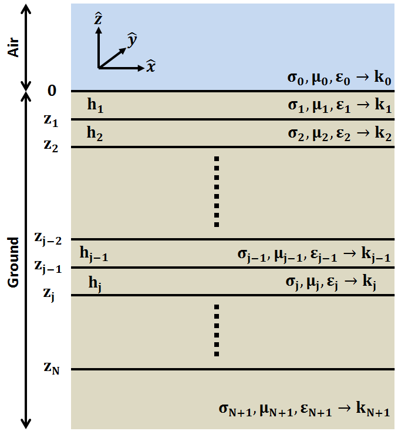
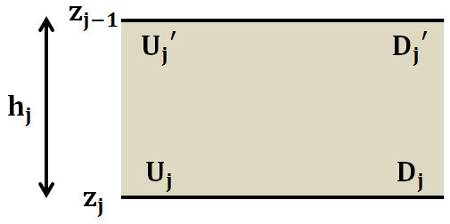

.. _impedance_layeredearth:

Ondas Planas em uma Terra com N Camadas
=======================================

.. purpose::

    Aqui, consideramos um caso especial da solução de onda plana para uma Terra com N camadas. Nossa derivação segue aquela encontrada em 
    :cite:`ward1988`. Este exemplo é um primeiro passo para entender como a estrutura da Terra e as propriedades físicas impactam os campos elétricos e magnéticos medidos na superfície.

   Geometria para o caso de N camadas.

Considere as ondas planas ascendentes e descendentes que normalmente incidem em uma Terra isotrópica com N camadas. Assumiremos que os campos elétricos associados a essas ondas são polarizados ao longo da direção :math:`x`; assim, os campos magnéticos são polarizados ao longo da direção :math:`y`. A seguir, desenvolveremos um esquema para determinar os campos elétricos e magnéticos em qualquer uma das camadas. Além disso, iremos caracterizar a relação entre os componentes perpendiculares do campo elétrico e magnético na superfície da Terra.

Campos na j-ésima camada
------------------------

Na j-ésima camada, temos ondas ascendentes e descendentes resultantes de transmissões e reflexos dentro da Terra. O campo elétrico tem a seguinte forma:

   Notação para ondas ascendentes e descendentes na camada j.

.. math::
	E_{x,j}(\omega ,z) = U_j e^{-ik_j (z-z_j)} + D_j e^{ik_j (z-z_j)}
	:label: E_j

onde :math:`z_j` denota a localização inferior da j-ésima camada.  :math:`U_j` e :math:`D_j` são amplitudes de campo elétrico da onda ascendente e descendente na parte inferior da j-ésima camada, respectivamente. De acordo com a teoria apresentada para :ref:`Ondas EM em meios homogêneos<harmonic_planewaves_homogeneous_derivation>`, a relação entre o campo elétrico e o campo magnético é dada por:

.. math::
	\frac{\partial E_x}{\partial z} + i\omega \mu H_y = 0
	:label:

Como um resultado, o campo magnético na j-ésima camada é dado por

.. math::
	H_{y,j} (\omega ,z) = \frac{1}{Z_j} \bigg [ U_j e^{-ik_j (z-z_j)} - D_j e^{ik_j (z-z_j)} \bigg ]
	:label: H_j

onde a :ref:`impedância de onda<harmonic_planewaves_homogeneous_impedancephase>` para a camada :math:`j` é dado por:

.. math::
	Z_j = \frac{\omega \mu_j}{k_j}
	:label:

Usando as Equações :eq:`E_j` and :eq:`H_j`, os campos elétricos e magnéticos na parte inferior da j-ésima camada podem ser representados usando o sistema a seguir.Onde :math:`z = z_j`:

.. math::
	\begin{bmatrix} E_{x,j} \\ H_{y,j} \end{bmatrix} \Bigg |_{z=z_j} = \begin{bmatrix} 1 & 1 \\ \frac{1}{Z_j} & -\frac{1}{Z_j} \end{bmatrix} \begin{bmatrix} U_j \\ D_j \end{bmatrix} = \mathbf{P_j} \begin{bmatrix} U_j \\ D_j \end{bmatrix}
	:label: Fields_bottom

Em qualquer local dentro da camada, os campos elétricos e magnéticos são dados por:

.. math::
	\begin{bmatrix} E_{x,j} \\ H_{y,j} \end{bmatrix} = \begin{bmatrix} 1 & 1 \\ \frac{1}{Z_j} & -\frac{1}{Z_j} \end{bmatrix} \begin{bmatrix} e^{-ik_j (z-z_j)} & 0 \\ 0 & e^{ik_j(z-z_j)} \end{bmatrix} \begin{bmatrix} U_j \\ D_j \end{bmatrix}
	:label: Fields_j

As amplitudes do campo elétrico no topo da j-ésima camada (:math:`U_j^\prime` e :math:`D_j^\prime`), pode ser determinadas de :math:`U_j` e :math:`D_j` usando as seguintes expressões:

.. math::
	\begin{bmatrix} U_j^\prime \\ D_j^\prime \end{bmatrix} = \begin{bmatrix} e^{-ik_j h_j} & 0 \\ 0 & e^{ik_j h_j} \end{bmatrix} \begin{bmatrix} U_j \\ D_j \end{bmatrix} = \boldsymbol{\Lambda_j} \begin{bmatrix} U_j \\ D_j \end{bmatrix}
	:label: Amps_layer

onde :math:`h_j` é a espessura da j-ésima camada. Agora que relacionamos os campos e amplitudes entre si em uma camada específica, como podemos resolver os campos em uma camada se apenas os campos em uma camada diferente são conhecidos.

Condições de Interfaces
-----------------------

Vamos supor que conhecemos as amplitudes do campo elétrico :math:`U_{j+1}` e :math:`D_{j+1}`. Queremos encontrar as amplitudes das ondas na j-ésima camada ( :math:`U_{j}` e :math:`D_{j}`) para que possamos encontrar os campos de acordo com a Equação :eq:`Fields_j`.

De acordo com as condições de interface correspondentes às ondas planas, os componentes do :ref:`campo elétrico<Fresnel_equations_TE>` paralelo à interface são contínuos. O mesmo é verdade para o :ref:`campo magnético<Fresnel_equations_TM>`. Assim, em :math:`z = z_j`:

.. math::
	\begin{bmatrix} E_{x,j} \\ H_{y,j} \end{bmatrix} \Bigg |_{z=z_j} = \mathbf{P_j} \begin{bmatrix} U_j \\ D_j \end{bmatrix} = \mathbf{P_{j+1}} \begin{bmatrix} U_{j+1}^\prime \\ D_{j+1}^\prime \end{bmatrix}
	:label: Uj

Usando as Equações :eq:`Fields_bottom`, :eq:`Amps_layer` e :eq:`Uj`, podemos relacionar os campos elétrico e magnético no topo da camada j+1 àqueles no topo da camada j:

.. math::
	\begin{bmatrix} E_{x,j} \\ H_{y,j} \end{bmatrix} \Bigg |_{z=z_{j-1}} = \mathbf{P_j} \boldsymbol{\Lambda_j} \mathbf{P_j^{-1}} \begin{bmatrix} E_{x,j+1} \\ H_{y,j+1} \end{bmatrix} = \mathbf{T_j} \begin{bmatrix} E_{x,j+1} \\ H_{y,j+1} \end{bmatrix} \Bigg |_{z=z_j}
	:label:

Da mesma forma, as amplitudes do campo elétrico no topo da camada j e no topo da camada j+1 estão relacionados por:

.. math::
	\begin{bmatrix} U_j^\prime \\ D_j^\prime \end{bmatrix} = \boldsymbol{\Lambda_j} \mathbf{P_j^{-1}} \mathbf{P_{j+1}} \begin{bmatrix} U_{j+1}^\prime \\ D_{j+1}^\prime \end{bmatrix} = \mathbf{S_j} \begin{bmatrix} U_{j+1}^\prime \\ D_{j+1}^\prime \end{bmatrix}
	:label:

Solução Recursiva para N-camadas
--------------------------------

Consideremos o caso em que estamos na superfície da Terra e medimos as componentes perpendiculares dos campos elétrico e magnético; ou seja 
:math:`E_{x,0}` e :math:`H_{y,0}` em :math:`z=0`. De acordo com as condições de interface, elas são idênticas aos campos elétrico e magnético no topo da camada 1; ou seja :math:`E_{x,1}` e :math:`H_{y,1}` em :math:`z=0`. Em termos de ampliação do campo elétrico ascendente e descendente:

.. math::
	\begin{bmatrix} E_{x} \\ H_{y} \end{bmatrix} \Bigg |_{z=0} = \mathbf{P_1} \begin{bmatrix} U_1^\prime \\ D_1^{\, \prime} \end{bmatrix}
	:label:

Em termos de ondas ascendentes e descendentes na camada 2, a expressão anterior pode ser reescrita como:

.. math::
	\begin{bmatrix} E_{x} \\ H_{y} \end{bmatrix} \Bigg |_{z=0} = \mathbf{P_1 S_1} \begin{bmatrix} U_2^\prime \\ D_2^{\, \prime} \end{bmatrix}
	:label:

Este processo pode ser repetido para cada camada. Em última análise, os campos elétricos e magnéticos na superfície da Terra podem ser expressos como:

.. math::
	\begin{bmatrix} E_{x} \\ H_{y} \end{bmatrix} \Bigg |_{z=0} = \mathbf{P_1} \prod_{j=1}^N \mathbf{S_j} \begin{bmatrix} 0 \\ D_{N+1}^{\, \prime} \end{bmatrix} = \mathbf{M} \begin{bmatrix} 0 \\ D_{N+1}^{\, \prime} \end{bmatrix}
	:label:

Observe como não há onda ascendente no meio inferior. Isso faz sentido supondo que não haja nenhuma fonte ou refletor capaz de criar um sinal de retorno. Se amalgamarmos o produto de todas as matrizes em uma única matriz :math:`\mathbf{M}`, então:

.. math::
	E_x \big |_{z=0} = M_{12} D_{N+1}^{\, \prime}
	:label:

e

.. math::
	H_y \big |_{z=0} = M_{22} D_{N+1}^{\, \prime}
	:label:

As relações entre :math:`E_x` e :math:`H_y` na superfície da Terra é desta foema dada por:

.. math::
	Z = \frac{E_x}{H_y} = \frac{M_{12}}{M_{22}}
	:label: impedance_Earth

A Equação :eq:`impedance_Earth` nos diz que a relação entre as componentes perpendiculares dos campos elétricos e magnéticos na superfície da Terra, em uma determinada frequência, dependem das propriedades físicas de todas as camadas. No entanto, a natureza exponencial das matrizes 
:math:`\boldsymbol{\Lambda_j}` dentro de :math:`\mathbf{S_j}` sugere que o impacto de camadas mais profundas em :math:`Z` é menor do que para as camadas rasas. Este resultado é muito importante quando se considera :ref:`métodos magnetotelúricos (MT)<mt_index>`.

**Impedância para um semi-espaço**

No caso em que a Terra é um semi-espaço homogêneo:

.. math::
	\mathbf{M} = \mathbf{P_1} = \begin{bmatrix} 1 & 1 \\ \frac{1}{Z_1} & -\frac{1}{Z_1} \end{bmatrix}
	:label:

onde

.. math::
	Z_1 = \frac{\omega \mu_1}{k_1}
	:label:

e assim:

.. math::
	\frac{E_x}{H_y} = \frac{M_{12}}{M_{22}} = - \frac{\omega\mu_1}{k_1} = -\frac{\omega \mu_1}{\sqrt{-i\omega\mu_1\sigma_1 + \omega^2\mu_1\varepsilon_1}} = \begin{cases} -\sqrt{\dfrac{i\omega\mu_1}{\sigma_1}} \;\; \textrm{for} \;\; \sigma \gg \omega\varepsilon \\ -\sqrt{\dfrac{\mu_1}{\varepsilon_1}} \;\;\;\;\,\;\; \textrm{for} \;\; \sigma \ll \omega\varepsilon \end{cases}
	:label:

O significado físico disso foi explicado durante o material sobre :ref:`impedância e fase<harmonic_planewaves_homogeneous_impedancephase>` para ondas planas em meios homogêneos.

