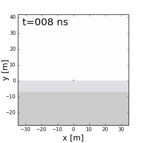

.. _reflection_and_refraction_index:

Ondas Planas nas Interfaces
===========================

.. purpose::

    Aqui, fornecemos teoria para descrever o comportamento das ondas planas à medida que atingem interfaces de propriedades físicas. Reflexão, refração e transmissão são discutidas.

   Reflexão, refração e transmissão de um sinal de radar de penetração de solo (GPR).

**Introdução**

Quando as ondas EM atingem uma interface caracterizada por uma mudança abrupta nas propriedades físicas, partes do sinal sofrem reflexão, refração e transmissão. Em :numref:`reflections_example_index`, mostramos esses comportamentos para um sinal de :ref:`radar de penetração no solo<gpr_index>`. Uma compreensão fundamental de reflexão, refração e transmissão pode ser obtida considerando ondas planas. Aqui, fornecemos uma teoria que descreve o comportamento das ondas planas conforme elas interagem com interfaces de propriedades físicas. Aplicativos de modelagem numérica são fornecidos para simular esses comportamentos.

**Organização**

O conteúdo desta parte é organizado em 3 partes:

	- :ref:`Reflexão e lei de Snell<Snells_law>`: Define a relação entre as direções de propagação das ondas EM incidentes, refletidas e refratadas.
	- :ref:`Equações de Fresnel<Fresnel_equations>`: Define as relações entre as direções de propagação e amplitudes das ondas EM incidentes, refletidas, refratadas e transmitidas.
	- :ref:`Terra N-camadas<impedance_layeredearth>`: Depois de caracterizar o comportamento das ondas planas em uma única interface, estendemos a teoria para um modelo terrestre em camadas.

**Conteúdo**

.. toctree::
    :maxdepth: 2

    Snells_law
    Fresnel_equations
    impedance_layeredearth

