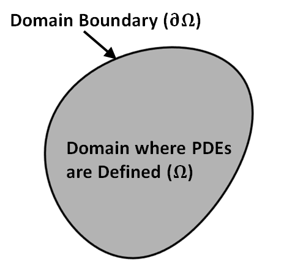
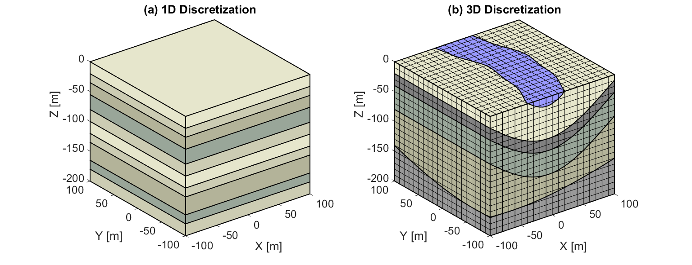

.. _solving_maxwells_equations:

Solucionando as Equações de Maxwell
===================================

.. purpose::

    Aqui, fornecemos uma visão geral sobre como resolver as equações de Maxwell na prática. As abordagens usadas para resolver problemas específicos são abordadas posteriormente

    
A prática de resolver as equações de Maxwell para um problema aplicado pode ser dividida em três partes:

     1) **Definindo o problema:** aqui, as equações de Maxwell são modificadas, reformuladas ou aproximadas para se adequar a um problema físico particular.
     2) **Definindo o limite e as condições iniciais:** são invocados para que as soluções das equações de Maxwell sejam resolvidas exclusivamente para uma aplicação particular.
     3) **Resolução com abordagens analíticas ou numéricas:** uma vez que o problema, as condições de contorno e as condições iniciais tenham sido definidas, a solução final é obtida através de abordagens analíticas ou numéricas.

.. _solving_maxwells_equations_problem:

Definindo o Problema
--------------------

Em ":ref:`quick_guide_maxwell`", apresentamos formulações gerais para as equações de Maxwell. Na maioria dos casos, entretanto, as equações de Maxwell podem ser modificadas, reformuladas ou aproximadas para simplificar um problema aplicado. A falha em escolher uma formulação apropriada pode resultar na dificuldade ou impossibilidade de resolver o problema usando os meios atuais.

**Examplos:**

- :ref:`DC Resistivity:<dcr_index>`

.. math::
	\begin{align}
	\nabla \cdot \sigma \phi &= \nabla \cdot \mathbf{J_s}\\
	\mathbf{E} =& - \nabla \phi
	\end{align}

onde :math:`\mathbf{J_s}` é uma fonte de corrente elétrica e :math:`\phi` é um potencial escalar.

- :ref:`Frequency Domain Electromagnetics:<airborne_fdem_index>`

.. math::
	\begin{align}
	\nabla\times \mu^{-1} \nabla\times\mathbf{E} + i\omega \sigma \mathbf{E} -& \omega^2 \varepsilon \mathbf{E} = - i\omega \mathbf{J_s}\\
	\nabla\times\mathbf{E} + i\omega \mathbf{B} &= 0
	\end{align}

onde :math:`\mathbf{J_s}` é uma fonte de corrente elétrica. Para alguns problemas, podemos ser capazes de trabalhar nos regimes quase estáticos 
(:math:`\sigma \gg \omega \varepsilon`) ou onda (:math:`\sigma \ll \omega \varepsilon`); permitindo-nos negligenciar os termos envolvendo 
:math:`\varepsilon`. Em muitos ambientes geológicos, o impacto das propriedades magnéticas da Terra é insignificante (ou seja :math:`\mu \approx \mu_0`). Neste caso, podemos tirar :math:`\mu` do sistema curl-curl. No caso de uma fonte magnética, precisaríamos resolver um sistema diferente.

- :ref:`Métodos Eletromagnéticos no Domínio do Tempo:<airborne_tdem_index>`

.. math::
	\begin{align}
	\nabla\times \mu^{-1} \nabla\times\mathbf{e} + \sigma \frac{\partial \mathbf{e}}{\partial t} +& \varepsilon \frac{\partial^2 \mathbf{e}}{\partial t^2}= - \frac{\partial \mathbf{j_s}}{\partial t}\\
	\nabla\times\mathbf{e} + \frac{\partial \mathbf{b}}{\partial t} &= 0
	\end{align}

onde :math:`\mathbf{j_s}` é uma fonte de corrente elétrica. Esta equação é o equivalente dependente do tempo àquela usada em métodos eletromagnéticos no domínio da frequência. Para alguns problemas, podemos ser capazes de trabalhar nos regimes quase estáticos ou de onda; permitindo-nos negligenciar os termos envolvendo 
:math:`\varepsilon`. Se o impacto das propriedades magnéticas da Terra for insignificante (ou seja :math:`\mu \approx \mu_0`), podemos tirar 
:math:`\mu` do sistema curl-curl. No caso de uma fonte magnética, precisaríamos resolver um sistema diferente.

Condições Iniciais e de Contornos
---------------------------------

Condições de Fronteiras
^^^^^^^^^^^^^^^^^^^^^^^

		Ilustração de um domínio e contorno.

As condições de contornos garantem que o problema seja bem posto; ou seja, tem uma solução única. Isso é necessário ao usar as equações de Maxwell para resolver problemas aplicados em geociências eletromagnéticas. Equações diferenciais correspondentes a um problema físico são definidas dentro de uma região, ou "domínio" (denotado por :math:`\Omega`). Para colocar o problema bem colocado, as condições de contorno são aplicadas às arestas deste domínio (denotadas por 
:math:`\partial \Omega`). Existem três tipos de condições de limite, que estão listados abaixo:

**Condições de Contornos de Dirichlet:** As condições de contorno de Dirichlet são de longe as mais diretas e fáceis de implementar. As condições de Dirichlet definem diretamente o valor da solução no limite, ou seja:

.. math::
	 \mathbf{F(r)} \, \Big |_{\partial \Omega} = \mathbf{g(r)}

onde :math:`\mathbf{F}` é algum vetor campo/fluxo definido dentro do domínio, :math:`\mathbf{g}` é uma função espacialmente dependente e :math:`\mathbf{r} = (x,y,z)`. Em muitos casos, a condição de Dirichlet é fornecida como um valor constante; como, todos os campos vão para zero no limite.

**Condições de Contornos de Neumann:** As condições de contorno de Neumann são impostas especificando as derivadas espaciais da solução no contorno. Comumente, as condições de Neumann definem as derivadas direcionais normais à superfície do domínio, ou seja:

.. math::
	\frac{\partial F_n}{\partial \mathbf{n}} \bigg |_{\partial \Omega} = \mathbf{g(r)}

onde :math:`\mathbf{n}` é a direção do vetor unitário perpendicular a fronteira do domínio :math:`\partial \Omega`, :math:`F_n = \mathbf{F \cdot \hat n}\;` é a componente de um campo vetorial/fluxo :math:`\mathbf{F}` ao longo :math:`\mathbf{n}`, :math:`\mathbf{g}` é uma função espacialmente dependente e 
:math:`\mathbf{r} = (x,y,z)`. Fisicamente, as condições de Neumann são usadas para definir a taxa de fluxo através da fronteira. Isso é frequentemente aplicado a problemas que se comportam de acordo com a equação de calor.

**Condições de Contorno de Robin (Mista):** As condições de contorno de Robin são uma combinação linear das condições de Dirichlet e Neumann, ou seja:

.. math::
	\bigg [ a\mathbf{F(r)} + b\frac{\partial F_n}{\partial \mathbf{n}} \bigg ] \Bigg |_{\partial \Omega} = \mathbf{g(r)}

onde :math:`a` e :math:`b` são constantes, :math:`\mathbf{n}` é a direção do vetor unitário perpendicular a fronteira do domínio :math:`\partial \Omega`, 
:math:`F_n = \mathbf{F \cdot \hat n}\;` é a componente de um campo/fluxo vetorial :math:`\mathbf{F}` junto com :math:`\mathbf{n}`, :math:`\mathbf{g}` é uma função espacialmente dependente e :math:`\mathbf{r} = (x, y, z)`. As condições de Robin são usadas quando a taxa de fluxo que sai do domínio depende do valor do campo na fronteira.

Condições Iniciais
^^^^^^^^^^^^^^^^^^

As condições iniciais, além das condições de contorno, são necessárias para resolver problemas dependentes do tempo. Como as soluções para problemas nas ciências físicas são causais, os campos e fluxos em um determinado momento dependem dos campos e fluxos em momentos anteriores. Geralmente, definimos as condições iniciais para definir a solução em :math:`t=0` e estamos interessados no comportamento dos campos e fluxos em :math:`t \geq 0`. Se a equação diferencial sendo resolvida tem apenas derivadas de primeira ordem no tempo, as condições iniciais podem ser dadas por:

.. math::
	\mathbf{F}(\mathbf{r},t) \big |_{t=0} = \mathbf{F_0}(\mathbf{r})

onde :math:`\mathbf{F}` é o vetor campo/fluxo e :math:`\mathbf{F_0}` é o vetor campo/fluxo em :math:`t=0`. Este tipo de condição seria necessário para resolver a equação eletromagnética no domínio do tempo apresentada em ":ref:`solving_maxwells_equations_problem` ".

**Variáveis ​​múltiplas e derivadas no tempo de ordem superior**

Se a equação diferencial contém múltiplas variáveis ​​e derivadas no tempo de ordem superior, não podemos resolver o problema simplesmente definindo as condições iniciais nos campos/fluxos em :math:`t = 0`. Onde :math:`k` é a derivada no tempo de ordem mais alta encontrada no problema e :math:`n` é o número de variáveis ​​dependentes do tempo, exigiríamos :math:`nk` condições iniciais totais para resolver o problema. Essas condições iniciais assumiriam a forma:

.. math::
	\frac{\partial^k \mathbf{F}}{\partial t^k} \bigg |_{t=0} = \mathbf{g^k(r)}

onde :math:`\mathbf{F}` é o campo vetorial/fluxo associado à variável :math:`n`, e :math:`\mathbf{g^k}` é uma função dependente do tempo definida em todo o domínio para a derivada :math:`k^{j}`. Um exemplo disso é a equação de onda dependente do tempo apresentada em ":ref:`solving_maxwells_equations_problem`", 
que requer condições iniciais em :math:`\mathbf{e}` e sua derivada de tempo de primeira ordem :math:`\partial \mathbf{e}/ \partial t`.

Soluções Numéricas e Analíticas
-------------------------------

Tendo formulado as equações de Maxwell apropriadamente, bem como implementado as condições de contorno e as condições iniciais, podemos agora resolver o problema. Existem duas maneiras de obter soluções significativas: analiticamente e numericamente.

Soluções Analíticas
^^^^^^^^^^^^^^^^^^^

Idealmente, alguém derivaria uma solução analítica. O problema se torna ainda mais tratável se a solução for uma expressão de forma fechada; pode ser avaliada usando um número finito de operações simples. Geralmente, as soluções analíticas só são possíveis se o problema for simplificado ou exibir um grau suficiente de simetria geométrica. Preferimos soluções analíticas porque são rápidas de calcular e mostram explicitamente como a solução depende de suas variáveis de entrada.

Algumas soluções podem ser chamadas de **semi-analíticas**. Soluções semi-analíticas geralmente requerem a avaliação numérica de uma ou mais funções integrais, séries infinitas e/ou limites. Nesse caso, a solução não é uma expressão de forma fechada. No entanto, as soluções semi-analíticas podem ser muito úteis na prática.

Soluções Numéricas
^^^^^^^^^^^^^^^^^^

Soluções numéricas são usadas para aproximar os campos e fluxos a um nível desejado de precisão. As abordagens numéricas são capazes de resolver problemas sem depender de simetrias geométricas. O processo de obtenção de uma solução numérica pode ser dividido em três partes:

1) **Discretizando o Domínio**
2) **Definindo Campos e Fluxos**
3) **Aplicação de algoritmos de computador**

Uma compreensão conceitual das etapas acima mencionadas será fornecida aqui. No entanto, não apresentaremos todos os antecedentes necessários para resolver esses problemas na prática; como é extenso.

**Discretização do Domínio:**

Para obter uma solução numérica, o domínio é primeiro discretizado; ou seja, subdividido em uma coleção de pequenos volumes/regiões. A coleção desses volumes é chamada de 'malha'. As propriedades físicas dentro de cada volume são consideradas constantes. O tamanho e a forma de cada volume dependem da geometria do problema, do tamanho do domínio e da quantidade de memória disponível no computador. Em :numref:`fig_solving_maxwells_discretization` a, vemos uma discretização 1D. A discretização 1D funciona bem quando, localmente, a Terra exibe uma estrutura em camadas. Para problemas com geometrias irregulares, podemos escolher usar uma discretização 2D ou 3D (:numref:`fig_solving_maxwells_discretization` b). Via de regra, quanto mais fina a discretização (conforme as dimensões das células diminuem), melhor nossa solução numérica se aproximará da verdadeira solução do nosso problema.

		Discretizaçõa da estrutura da Terra. (a) Discretização 1D. (b) Discretização 3D.

**Definindo Campos, Fluxos e Potenciais**

.. figure:: images/Yee-cube-w-b.png
	:align: right
	:figwidth: 50%
	:name: fig_solving_maxwells_cube
	
	Definição de campos (:math:`\mathbf{E}`), fluxos (:math:`\mathbf{B}`) e potenciais :math:`\phi` sobre uma célula cúbica.

Os campos, fluxos e/ou potenciais pertencentes a um problema particular são definidos em todo o domínio. Uma vez que o domínio foi discretizado, entretanto, a avaliação dessas quantidades só é possível em um número finito de locais. Os campos, fluxos e/ou potenciais sendo calculados dependem da formulação das equações de Maxwell. As localizações dessas quantidades para cada célula dependem do problema e das condições de interface correspondentes.

Como exemplo, considere :numref:`fig_solving_maxwells_cube` onde:

- o potencial :math:`\phi` é definido nos nós da célula.
- componentes cartesianas do campo elétrico :math:`\mathbf{E}` são definidas nas bordas da célula.
- componentes cartesianas da densidade do fluxo magnético :math:`\mathbf{B}` são definidas nas faces das células.
- propriedades físicas :math:`\sigma` e :math:`\mu` são definidas nos centros das células.

Em problemas envolvendo :math:`\mathbf{E}` e :math:`\mathbf{B}`, temos como técnica de abordagem ideal porque respeita naturalmente as condições de interface para campos eletromagnéticos. Lembre-se de ":ref:`maxwell1_fundamentals_interface_conditions_index`" que as componentes tangenciais do campo elétrico e as componentes normais do fluxo magnético são contínuas, assim como, elas são contínuas através das interfaces.

**Aplicação de Algoritmos Computacionais: **

Como etapa final, o problema numérico é comumente escrito como um sistema linear e resolvido usando algoritmos de computador. O sistema pode ser formado usando métodos de diferenças finitas, volumes finitos ou elementos finitos. Geralmente assumindo a forma:

.. math::
	\mathbf{A(m)u=q_s}

onde :math:`\mathbf{u}` contém os campos e/ou fluxos em locais discretos em todo o domínio, :math:`\mathbf{q_s}` é um vetor correspondente ao termo de origem e 
:math:`\mathbf{A(m)} `é um operador linear que depende das propriedades físicas (:math:`\sigma, \mu, \varepsilon`). Coletivamente, as propriedades físicas que definem cada célula formam um modelo de propriedade física :math:`\mathbf{m}`. Em geociências eletromagnéticas, estamos frequentemente interessados no "problema inverso". Ou seja, podemos recuperar o modelo de propriedade física :math:`\mathbf{m}` se :math:`\mathbf{u}` e :math:`\mathbf{q_s}` são conhecidos?

.. **aka: A (very) brief introduction to solving Maxwell's equations on a computer**

.. Maxwell's equations can only be solved exactly for a few special cases where
.. the conductivity model (and possibly the source-receiver geometry) has some
.. special structure and symmetry. To model an arbitrary geophysical survey over
.. an earth with topography and arbitrary conductivity, approximate methods that
.. can be implemented in a computer are required. These methods are known as
.. discretizations of Maxwell's equations because they break the earth into a set
.. of discrete volumes, or cells, with the physical properties held constant in
.. each cell.

.. It is possible to construct a discretization based on either the integral or
.. differential form of Maxwell's equations in the time and frequency domains.
.. For simplicity, we will restrict this discussion to discretizations of the
.. differential form of Maxwell's equations in the frequency domain.

.. Discrete approximations of Maxwell's equations used in geophysical prospecting
.. fall into three general categories based on the complexity of earth model they
.. can represent. The simplest discretizations assume that conductivity varies
.. only with depth but not laterally. The subsurface can then be divided into a
.. set of flat layers, with physical properties constant in each layer.

.. One may model a much larger class of geoelectric structures by assuming that
.. conductivity may vary with depth and in one lateral direction. This is known
.. as 2D modelling and requires dividing a two-dimensional (2D) section of the
.. earth into a set of discrete polygons, usually rectangles or triangles. This
.. provides a compromise between the computational difficulty of full three-
.. dimensional (3D) modelling and the limitations of 1D modelling. Of course, to
.. model the most complex terrain and conductivity variation, 3D modelling is
.. required. In 3D modelling the earth is divided into a set of discrete volumes,
.. usually cuboids or tetrahedra, with physical properties constant in each cell.
.. These three types of earth models, with their increasing complexity, are
.. illustrated in figure 1.

.. .. figure:: ../../images/1-2-3.png

..   Visualization of 1D, 2D, and 3D discretizations.

.. 1D modelling methods write the electric and magnetic fields due to a source
.. above a layered earth in terms of `Hankel transform
.. <https://en.wikipedia.org/wiki/Hankel_transform>`_ integrals that are
.. evaluated approximately. Two and three dimensional frequency domain
.. discretizations transform Maxwell's equations into a system of linear
.. algebraic equations for the electric field or magnetic flux density at
.. discrete points in space, at a single frequency. In all these methods there is
.. a tradeoff between solution accuracy and computational complexity. A finer
.. mesh will lead to a more accurate solution but also to a larger linear system
.. that must be solved to compute the fields or fluxes.

.. Now let us restrict our attention to three dimensions. There are several ways
.. to discretize Maxwell's equations in 3D, including finite difference, finite
.. element and finite volume approaches. Here we consider a mimetic finite volume
.. approach applied to a uniform grid. For a full description see chapters 3 and
.. 4 of :cite:`haber2014`. Consider Faraday's law and the quasi-static Ampere's law in the
.. frequency domain

.. .. math::
..   \boldsymbol{\nabla\times}\mathbf{E} = -i\omega\mathbf{B}
..   :label: FaradayAnal

.. .. math::
..   \boldsymbol{\nabla\times}\mu^{-1}\mathbf{B} - \sigma\mathbf{E} = \mathbf{J}_s,
..   :label: AmpereAnal

.. where :math:`\mathbf{J}_s` is the source current density and currents flowing
.. in the ground are represented using Ohm's law,
.. :math:`\mathbf{J}_{\text{ground}} = \sigma\mathbf{E}`. Almost all
.. discretizations of Maxwell's equations used in geophysical prospecting apply
.. the quasi-static approximation, meaning that they ignore the electric
.. displacement term :math:`-i\omega\mathbf{D}` in :ref:`Ampere's law
.. <ampere_maxwell>`. In broad terms, ignoring displacement is justified when the
.. area of interest is smaller than the source wavelength. See :cite:`ward1988` for more
.. information.

.. We divide the earth into a grid of cubic cells. The edges of the grid are
.. aligned with the axes of a cartesian coordinate system, as shown in figure 12.
.. The x-directed component of the electric field is discretely represented by
.. it's values at the centre of cell edges that point in the x-direction. The y
.. and z components of the electric field are similarly represented at the
.. centres of the y and z-directed cell edges. In the parlance of partial
.. differential equations, we say that :math:`\mathbf{E}` is discretized on the
.. cell edges. The magnetic flux density :math:`\mathbf{b}` is discretized at the
.. centres of cell faces. When electrical potential is considered (in
.. electrostatic problems) it is discretized at cell corners, called the mesh
.. nodes.

.. .. figure:: ../../images/Yee-cube-w-b.png

..   Cubic cell with :math:`\mathbf{E}` discretized onto cell edges,
..   :math:`\mathbf{b}` onto cell faces, and physical properties onto cell
..   centres. Electrical potential :math:`\phi` is discretized onto the mesh
..   nodes.

.. By constructing discrete approximations to the differential operators in
.. equations :eq:`FaradayAnal` and :eq:`AmpereAnal`, we can construct a system of
.. equations to solve for the electric field at the cell edges and/or the
.. magnetic flux at cell faces. The discrete versions of equations are
.. :eq:`FaradayAnal` and :eq:`AmpereAnal`

.. .. math::
..   \mathbf{C} \tilde{\mathbf{E}} -i\omega\tilde{\mathbf{B}} = 0
..   :label: FarDiscrete

.. .. math::
..   \mathbf{C}^T \mathbf{M}_{\mu^{-1}}^f \tilde{\mathbf{B}} - \mathbf{M}_{\sigma}^e\tilde{\mathbf{E}} = \tilde{\mathbf{s}},
..   :label: AmpDiscrete

.. where:

.. - :math:`\mathbf{C}` is the discrete curl operator (all discrete operators are sparse matrices)
.. - :math:`\mathbf{M}_{\sigma}^e` contains information on the discrete conductivity
.. - :math:`\mathbf{M}_{\mu}^f` contains information on the discrete magnetic permeability
.. - :math:`\tilde{\mathbf{E}}` is a vector containing the approximate electric field at each cell edge
.. - :math:`\tilde{\mathbf{B}}` is a vector containing the approximate magnetic flux at each cell face.
.. - :math:`\tilde{\mathbf{s}}` is a vector containing an approximation of the source discretized onto the cell edges.

.. We can now combine equations :eq:`FarDiscrete` and :eq:`AmpDiscrete` and use
.. the methods of sparse linear algebra to solve a large system of equations to
.. determine :math:`\tilde{\mathbf{e}}` and :math:`\tilde{\mathbf{b}}`
.. simultaneously. We can also combine the two equations to form two smaller
.. systems of equations to solve for :math:`\tilde{\mathbf{e}}` and
.. :math:`\tilde{\mathbf{b}}` independently.

