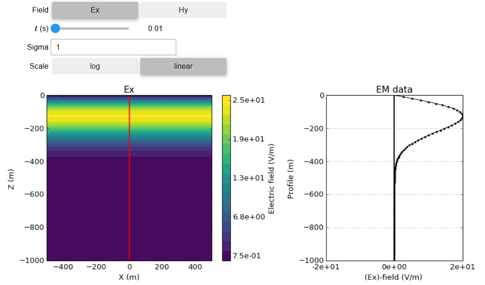

.. _transient_planewaves_homogeneous_index:

Transiente de Ondas Planas num Meio Homogêneo
=============================================

.. purpose::

    Já mostramos que em um meio homogêneo, os sinais eletromagnéticos no domínio do tempo se comportam de acordo com a equação :ref:`wave<time_domain_equations>`. Aqui, discutimos as propriedades das soluções de ondas planas transitórias no domínio do tempo. O conteúdo educacional é aumentado usando :ref: `aplicativos interativos<apps_index>` fornecidos para responder a um conjunto de questões fundamentais. Também discutimos as relações entre os campos elétricos e magnéticos transportados por ondas planas. O conteúdo aqui é paralelo aos materiais fornecidos em muitos recursos de EM (consulte :cite:`ward1988, griffiths1999, stratton1941`).

**Introdução**

Nós mostramos anteriormente que em meios homogêneos, a propagação de sinais eletromagnéticos no domínio do tempo é governada pela :ref:`equação de onda<time_domain_equations>`. Uma solução para essa equação é uma onda plana, onde os campos elétricos e magnéticos ficam em um plano 2D e a onda se propaga em uma direção perpendicular a esse plano. Fisicamente, as soluções de ondas planas oferecem boas aproximações para o que está acontecendo longe de fontes eletromagnéticas. Como resultado, as ondas planas formam uma base primária para a compreensão dos comportamentos fundamentais de muitos fenômenos eletromagnéticos.

.. figure:: images/planewavedown.png
   :align: right
   :figwidth: 50%
   :name: planewavedown_index_time_1

   Geometria de onda plana EM  propagando-se para baixo.

Aqui, exploramos a propagação de ondas planas no domínio do tempo (para sinais de impulso). O conteúdo fornecido aqui se assemelha a materiais de muitos recursos EM (consulte [WH88] [Gri99] [Str41]). Um aplicativo é fornecido para permitir que você explore os conceitos de comprimento de onda, atenuação e outros aspectos dos campos EM propagados. Para complementar o aplicativo, :ref:`questões<harmonic_planewaves_homogeneous_questions>` são fornecidas para promover a aprendizagem interativa. O recurso é ampliado com derivações e equações que quantificam as informações aprendidas com o uso dos aplicativos.

**Links Rápidos**

    - :ref:`Derivando a solução das ondas planas<transient_planewaves_homogeneous_derivation>`
    - :ref:`Suporte matemático para o App <transient_planewaves_homogeneous_derivation_app>`
    - :ref:`Questões a serem respondidas usando o App<transient_planewaves_homogeneous_questions>`

**Tópicos em Ondas Planas**

Existem inúmeras propriedades que podem ser usadas para entender a propagação de ondas planas no domínio do tempo. Compreender essas propriedades é muito importante, pois elas podem ser usadas para descrever o comportamento das ondas EM em casos mais gerais. Aqui, discutiremos as seguintes propriedades:

    - :ref:`Distância do Pico (Distância de Difusão)<transient_planewaves_homogeneous_peakdistance>`: A distância em que a uma onda plana derada por um impulso experimenta seu pico em amplitude.
    - :ref:`Tempo de Pico<transient_planewaves_homogeneous_peaktime>`: O tempo a em que a onda plana experimenta seu pico de amplitude.
    - :ref:`Velocidade de Pico<transient_planewaves_homogeneous_peakvelocity>`: A velocidade da onda plana em sua amplitude máxima.

.. _transient_planewaves_homogeneous_index_app:

Uma compreensão fundamental da propagação das ondas planas no domínio do tempo pode ser obtida usando o `TDEM Planewave Wholespace App <https://notebooks.gesis.org/binder/v2/gh/victortocantins/em-notebooks/dd4d0584d101c18ee2665e0388cda2011d25ccc7?urlpath=lab%2Ftree%2Fnotebooks%2Fem%2FTDEM_Planewave_Wholespace.ipynb>`__
(:numref:`FDEM_planewaves_wholespace_app`); que permite ao usuário simular os campos elétricos e magnéticos suportados por uma onda plana de propagação para baixo. O aplicativo permite que o usuário explore os efeitos de diferentes parâmetros (por exemplo, condutividade, localização do observador, tempo) e responda a um conjunto de questões fundamentais. Por exemplo, suponha que uma excitação por impulso envie um sinal de onda plana EM para a Terra e que o solo tenha uma condutividade de 1 S / m.

    - Qual é o pico da amplitude (amplitude máxima) em :math:`t` = 0.01 s?
    - Em qual tempo o pico de amplitude da onda atravessa 600 m de profundidade?
    
Uma série de perguntas adicionais que podem ser respondidas usando o aplicativo são encontradas :ref:`aqui<transient_planewaves_homogeneous_questions>`.

   Screen shot do app TDEM planewaves wholespace.

**Contents**

.. toctree::
    :maxdepth: 1
    
    derivation
    peakdistance
    peaktime
    peakvelocity
    questions

