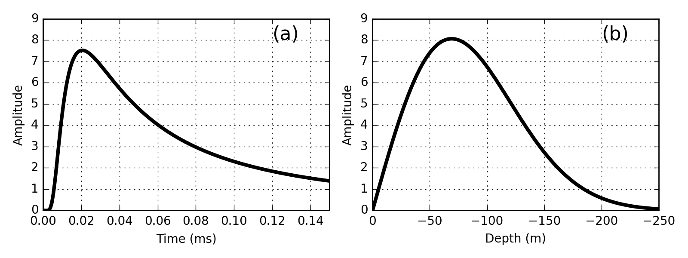

.. _transient_planewaves_homogeneous_peakdistance:

Distância de Pico (Distância de Difusão)
========================================

Em um determinado momento, a distância na qual a amplitude do sinal é maior é definida como profundidade do pico. A profundidade de pico observada em :numref:`fig_planewaves_peakdistance` (b) pode ser obtida definindo a derivada de profundidade da solução analítica para :math:`E_x` para zero. Onde:

.. math::
	e_x(t>0)  = E_{x,0}^- \frac{\big (\mu\sigma)^{1/2} z}{2\pi^{1/2} t^{3/2}} \, e^{-\mu\sigma z^2/4t}

é a solução analítica quase estática, a distância de pico é dada por:

.. math::
    z_{max} = \sqrt{\frac{2 t}{\mu\sigma}} \approx 1260 \sqrt{\frac{ t}{\sigma}}.
    :label: zmax

Essa quantidade é frequentemente chamada de **distância de difusão**. Ele atua como um equivalente no domínio do tempo para o :ref:`skin depth<harmonic_planewaves_homogeneous_skindepth>`.

   
   Campo elétrico em função do tempo 100 m de um impulso 1D no campo em um espaço inteiro de 0,01 S/m (a). Campo elétrico em t = 0,03 ms em função da distância (modificado de :cite:`ward1988`) (b).
