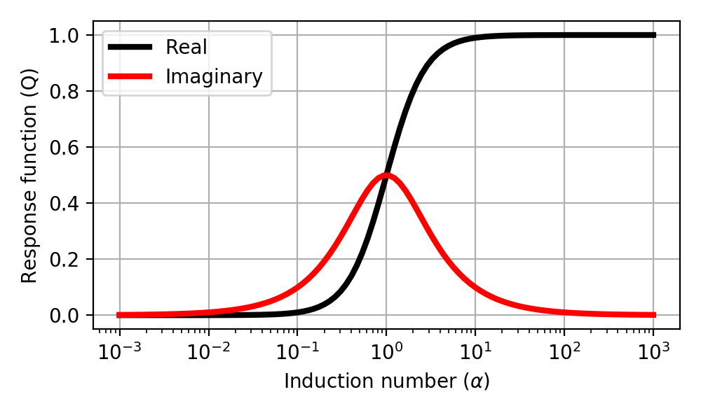

.. _derive_response_function:

Derivação da Função Resposta
============================

Considere um simples circuito equivalente como mostrado na :numref:`Concepts_3loops_only`.

.. figure:: ./images/Concepts_3loops_only_M.png
   :align: center
   :scale: 70%
   :name: Concepts_3loops_only

   Diagrama conceitual para o sistema de 3-loops.
   
Vamos supor que a corrente alternada, :math:`I_1 e^{\imath\omega t}` seja 
feito para fluir no Tx (Loop 1). Esta corrente gera uma alternância do 
campo magnético no ambiente circundante, que por sua vez induz um FEM (força eletromotriz)
tanto no corpo (Loop 2) quanto no Rx (Loop 3). Esses FEMs são regidos pela
Lei de Faraday

.. math::
  \mathcal{E}_{j} = - M_{ij} \frac{d I_i}{dt},

onde :math:`\mathcal{E}_j` é a FEM induzida em um circuito por uma corrente 
:math:`I_i` fluindo em outro circuito. Se :math:`M_{ij}` é sua indutância mútua.
A FEM induzida no Rx é desta forma

.. math::

  \mathcal{E}^p_3 = -\imath \omega M_{13} I_1 e^{\imath\omega t}

e a FEM induzida no corpo é

.. math::
  \mathcal{E}_2 = -\imath \omega M_{12}I_1 e^{\imath\omega t}

Nós devemos acrescentar :math:`\mathcal{E}_2^{\dagger}`, a soma da queda de tensão através da resistência do circuito e da FEM 
de retorno gerado pela auto-indutância quando uma corrente :math:`I_2e^{\imath \omega t}` flui pelo corpo. Para isso, consideramos o 
circuito RL como mostrado em :numref:`RLcircuit`.

.. figure:: ./images/RLcircuit.png
   :align: right
   :scale: 60%
   :name: RLcircuit

   Diagrama conceitual do circuito RL.

A impedância elétrica do circuito RL pode ser escrita como

.. math::
    Z(\omega) = R + \imath \omega L,

onde :math:`R` e :math:`L` indicam resistência e indutância, respectivamente.
Usando lei de Ohm obtemos

.. math::
    V(\omega) = \mathcal{E}_2 = I_2(\omega) Z(\omega).

Para encontra a corrente :math:`I_2`, observamos que em torno de qualquer circuito fechado a força FEM total deve ser nula i.e.

.. math::
    \mathcal{E}_2 + \mathcal{E}^{\dagger}_2 = 0

e desta forma

.. math::
    I_2 e^{\imath \omega t}
    = - \frac{\imath \omega M_{12}}{R + \imath \omega L} I_1 e^{\imath \omega t} \\
    =  - \frac{\imath \omega L/R}{ 1 + \imath \omega L/R} \frac{M_{12}I_1}{L} e^{\imath \omega t} \\

Esta é a solução para a corrente parasita induzida no corpo (Loop 2). No entanto, estamos interessados apenas no campo magnético secundário que esta corrente produz, e particularmente na FEM que o campo induz no Rx (Loop 3).

.. math::
    \mathcal{E}^s_3 = -\imath \omega M_{23} I_2 e^{\imath \omega t}

Na maioria dos casos, o aparelho mede essa tensão anômala comparando-a com a FEM induzida pelo campo primário na ausência do circuito; ou seja, mede 
:math:`\mathcal{E}_3^s / \mathcal{E}_3^p`. Assim, a resposta EM do loop enterrado é dada por

.. math::
    \frac{\mathcal{E}_3^s }{\mathcal{E}_3^p}
    = \frac{-\imath \omega M_{23} I_2 e^{\imath \omega t}}{-\imath \omega M_{13} I_1 e^{\imath\omega t}}
    = - \frac{M_{12}M_{23}}{M_{13}L} \Big[\frac{\imath \omega L/R}{ 1 + \imath \omega L/R} \Big] \\
    = C Q (\alpha)

A resposta EM é composta por duas partes: coeficiente de acoplamento, C e função de resposta, Q, que pode ser escrita como

.. math::
    C = - \frac{M_{12}M_{23}}{M_{13}L}

e

.. math::
    Q = \frac{\imath \omega L/R}{ 1 + \imath \omega L/R}

Podemos redefinir isto usando a constante de tempo :math:`\tau = L/R`

.. math::
    Q = \frac{\imath\omega \tau}{1+\imath \omega \tau}

ou usando o número de indução :math:`\alpha = \omega \tau`

.. math::
    Q = \frac{\imath \alpha}{1+\imath\alpha} = \frac{\alpha^2 + \imath \alpha}{1+\alpha^2}

Abaixo a figura mostara as componentes real e imaginária de :math:`Q`.

De derivação similar podemos obter

.. math::
    \frac{H_3^s }{H_3^p} =  C Q(\alpha),

onde :math:`H` representa o campo magnético. Portanto, a igualdade:

.. math::
    \frac{\mathcal{E}_3^s }{\mathcal{E}_3^p} = \frac{H_3^s }{H_3^p}

mantém os campos e as tensões, desta forma podendo ser usados alternadamente ao medir com uma bobina.

.. \alpha: induction number
.. \alpha = \omega \tau
.. \tau: time constant (L/R)
.. Diagram Re/Im;  plus names; quadrature, out-of-phase
.. Diagram (?? Amp-phase)
.. es/ep = Hs/Hp    so fields and voltages can be used interchangeably when measuring with a coil

.. The phase of the current, :math:`\theta_I` can be written as

.. .. math::
..     \theta_I = \theta_V - \theta_Z = -\frac{\pi}{2} - tan^{-1}\Big(\frac{\omega L}{R}\Big),
..     :label: PhaseI

.. where :math:`\theta_z=\Re[z] / \Im[z]` and :math:`\Re[z]` and :math:`\Im[z]` are real and imaginary part of a complex value :math:`z`.

.. Considering Faraday's law: :math:`V = -\imath\omega\Phi^p`, then recoginze factor of :math:`-\imath\omega`, which makes :math:`\frac{\pi}{2}` lag of phase in the induced current. And :math:`tan^{-1}(\frac{\omega L}{R})` lag of phase is induced by the Loop2.

.. So the phase of the current vary with frequency. At low frequencies the information about the conductor is in the quadrature (imaginary part) portion, at high frequencies it is in out-of-phase (real part) portion.
