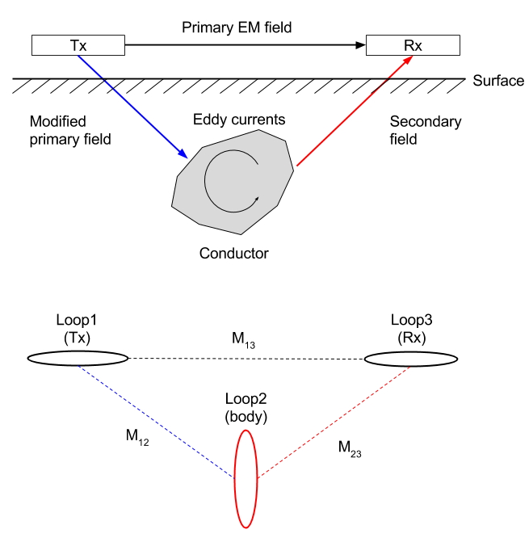
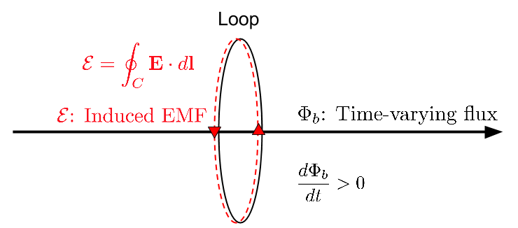

.. _emi_tuotorial_index_FD:

Modelo de Circuito para Indução EM
==================================

.. purpose::

   Os princípios básicos para indução EM foram descritos em anterormente. Aqui usamos
   um modelo de circuito elétrico equivalente consistindo em três loops para representar
   esse processo. Derivamos a função de resposta indutiva em termos de circuitos,
   acoplamento mútuo e auto-indutância. Widgets são desenvolvidos para ajudar
   compreensão física. As funções de resposta para muitas práticas geofísicas
   pesquisas se assemelham àquelas ao modelo de circuito e, portanto, muita intuição sobre
   Os sinais EM podem ser obtidos usando esta análise.

A pesquisa básica de EM é mostrada em :numref:`Concepts_3loops`. O tempo variando
campo magnético (referido como o campo primário) no Tx induz correntes
no condutor. Essas correntes produzem um campo secundário que pode ser
gravada no receptor.

    
    Diagramas conceituais para induções EM. O painel superior mostra a excitação do 
    condutor usando indução e o painel inferior mostra o sistema de 3 loops correspondente.
   

Da :ref:`faraday`, nós estabelecemos o link entre FEM (força eletromotriz) (:math:`\mathcal{E}`,
tensão), e o fluxo variante no tempo (:math:`\Phi_b`). Abaixo o diagrama ilustra 
como a FEM pode ser gerada do fluxo variante no tempo (:math:`\mathcal{E}= -
\frac{d \Phi_b}{dt}  = \imath \omega \Phi_b`). A FEM (tensão) produz uma
corrente no loop.

O modelo de circuito agora é entendido da seguinte forma:

- Loop 1: é o transmissor (Tx).
  Tem uma corrente variável com o tempo (:math:`I_1 e^{i\omega t}`) e, portanto, produz 
  um campo variável com o tempo em todo o espaço.

- Loop 2: representa o corpo condutor.
  O fluxo variável com o tempo gera correntes no condutor (:math:`I_2 e^{\imath\omega t}`). 
  Essas correntes variáveis de tempo produzem uma variação de tempo
  campo em todo o espaço.

- Loop 3: é o receptor (Rx). A FEM medida, :math:`\mathcal{E}^t` é

.. math::
    \mathcal{E}^t = \mathcal{E}^p +\mathcal{E}^s

onde sobrescritos se referem respectivamente aos campos total, primário e secundário.

Tanto numericamente, quanto por meio de instrumentação, é possível remover o
campo primário das medições. A resposta geofísica importante é

.. math::
  \frac{\mathcal{E}^s}{\mathcal{E}^p} =  \frac{H^s}{H^p}  =   - \frac{M_{12} M_{23}}{M_{13}L_2} \frac{\alpha^2 + i \alpha}{1 + \alpha^2} \\ = CQ(\alpha),
  :label: l2

onde :math:`C` é o coefiicente de acoplamento.
Na Equação :eq:`l2`, :math:`M_{ij}` é a iduntÂncia mútua entre os loops :math:`i` e :math:`j`, :math:`L` é a autoindutância  do loop alvo, 
:math:`Q` é a função resposta indutiva. :math:`\alpha = \omega L/R`  é um número de indução sem diemensão.

A função de resposta é uma quantidade complexa e as partes reais e imaginárias 
(ou em fase e em quadratura) se parecem com a figura abaixo. O eixo horizontal é o número de indução.

.. figure:: ./images/frespQ.png
    :align: center
    :scale: 60%
    :name: frespQ1

A Equação :eq:`l2` tem duas principais componentes :math:`C` que é determinada pela geometria e
:math:`Q` que está relacionado ao corpo alvo.

Na páginas seguintes ilustramos

.. toctree::
    :maxdepth: 1

    derive_response_function
    understanding_harmonicEMresponse
    understanding_response_widget

