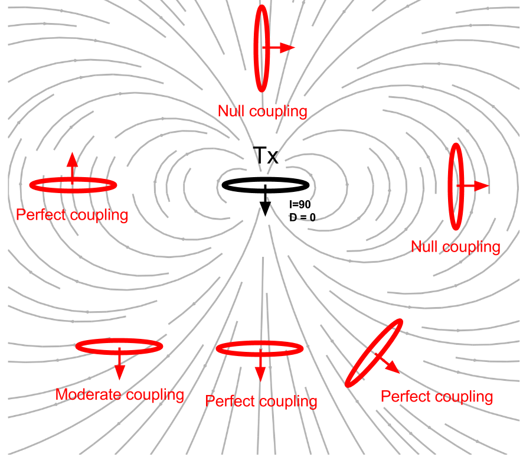
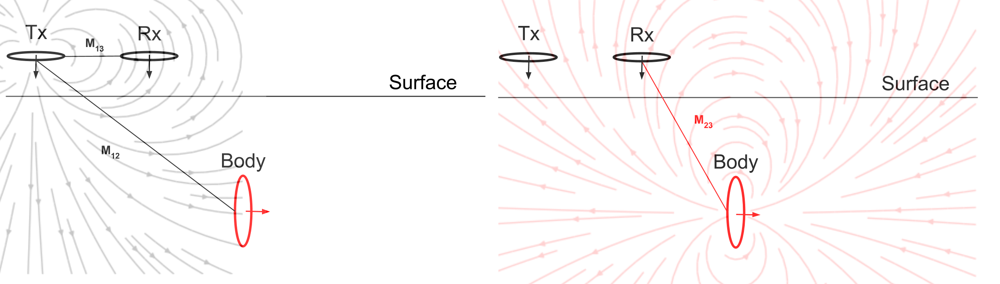

.. _understanding_harmonicEMresponse:

Entendendo a Resposta Harmônica
===============================

A resposta EM de um loop enterrado

.. math::
  \frac{H_3^s }{H_3^p}
  = \frac{\mathcal{E}_3^s }{\mathcal{E}_3^p}
  = - \frac{M_{12}M_{23}}{M_{13}L} \Big[\frac{\alpha^2 + \imath \alpha}{1+\alpha^2}\Big] \\
  = C Q (\alpha)

Esta expressão tem duas partes. C depende da geometria (coeficiente de acoplamento)
e Q depende apenas das propriedades EM do corpo.

	- Coupling coefficient: :math:`C`
	- Response function: :math:`Q`

Coeficiente de Acoplamento
--------------------------

O coeficiente de acoplamento pode ser escrito como

.. math::
	C = - \frac{M_{12}M_{23}}{M_{13}L},
	
onde :math:`M_{ij}` representa a indutância mútua entre os loops :math:`i` e 
:math:`j`. Derivar a indutância mútua é uma etapa essencial para entender
o coeficiente de acoplamento. A indutância mútua pode ser derivada da 
:ref:`Lei de Biot-Savart <biot_savart>`, que nos dá o campo magnético. Suponha que nós
estão olhando para dois loops e o campo magnético devido ao primeiro loop é
:math:`\mathbf{B}_1`. Podemos calcular o fluxo :math:`\Phi_2` deste
campo magnético através do segundo loop da seguinte forma:

.. math::
        \Phi_2 = \int \mathbf{B}_1 \cdot da_2 = M_{12} I_1.
        :label: phi2

Este fluxo é então igual à indutância mútua vezes a corrente. Podemos resolver
para a indução mútua em mais algumas etapas. Usando o Teorema de Stokes e o
potencial de vetor de :math:`\mathbf{B}_1`, A Equação :eq:`phi2` torna-se uma 
integral de linha:

.. math::
        \Phi_2 = \int \mathbf{B}_1 \cdot da_2 = \int (\nabla \times \mathbf{A}_1) \cdot da_2 = \oint \mathbf{A}_1 \cdot dl_2,
        :label: phi22

onde :math:`\mathbf{A}_1` é derivada usando a lei de Biot-Savart:

.. math::
        \mathbf{A}_1 = \frac{\mu_0 I_1}{4\pi} \oint \frac{dl_1}{\lvert \mathbf{r} - \mathbf{r'}\rvert^2}.
        :label: A1

Subpondo a Equação :eq:`A1` em :eq:`phi22`, obtemos a seguinte expressão integral
para o fluxo:

.. math::
        \Phi_2 = \frac{\mu_0 I_1}{4\pi} \oint \left ( \oint \frac{dl_1}{\lvert \mathbf{r} - \mathbf{r'}\rvert^2} \right ) \cdot dl_2.
        :label: phi23

Podemos então escrever a iduntância mútua entre dois loops como:

.. math::
        M_{12} = \frac{\mu_0}{4\pi} \oint \oint \frac{dl_1 \cdot dl_2}{\lvert \mathbf{r} - \mathbf{r'}\rvert^2}.
        :label: m12

Existem algumas coisa significativas sobre a Equação :eq:`m12`:

.. note:: 
    - 1- :math:`M_{12}` depende puramente da geometria, como o tamanho, forma, 
      e posições relativas dos dois loops.
    - 2- Esta expressão não muda se olharmos para o fluxo no primeiro
      loop devido ao segundo loop, o que significa que :math:`M_{12} = M_{21}`.
      Portanto, seguindo os passos da reciprocidade
    
    .. math::
            M_{12} = \frac{\Phi_2}{I_1} = \frac{\Phi_1}{I_2}.

Efeitos do Coefeiciente de Acoplamento
**************************************

    
    Efeitos do acoplamento entre loops. A orientação dos loops pode ser
    alterado ajustando a inclinação :math:`I` e a declinação :math:`D`.

Efeitos do coeficiente de acoplamento (:math:`C`) muda principalmente devido a
orientação dos loops. Nós definimos a orientação de um loop usando inclinação
(:math:`I`) e declinação (:math:`D`) como mostrado em :numref:`CouplingEffects`.
Para definições detalhadas de inclinação e declinação, consulte XXX. Quando o
orientação o loop do corpo está alinhado com a linha do campo magnético, melhor acoplamento
é criado resultando em maior indutância mútua.

Consideramos uma configuração com três loops: Tx, Rx e corpo. O painel esquerdo de
:numref:`Couping_3loops` mostra as linhas de campo primárias e a interação
entre Tx e Rx e Tx e Body. Conforme mostrado no painel direito de
:numref:`Couping_3loops`, no corpo, o campo magnético secundário é gerado,
e tem a mesma direção para :math:`H^p_3` em Rx, portanto, a resposta EM
(:math:`H^s_3 / H^p_3`) tem sinal positivo.

Este processo pode ser explicado por indutância mútua: :math:`M_ {13}` terá
(-) porque as linhas de campo primárias sobem principalmente em Rx. de forma similar
:math:`M_{12}` e :math:`M_{23}` têm sinais (+) e (-), respectivamente.
Portanto, o sinal do coeficiente de acoplamento será positivo. Observe que não
apenas o sinal, mas também a decaimento geométrico é considerado na indutância mútua, então
como no coeficiente de acoplamento. O coeficiente de acoplamento entre três loops
mudará conforme o loop de Tx e Rx se movem ao longo da superfície.

    
    Acoplamento entre 3 loops.

O coeficiente de acoplamento calculado ao longo da linha é mostrado abaixo:

.. plot::

    from em_examples.EMcircuit import Mijfun, Cfun, Qfun
    import numpy as np
    import matplotlib.pyplot as plt
    L = 1.
    R = 2000.
    xc = 0.
    yc = 0.
    zc = 2.
    incl = 0.
    decl = 90.
    S = 4.
    ht = 0.
    f = 10000.
    xmin = -10.
    xmax = 10.
    dx = 0.25
    xp = np.linspace(xmin, xmax, 101)
    yp = xp.copy()
    zp = np.r_[-ht]
    xyz_profile = np.c_[xp, np.zeros_like(xp), np.ones_like(xp)*ht]
    c_profile, m12_profile, m23_profile, m13_profile = Cfun(L,R,xc,yc,zc,incl,decl,S,ht,f,xyz_profile)
    fig = plt.figure(figsize=(5,3))
    plt.plot(xp, c_profile, 'k', lw=2)
    plt.plot(xp, np.zeros_like(xp), 'k--', lw=1)
    plt.ticklabel_format(style='sci', axis='y', scilimits=(0,0))
    plt.xlabel("Mid point between Tx and Rx (m)")
    plt.ylabel("Coupling Coefficient")
    plt.grid()
    plt.tight_layout()
    plt.show()

Because the coupling coefficient is generally very small, the EM response, :math:`\frac{H^s_3}{H^{p}_3}` is small, regardless of the value of :math:`\alpha` [0, 1]. Often part per million (ppm) is used for the unit of this ratio.

.. So,  by solving Equation :eq:`m12` for the three mutual inductances for a three-loop system, we can analytically obtain the coupling coefficient allowing us to compute the EM data :math:`H^s / H^p` over different targets, using differing frequencies, loop orientations, and loop separations with the response function.

Response function
-----------------

The response function, :math:`Q` can be written as

.. math::
  Q = \frac{\alpha^2 + \imath \alpha}{1+\alpha^2}

Since :math:`Q` is complex-valued, we can express them as either real and
imaginary or ampliutde and phase.

.. plot::

    from em_examples.EMcircuit  import Qfun
    import numpy as np
    import matplotlib.pyplot as plt
    L = 1.
    R = 2000.
    alpha = np.logspace(-3, 3, 100)
    alpha, Q = Qfun(R, L, None, alpha=alpha)
    fig = plt.figure(figsize=(10, 3))
    ax1 = plt.subplot(121)
    ax2 = plt.subplot(122)
    ax2_1 = ax2.twinx()
    ax1.semilogx(alpha, Q.real, 'k', lw=3)
    ax1.semilogx(alpha, Q.imag, 'r', lw=3)
    ax1.grid(True)
    ax1.legend(("Real","Imaginary"), loc=2)
    ax1.set_xlabel("Induction number ($\\alpha$)")
    ax1.set_ylabel("Response function (Q)")
    ax2.semilogx(alpha, abs(Q), 'k', lw=3)
    ax2_1.semilogx(alpha, np.angle(Q, deg=True), 'r', lw=3)
    ax2.grid(True)
    ax2.set_ylabel("Amplitude |Q|")
    ax2_1.set_ylabel('Pahse (angle)', color='r')
    ax2.set_xlabel("Induction number ($\\alpha$)")
    for tl in ax2_1.get_yticklabels():
        tl.set_color('r')
    plt.tight_layout()
    plt.show()

Asymptotic
**********

We have obtained full expression of the EM response (:math:`H^s_3/H^p_3`),
which can be written as

.. math::

    \frac{H^s_3}{H^p_3} = - \frac{M_{12}M_{23}}{M_{13}L} \Big[\frac{\alpha^2 + \imath \alpha}{1+\alpha^2}\Big]

Obtaining asymptotic values of this EM response at small and large
:math:`\alpha` provides important physical features:

Resistive limit: when :math:`\alpha \ll 1`:
^^^^^^^^^^^^^^^^^^^^^^^^^^^^^^^^^^^^^^^^^^^
.. math::
    \frac{H^s_3}{H^p_3} \approx - \frac{M_{12}M_{23}}{M_{13}L} (\imath \alpha)

The EM response is purely imaginary-valued. The amount of current induced in
the body will also be small, and the secondary magnetic field will be
everywhere much smaller than the primary field. Therefore, each process of
induction(Rx from Tx, body from Tx, Rx from body) can be considered as quite
independently.

.. note::

    Within the resistive limit, it is reasonable to superpose EM response from
    multiple bodies.

Inductive limit: :math:`\alpha \gg 1`:
^^^^^^^^^^^^^^^^^^^^^^^^^^^^^^^^^^^^^^
.. math::
    \frac{H^s_3}{H^p_3} \approx - \frac{M_{12}M_{23}}{M_{13}L}

The EM response is purely real-valued, and only dependent of the coupling
coefficient. As :math:`\alpha` becomes larger, the secondary magnetic field
induced an EMF in the body which begins to become appreciable in relation to
that induced by the primary field. The phase angle of the current in the body,
and therefore the phase angle of the secondary magnetic field, must shift in
order that the net induced EMF and the resistive loss should exactly balance.
At the inductive limit, this balance virtually becomes equality between the
EMFs induced by the primary and by the secondary magnetic field in the body.
The induced current and the secondary magnetic field must therefore be in-
phase with, but in opposition to the primary field.

Phase
*****

The phase of :math:`\frac{H^s_3}{H^p_3}`, :math:`\theta_s` will be same as
that of :math:`Q(\omega)`, hence

.. math::
    \theta_s = - \frac{\pi}{2} - \phi,
    :label: phaseHs

where

.. math::
    \phi=tan^{-1}(\frac{\omega L}{R})=tan^{-1}(\alpha).
    :label: phaseHs_phi

.. figure:: ./images/PhaseHs.png
   :align: center
   :scale: 60%
   :name: PhaseHs

   Phase diagram of secondary magnetic field (:math:`H^s`).

From above diagram and Eq. :eq:`phaseHs_phi`, it can be seen that:

.. note::

    - For a very good conductor: :math:`\alpha = \frac{\omega L}{R}
      \rightarrow \infty` and :math:`\phi \rightarrow \frac{\pi}{2}`. In this
      case, phase of the secondary field is 180 :math:`^\circ` (:math:`\pi`)
      behind the primary field

    - For a very poor conductor: :math:`\alpha = \frac{\omega L}{R}
      \rightarrow 0` and :math:`\phi \rightarrow 0`.  In this case, phase of
      the secondary field is 90 :math:`^\circ` (:math:`\frac{\pi}{2}`) behind
      the primary field

Assuming the phase of the primary magnetic field, :math:`\theta_p=0`, its
phase lag, :math:`\psi`, can be written as

.. math::
    \psi = \theta_p - \theta_s =\frac{\pi}{2} + \phi,
    :label: phaseHs_lag

The lag in the phase of :math:`\frac{\pi}{2}` is due to the inductive coupling
between Loop1 and Loop2, whereas the additional phase lag :math:`\phi` is
determined by the properties of the conductor as an electrical circuit. That
is,

.. math::
    H^s_3 = |H^s_3| cos (\omega t - (\frac{\pi}{2}+\phi))
        = |H^s_3| sin (\omega t - \phi)

        = |H^s_3| \Big( cos (\omega t-\frac{\pi}{2}) cos (\phi) + cos (\omega t-\pi) sin (\phi) \Big)

The component of :math:`H^s_3` 180 :math:`^\circ` out of phase with
:math:`H^p` is :math:`H^s_3 sin(\phi)`, whereas the component 90
:math:`^\circ` out-ouf-phase is :math:`H^s_3 cos(\phi)`.

In frequency domain EM survey:

- the 180 :math:`^\circ` out-of-phase fraction of :math:`H^s_3` is called the
  **Real** or **In-phase** component.

- the 90 :math:`^\circ` out-of-phase fraction of :math:`H^s_3` is called the
  **Imaginary**, **Out-of-phase**, or **Quadrature** component.

