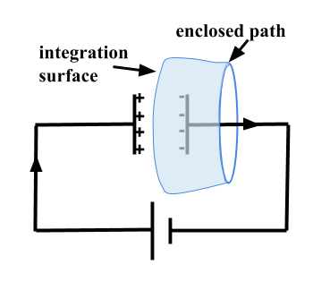

.. _ampere_maxwell:

Lei de Ampere-Maxwell
=====================

A equação Ampere-Maxwell relaciona correntes elétricas e fluxo magnético. Isto
descreve os campos magnéticos que resultam de um fio transmissor ou loop em
levantamentos eletromagnéticos. Para correntes estacionárias, ela é a chave para descrever o
experimento de resistividade magnetométrica.

.. _ampere_maxwell_integral_time:

Equação Integral
----------------

A equação Ampere-Maxwell na forma integral é fornecida abaixo:

.. math::
    \int_S \boldsymbol{\nabla} \times \mathbf{b} \cdot \mathbf{da} =  \oint_C \mathbf{b} \cdot \mathbf{dl} = \mu_0 \left( I_{enc} + \varepsilon_0 \frac{d}{dt} \int_S \mathbf{e} \cdot \hat{\mathbf{n}} ~\text{da} \right),
    :label: ampere_maxwell_integral

onde:

- :math:`\mathbf{b}` é o fluxo magnético
- :math:`\mathbf{e}` é o campo elétrico
- :math:`I_{enc}` é a corrente circulante
- :math:`\mu_0` é a permeabilidade magnética livre no espaço
- :math:`\varepsilon_0` é a permissividade elétrica no espaço livre
- :math:`\hat{\mathbf{n}}` é o vetor normal unitário apontando para fora

 .. figure:: images/Ienc.png
    :align: right
    :scale: 20% 
    :name: Ienc

    corrente circulante. 

O primeiro termo do lado direito da equação foi descoberto por Ampere. Mostra o relacionamento
entre uma corrente :math:`I_ {enc}` e a circulação do campo magnético, :math:`\mathbf {b}`,
em torno de qualquer linha de contorno fechada (Veja :numref:`Ienc`). :math: `I_{enc}` refere-se a todas as correntes
independentemente de sua origem física.

A segunda parte da equação é a contribuição de Maxwell e mostra que um
a circulação do campo magnético também é causada por uma taxa de mudança de tempo de
fluxo eletrico. Isso explica como a corrente em um circuito simples envolvendo um
a bateria e o capacitor podem fluir. O termo é fundamental para mostrar que
a energia eletromagnética se propaga como ondas.

    Integração sobre um capacitor

Por exemplo, imagine a integração sobre uma superfície associada a um caminho fechado
como o mostrado em :numref:`Capacitor`. Podemos definir a superfície sendo
a área do círculo, como em :numref:`Ienc`, ou alternativamente, como uma
superfície esticada, conforme mostrado em :numref:`Capacitor`. No primeiro caso,
a corrente fechada é o fluxo de cargas no fio. No segundo caso,
no entanto, não há cargas fluindo através da superfície, ainda que o magnético
campo definido na curva envolvente, :math:`C`, deve ser o mesmo. Esta aparente
discrepância é reconciliada se levarmos em consideração a corrente de deslocamento,
que é a taxa de variação de tempo do campo elétrico, entre as duas
placas do capacitor. Essa integração é a mesma como se estivéssemos integrando em 
superfície plana com o fio de corrente cruzando-a.

.. When the current is flowing, the magnetic field has to be related
.. to the electric field flowing between the two plates during the charge (more
.. precisely, its variation), as the result of this integration is the same as if
.. we were integrating over a flat surface, with the current wire crossing it
.. (see the first portion of the equation).

As formulações integrais são fisicamente perspicazes e intimamente relacionadas com o
experimentos que os originaram. Eles também desempenham um papel formativo na
geranção das condições de contorno para ondas que se propagam através de diferentes
materiais.

Ao lidar com a propagação das ondas EM em meios materiais, as correntes
:math:`I_{enc}` são geralmente tratados em termos de densidades de corrente. A
equação integral acima é, portanto, escrita como

.. math:: 
    \int_S \boldsymbol{\nabla} \times \mathbf{b} \cdot \mathbf{da} =  
    \oint_C \mathbf{b} \cdot \mathbf{dl} = 
    \mu_0 \left(\int_S \left(\mathbf{j_f}  
        + \frac{\partial \mathbf{p}}{\partial t} 
        + \boldsymbol{\nabla} \times \mathbf{m}\right)\cdot \mathbf{da} 
        +  \varepsilon_0 \frac{d}{dt}  \int_S \mathbf{e} \cdot \mathbf{\hat{n}} ~\text{da}\right),
    :label: ampere_maxwell_integral_p&m

onde as densidade de correntes são:

- :math:`\mathbf{j_f}` é a corrente livre causada por cargas móveis
- :math:`\mathbf{j_p} = \frac{\partial \mathbf{p}}{\partial t}` é a corrente de polarização ou corrente de deslocamento, onde :math:`\mathbf{p}` é a polarização elétrica resultante das cargas deslocadas dentro do dieletros
- :math:`\mathbf{j_m} = \nabla\times\mathbf{m}` 
é a corrente de magnetização, ou seja, as correntes necessárias para gerar a magnetização :math:`\mathbf{m}`

A densidade de corrente total é a soma dessas três contribuições e é descrita por

.. math::
    \mathbf{j} = \mathbf{j}_f + \mathbf{j}_p + \mathbf{j}_m.
    :label: current_contributions

.. A note on the total current 
.. ***************************

.. note:: 

    .. figure:: images/Currents.png
        :align: center
        :scale: 50%

    A corrente total envolvida na equação Ampere-Maxwell consiste em
    corrente de condução e corrente de deslocamento, embora todas as correntes sejam essencialmente as mesmas de
    uma perspectiva microscópica. Tratar a corrente de condução e a corrente de deslocamento de maneira diferente
    oferece insights físicos para a equação de Ampere-Maxwell em diferentes contextos.

    A corrente de condução é causada pelo movimento de cargas que não estão ligadas aos átomos, muitas vezes
    referido como corrente de cargas livres. Em contraste, a corrente de delocamento é induzida por
    uma magnetização ou polarização em materiais. Quando um material magnético é
    colocado em um campo magnético externo, uma corrente de magnetização será induzida
    devido ao movimento dos elétrons nos átomos. Da mesma forma, quando um campo elétrico externo
    é aplicado a um material dielétrico, as cargas de ligação positiva e negativa dentro
    do material dielétrico pode separar e induzir uma densidade de corrente de polarização internamente.

.. Then the total current density can be described as

.. 
..     \mathbf{j} = \mathbf{j}_f + \mathbf{j}_m + \mathbf{j}_p

.. where

.. - :math:`\mathbf{j}_f = \sigma \mathbf{e}` is the free current density caused by
.. moving charges,
.. - :math:`\mathbf{j}_m = \nabla \times \mathbf{m}` is the bound current due to
.. magnetization,
.. - :math:`\mathbf{j}_p = \frac{\partial \mathbf{p}}{\partial t}` is the polarization current density due to the time-dependent bound charges.

Continuando a tratar a corrente de cargas livre e a corrente de deslocamento separadamente e usando o
equações constitutivas: :math:`\mathbf{b}=\mu_0(\mathbf{h} + \mathbf{m})` e :math:`\mathbf{d}=\varepsilon_0\mathbf{e} + \mathbf{p}`, a forma integral da equação de Ampère-Maxwell pode ser reformulada como:

.. math::
    \int_S \boldsymbol{\nabla} \times \mathbf{h} \cdot \mathbf{da} = \oint_C \mathbf{h} \cdot \mathbf{dl} = \int_S \left( \mathbf{j}_f + \frac{\partial \mathbf{d}}{\partial t} \right) \cdot \hat{\mathbf{n}} ~\text{da}.
    :label: ampere_maxwell_integral_h&d

.. and in differential form,

.. .. math::
..     \boldsymbol{\nabla} \times \mathbf{h} = \mathbf{j}_f + \frac{\partial \mathbf{d}}{\partial t}

Observe que a carga ligada devido à magnetização é integrada ao magnético
campo :math:`\mathbf{h}`, enquanto a carga ligada devido à polarização elétrica é
integrado no campo de deslocamento :math:`\mathbf {d}`.

.. _ampere_maxwell_differential_time:

Equação Diferencial no Domínio do Tempo
---------------------------------------

Existem várias maneiras de escrever a equação na forma diferencial. Cada
fornece seu próprio insight. Começamos considerando a forma diferencial da equação :eq:`ampere_maxwell_integral` em termos das variáveis 
:math:`\mathbf{e, b, p}` e :math:`\mathbf{m}`:

.. math::
    \boldsymbol{\nabla} \times \mathbf{b} 
        - \varepsilon_0 \mu_0 \frac{\partial \mathbf{e}}{\partial t} 
    = \mu_0\left( \mathbf{j_f} 
        + \frac {\partial \mathbf{p}}{\partial t} 
        + \boldsymbol{\nabla} \times \mathbf{m}\right) 
    :label: ampere_maxwell_differential_ebpm

e similarmente :eq:`ampere_maxwell_integral_h&d`, podemos usar as relações constitutivas :math:`\mathbf{d} = \varepsilon_0 \mathbf{e} + \mathbf{p}` e
:math:`\mathbf{b}=\mu_0(\mathbf{h} + \mathbf{m})` para escrever a equação diferencial no domínio do tempo em termos das variáveis :math:`\mathbf{h,j}_f`  e :math:`\mathbf{d}`:

.. math::
    \boldsymbol{\nabla} \times \mathbf{h} = \mathbf{j}_f + \frac{\partial \mathbf{d}}{\partial t}.
    :label: ampere_maxwell_differential_hjd

.. _ampere_maxwell_differential_frequency:

Equações Diferenciais no Domínio da Frequência
---------------------------------------------- 

Usamos :math:`e^{i\omega t}` :ref:`fourier_transform_convention` para transferir
nossas equações do domínio do tempo para o domínio da frequência.

Essa equações tornan-se

.. math::
    \boldsymbol{\nabla} \times \mathbf{H}  - i \omega \mathbf{D} = \mathbf{J}_f.
    :label: ampere_maxwell_frequency

Se lidarmos com meios isotrópicos lineares, então temos

.. math::
    \mathbf{D}(\omega)=\epsilon \mathbf{E}(\omega)
.. math::
    \mathbf{J}_f(\omega)=\sigma \mathbf{E}(\omega)
    :label: current_density_electric_field

	

e as equações de Ampère-Maxwell podem ser escritas como

.. math::
    \boldsymbol{\nabla} \times \mathbf{H}  - \left(\sigma + i \omega \epsilon\right) \mathbf{E} = 0.
    :label: ampere_maxwell_frequency2 
	

Unidades
--------

+--------------------------------+-------------------+---------------------------+------------------------------------------+
| Densidade Fluxo Magnético B    | :math:`\mathbf{b}`| T                         | tesla                                    |
+--------------------------------+-------------------+---------------------------+------------------------------------------+
| Campo Elétrico - E             | :math:`\mathbf{e}`|:math:`\frac{\text{V}}     |                                          |
|                                |                   |{\text{m}}`                | volt por metro                           |
+--------------------------------+-------------------+---------------------------+------------------------------------------+
| Corrente elétrica              | :math:`\text{I}`  | A                         | ampere                                   |
+--------------------------------+-------------------+---------------------------+------------------------------------------+
| Densidade de corrente elétrica | :math:`\mathbf{j}`|:math:`\frac{\text{A}}     |                                          |
|                                |                   |{\text{m}^{2}}`            | ampere por metro quadrado                | 
+--------------------------------+-------------------+---------------------------+------------------------------------------+
| Magnetização                   | :math:`\mathbf{m}`|:math:`\frac{\text{A}}     |                                          |
|                                |                   |{\text{m}}`                | ampere por metro                         |
+--------------------------------+-------------------+---------------------------+------------------------------------------+
| Polarização Elétrica           | :math:`\mathbf{p}`|:math:`\frac{\text{A}\cdot |                                          |
|                                |                   |\text{s}}{\text{m}}`       | ampere vezes segundos por metro quadrado | 
+--------------------------------+-------------------+---------------------------+------------------------------------------+
| Campo Magnético - H            | :math:`\mathbf{h}`|:math:`\frac{\text{A}}     |                                          |
|                                |                   |{\text{m}}`                | ampere por metro                         |
+--------------------------------+-------------------+---------------------------+------------------------------------------+
| Deslocamento Elétrico          | :math:`\mathbf{d}`|:math:`\frac{\text{C}}     |                                          |
|                                |                   |{\text{m}^{2}}`            | coulomb por metro quadrado               |
+--------------------------------+-------------------+---------------------------+------------------------------------------+

**Constantes** 

+--------------------------+-----------------------------------------------------------------------------------------------------------------------------------+
| Constante Magnética      | :math:`\mu_0 = 4\pi ×10^{−7} \frac{\text{N}}{\text{A}^2} \approx 1.2566370614...×10^{-6} \frac{\text{T}\cdot \text{m}}{\text{A}}` |
+--------------------------+-----------------------------------------------------------------------------------------------------------------------------------+
| Permeabilidade no vácuo  | :math:`\varepsilon_0  \approx 8.854 187 817... × 10^{−12} \frac{\text{F}}{\text{m}}` (farads por metro)                           |
+--------------------------+-----------------------------------------------------------------------------------------------------------------------------------+

**Conversões**

- Um Tesla é igual a um weber (a unidade SI de fluxo magnético) por metro quadrado:

.. math:: 
    1 \text{T} = 1 \frac{\text{Wb}}{\text{m}^{2}} = 1 \frac{\text{V}\cdot \text{s}}{\text{m}^{2}}.

- Um ampere é igula a one coulomb (a unidade SI de carga elétrica) por segundo: 

.. math:: 
    1 \text{A} = 1 \frac{\text{C}}{\text{s}}.

.. Magnetization :math:`\mathbf{m}`:  ampere per meter :math:`[\frac{\text{A}}{\text{m}}]`

.. Electric polarization :math:`\mathbf{p}`: ampere times seconds per square meter :math:`[\frac{A\cdot s}{m}]`

.. Magnetic H-field :math:`\mathbf{h}`: ampere per meter :math:`[\frac{A}{m}]`

.. Electric displacement :math:`\mathbf{d}`: coulomb per square meter :math:`[\frac{C}{m^{2}}]`

.. Magnetic constant :math:`\mu_0 = 4\pi ×10^{−7} \frac{N}{A^2} \approx  1.2566370614...×10^{-6} \frac{T\cdot m}{A}`. 

.. Vacuum permittivity :math:`\varepsilon_0  \approx 8.854 187 817... × 10^{−12} \frac{F}{m}` (farads per meter).

Descobertas da lei
------------------

A primeira observação que estimulou os pesquisadores a buscar a relação
ligando campo magnético e corrente foi feito por Hans Christian Ørsted em 1820,
que notou que as agulhas magnéticas eram desviadas por correntes elétricas. Isto
levou vários físicos na Europa a estudar este fenômeno em paralelo. Enquanto
Jean-Baptiste Biot e Félix Savart estavam experimentando uma configuração semelhante à
experiência de Ørsted (que os levou a definir em 1820 uma relação conhecida agora
como a lei de Biot-Savart), o experimento de André-Marie Ampère focou em
medir as forças que dois fios elétricos exercem um sobre o outro. Ele
formulou a lei circuital de Ampère em 1826 :cite:`griffiths1999`, que
relaciona o campo magnético associado a um circuito fechado à corrente elétrica
passando por ele. Em sua forma original, a corrente envolvida pelo
loop refere-se apenas à corrente livre causada por cargas móveis, causando vários
questões relativas à conservação de carga elétrica e a propagação de
energia eletromagnética.

Em 1861 :cite:`maxwell1861`, James Clerk Maxwell estendeu a lei de Ampère introduzindo a
corrente de deslocamento no termo de corrente elétrica para satisfazer
a equação de continuidade da carga elétrica. Com base na ideia de deslocamento
atual, em 1864 :cite:`maxwell1865`, Maxwell estabeleceu a teoria eletromagnética de campo, 
prevendo a propagação de ondas de campos eletromagnéticos e o
equivalência de propagação de luz e propagação de ondas eletromagnéticas.

Essas previsões não foram comprovadas até o final da década de 1880 :cite:`hertz1893`, 
até Heinrich Hertz provar experimentalmente a existência de ondas eletromagnéticas conforme previstos 
pela teoria eletromagnética de Maxwell, e demonstrar a equivalência de ondas eletromagnéticas e luz.

Esses esforços estabeleceram bases sólidas para o desenvolvimento do eletromagnetismo moderno.

