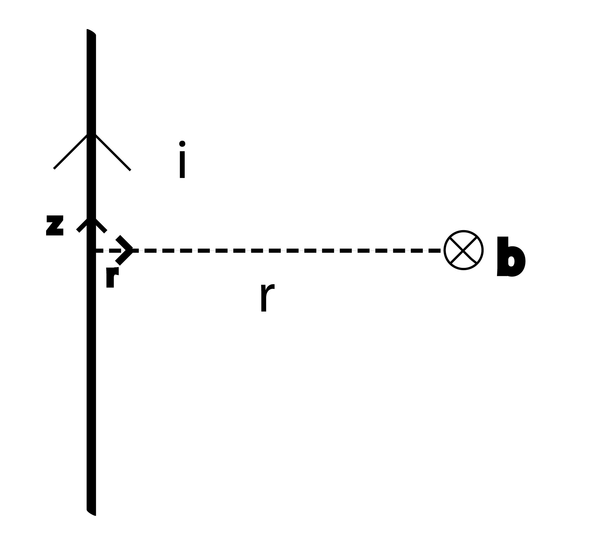

.. _biot_savart:

Biot-Savart
===========

Um pouco de historia
--------------------

A relação que caracteriza o fluxo magnético gerado por uma corrente elétrica 
foi descrita pela primeira vez por Jean-Baptiste Biot e Félix Savart, dois físicos franceses. 
Seu experimento original envolveu a passagem de corrente por um
fio longo vertical que moveu uma agulha magnética a alguma distância da
transmissor (fio). Eles construíram este experimento juntos em 1820, mais ou menos na mesma época que Ampère
e Faraday também realizavam seus próprios experimentos, 4 décadas antes da
teoria eletromagnética unificada de Maxwell. Como ainda não havia sido descoberta, esta lei
não leva em consideração o segundo termo da lei de Ampère-Maxwell, que
depende do tempo.

Definição
---------

.. math::
	\mathbf{b}= \frac{\mu_{0}}{4 \pi} \int_{C} \frac{I_{enc} \mathbf{dl} \times \mathbf{\hat{r}}} {r^2}

No estado estacionário, esta equação é fundamental para a modelagem direta do
fluxo magnético criado por uma fonte ativa, como um loop. Ela relacionada intimamente à lei de Ampère.

Alguns Exemplos
---------------

Cabo vertical infinito
**********************

Dado um fio vertical infinito ao longo do eixo :math:`\mathbf{z}`,
infinitesimalmente fino carregando uma corrente elétrica de intensidade :math:`i`, o
valor do fluxo magnético gerado em todos os pontos do espaço à distância :math:`r`
(com direção indicada pelo vetor unitário :math:`\mathbf {\hat{r}}`) do fio é:

.. math::
 	\mathbf{b(r)}= \frac{\mu_{0} I_{enc}}{2 \pi r } ({\mathbf{\hat{z}} \times \mathbf{\hat{r}}})

Fluxo Magnético ao longo do eixo central de um loop
***************************************************

DAdo um loop de raio :math:`R`, que é infinitesimalmente fino, levando uma corrente elétrica de
intensidade :math:`i`, o fluxo magnético gerado ao longo do eixo central do loop
:math:`\mathbf{z}`, numa distância :math:`r`, é:

.. math::
	\mathbf{b}= \frac{\mu_{0} I_{enc}}{2} \frac{R^2}{(r^2+R^2)^{\frac{3}{2}}} \mathbf{\hat{z}}
 
.. figure::
   images/loop_biotsavart.jpg
   :scale: 15 %

.. Note:: 

    Considerando :math:`\mathbf{dl}` e :math:`\mathbf{\hat{z}}` forma um sistema dextrógiro
    (sistema ortonormal, a direção do fluxo é dado pelo sinal :math:`i` )
