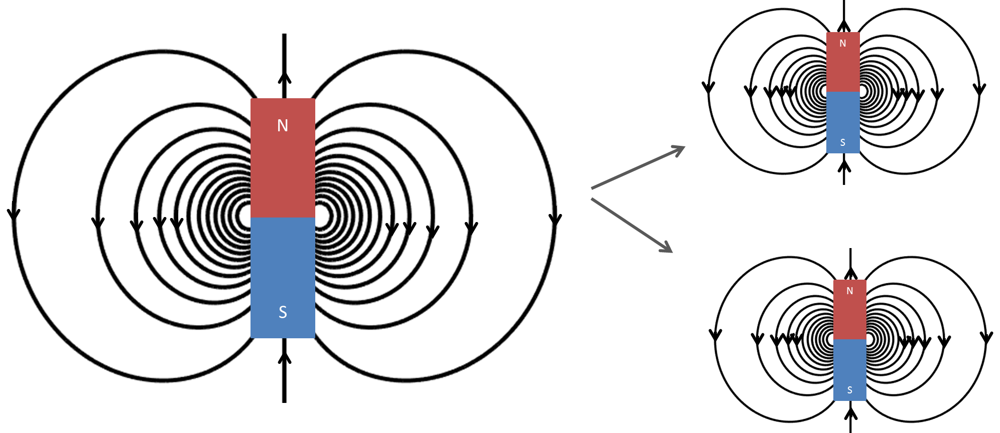

.. _gauss_magnetic:

Lei de Gauss para Campos Magnéticos
===================================

    Quando uma barra magnetizada é cortada em dois, você consegue duas barras magnetizadas.

A lei de Gauss para o magnetismo afirma que não existe monopólo magnético e que
o fluxo total através de uma superfície fechada deve ser zero. Esta página descreve o
formas integrais e diferenciais no domínio do tempo da lei de Gauss para o magnetismo e
como a lei pode ser derivada. A equação no domínio da frequência também é fornecida. No
final da página, uma breve história da lei de Gauss para o magnetismo é
fornecida.

.. _gauss_magnetic_integral:

Equação Integral
----------------

A lei de Gauss para campos magnéticos na forma integral é dada por:

.. math::
    \oint_S \mathbf{b} \cdot \mathbf{da} =  0,
    :label: gauss_magnetic_integral

onde:

- :math:`\mathbf{b}` is the magnetic flux

A equação afirma que não há fluxo magnético efetivo :math:`\mathbf{b}`
(que pode ser pensado como o número de linhas de campo magnético através de um
área) que passa por uma superfície fechada arbitrária :math:`S`. Isso significa
o número de linhas de campo magnético que entram e saem por esta
superfície :math:`S` é o mesmo. Isso é explicado pelo conceito de um ímã
que tem um pólo norte e um pólo sul, onde a força do pólo norte é
igual à força do pólo sul (:numref:`barmagnet`). Isto é
equivalente a dizer que um monopolo magnético, ou seja, um norte solitário ou
pólo sul, não existe porque para cada pólo magnético positivo, existe
deve ser uma quantidade igual de pólos magnéticos negativos.

.. _gauss_magnetic_differential:

Equação Diferencial
-------------------

A lei de Gauss para campos magnéticos na forma diferencial pode ser derivada usando
o teorema da divergência. O teorema da divergência afirma:

.. math::
        \int_V (\mathbf{\nabla} \cdot \mathbf{f}) dv = \oint_S \mathbf{f} \cdot \mathbf{da},

onde :math:`\mathbf{f}` é um vetor. O lado direito é muito semelhante
à Equação :eq:`gauss_magnetic_integral`. Usando o teorema da divergência,
Equação :eq:`gauss_magnetic_integral` é reescrito da seguinte forma:

.. math::
        0 = \oint_S \mathbf{b} \cdot d\mathbf{a} = \int_V ( \nabla \cdot \mathbf{b} ) dv.
        :label: gauss_magnetic_div_theorem

Como a expressão é definida como zero, o integrando :math:`(\nabla\cdot\mathbf{b})`
deve ser zero também. Assim, a forma diferencial da lei de Gauss
torna-se:

.. math::
        \nabla \cdot \mathbf{b} = 0.
        :label: gauss_magnetic_diff_time

Derivação usando a lei de Bio-Savart
------------------------------------

A lei de Gauss pode ser derivada usando :ref:`Biot-Savart law <biot_savart>`,
que é definida como:

.. math::
        \mathbf{b}(\mathbf{r}) = \frac{\mu_0}{4\pi} \int_V \frac{(\mathbf{j} (\mathbf{r'}) dv) \times ~\mathbf{\hat{\underline{r}}}}{\lvert \mathbf{r} - \mathbf{r'} \rvert ^2},
       :label: gauss_biot_savart 

onde:

- :math:`\mathbf{b}(\mathbf{r})` is the magnetic flux at the point :math:`\mathbf{r}`
- :math:`\mathbf{j}(\mathbf{r'})` is the current density at the point :math:`\mathbf{r'}`
- :math:`\mu_0` is the magnetic permeability of free space.

Tomando a divregência de ambos os lados da Equação :eq:`gauss_biot_savart` teremos:

.. math::
        \nabla \cdot \mathbf{b}(\mathbf{r}) = \frac{\mu_0}{4\pi} \int_V \nabla \cdot \frac{(\mathbf{j} (\mathbf{r'}) dv) \times ~\mathbf{\hat{\underline{r}}}}{\lvert \mathbf{r} - \mathbf{r'} \rvert ^2}.
        :label: gauss_bs_div

Para aplicar a divergência no integrando da Equação
:eq:`gauss_bs_div`, a seguinte identidade vetorial é usada:

.. math::
        \nabla \cdot (\mathbf{A} \times \mathbf{B}) = \mathbf{B} \cdot (\nabla \times \mathbf{A}) - \mathbf{A} \cdot (\nabla \times \mathbf{B}).

Assim, o integrando torna-se:

.. math::
        \left[ \mathbf{j} (\mathbf{r'}) \cdot \left( \nabla \times \frac{~\mathbf{\hat{\underline{r}}}}{\lvert \mathbf{r} - \mathbf{r'} \rvert ^2} \right) \right] - \left[ \frac{~\mathbf{\hat{\underline{r}}}}{\lvert \mathbf{r} - \mathbf{r'} \rvert ^2} \cdot \left( \nabla \times \mathbf{j} (\mathbf{r'}) \right) \right]
        :label: gauss_inside_div

A primeira parte da Equação :eq:`gauss_inside_div` é zero como o roatcional de
:math:`\frac{~\mathbf{\hat{\underline{r}}}}{\lvert\mathbf{r} -\mathbf{r'} \rvert^2}` é zero. 
A segunda parte da Equação :eq:`gauss_inside_div` torna-se zero porque :math:`\mathbf{j}` depende de
:math:`r'` e :math:`\nabla` depende apenas de :math:`r`. Conectando isso de volta
em :eq:`gauss_bs_div`, o lado direito da expressão torna-se zero.
Assim, vemos que:

.. math::
        \nabla \cdot \mathbf{b}(\mathbf{r}) = 0,

que é a lei de Gauss para o magnetismo na forma diferencial.

Equação diferencial no domínio da frequência
--------------------------------------------

A equação também pode ser escrita no domínio da frequência como:

.. math::
        \nabla \cdot \mathbf{B} = 0.
        :label: gauss_magnetic_diff_freq

.. _gauss_magnetic_frequency:

Unidades
--------

+--------------------------------+-------------------+-------------------------------------+---------------------------+
| Fluxo magnético                | :math:`\mathbf{b}`| T                                   | tesla                     |
+--------------------------------+-------------------+-------------------------------------+---------------------------+
| Densidade de corrente elétrica | :math:`\mathbf{j}`|:math:`\frac{\text{A}}{\text{m}^2}`  | ampere por metro quadrado |
+--------------------------------+-------------------+-------------------------------------+---------------------------+

**Constantes** 

+--------------------------+----------------------------------------------------------------------------------------------------------------------------------+
| Constante Magnética        | :math:`\mu_0 = 4\pi ×10^{−7} \frac{\text{N}}{\text{A}^2} \approx 1.2566370614...×10^{-6} \frac{\text{T}\cdot \text{m}}{\text{A}}`|
+--------------------------+----------------------------------------------------------------------------------------------------------------------------------+

Descobridores da lei
---------------------

A lei de Gauss para o magnetismo é uma aplicação física do teorema de Gauss (também
conhecido como teorema da divergência) no cálculo, que foi independentemente
descoberto por Lagrange em 1762, Gauss em 1813, Ostrogradsky em 1826 e Green
em 1828. A lei de Gauss para o magnetismo simplesmente descreve um fenômeno físico
que um monopolo magnético não existe na realidade. Portanto, esta lei também é chamada
"ausência de pólos magnéticos livres".

Há tempos pessoas percebiam que, quando uma barra magnética é dividida em duas
peças, dois pequenos ímãs são criados com seus próprios pólos sul e norte.
Isso pode ser explicado pela lei circuital de Ampère: a barra magnética é feita de
muitos anéis de correntes circulares, cada um dos quais essencialmente um dipolo magnético;
o magnetismo macroscópico é do alinhamento do microscópio dipolos magnéticos. 
Porque um pequeno anel de corrente sempre gera um equivalente dipolo magnético, 
não há como gerar uma carga magnética livre. Até agora não monopolo magnético f
oi encontrado em experimentos, apesar de muitos teóricos
acreditam que existe um monopolo magnético e ainda estão procurando por ele.

No entanto, como apontado por Pierre Curie em 1894, monopolos magnéticos podem existir
concebivelmente. Apresentando cargas magnéticas fictícias as equações de Maxwell
podem levar à lei de Gauss para o magnetismo a mesma aparência que a de lei de Gauss
para eletricidade, e a matemática pode se tornar simétrica.
