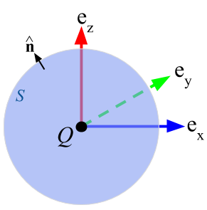

.. _lei_gauss:

Lei de Gauss para campos elétricos
==================================

    
    Carga encerrada por uma superfície

A lei de Gauss para o campo elétrico descreve o campo elétrico estático gerado por uma distribuição de cargas elétricas. Ela afirma que o fluxo elétrico através de qualquer superfície fechada é proporcional à carga elétrica total envolvida por esta superfície. Por convenção, uma carga elétrica positiva gera um campo elétrico positivo que sai da superfície. A lei foi publicada postumamente em 1867 como parte de uma coleção de trabalhos do famoso matemático alemão Carl Friedrich Gauss.

.. _lei_gauss_integral:

Equação de Gauss na forma integral
----------------------------------

A lei de Gauss na forma integral é daddo por:

.. math::
	\int_V \boldsymbol{\nabla} \cdot \mathbf{e} \; ~dv =\oint_{S} \mathbf{e} \cdot \hat{\mathbf{n}} \; ~da = \frac{Q}{ \varepsilon_{0} }\;,
	:label: Gauss_e_int

onde:

- :math:`\mathbf{e}` é o campo elétrico
- :math:`Q` é a carga elétrica encerrada por uma superfície
- :math:`\varepsilon_0` é a permissividade elétrica do espaço livre
- :math:`\hat{\mathbf{n}}` é vetor unitário normal a superfície apontada para fora

Fluxo é uma medida da força de um campo que passa por uma superfície. Fluxo elétrico é definido em geral como

.. math::
  \boldsymbol{\Phi} = \int_S \mathbf{e} \cdot \hat{\mathbf{n}} \, \mathrm{d}a.
  :label: e_flux
  
  
Podemos pensar no campo elétrico como densidade de fluxo. A lei de Gauss nos diz que o fluxo elétrico efetivo através de qualquer superfície fechada é zero, a menos que o volume limitado por essa superfície contém uma carga efetiva.

Forma Diferencial
-----------------

Ao considerar um corpo carregado espacialmente estendido, podemos pensar em sua carga como sendo continuamente distribuído por todo o corpo com densidade
: math: `\ rho`. A carga total é então dada pela integral da carga densidade sobre o volume do corpo.

.. math::
	Q = \int_V \rho \; \mathrm{d}v\;.
	:label: charge_dens
	
Usando esta definição e aplicando o teorema da divergência no lado esquerda da lei de Gauss :eq:`Gauss_e_int`, podemos reescrever a lei como:

.. math::
	\int_V \boldsymbol{\nabla} \cdot \mathbf{e} \; \mathrm{d}v = \int_V \frac{\rho}{\varepsilon_0} \; \mathrm{d}v \;.
	:label:
	
Uma vez que esta equação deve valer para qualquer volume :math: `V`, podemos igualar o integrantes, dando a forma diferencial da lei de Gauss:

.. math::
	\boldsymbol{\nabla} \cdot \mathbf{e} = \frac{\rho}{\varepsilon_0}.
	:label: Gauss_e_diff
	
Pode-se mostrar que a lei de Gauss para campos elétricos é equivalente à de Coulomb lei

Lei de Gauss na matéria
-----------------------

A lei de Gauss para campos elétricos é mais facilmente entendida negligenciando (:math:`\mathbf{d}`). Na verdade, a permissividade dielétrica pode não ser igual à permissividade do espaço livre (ou seja :math:`\varepsilon \neq \varepsilon_0`). Na matéria, a densidade de cargas elétricas pode ser separada em uma densidade de carga "livre" (:math:`\rho_f`) e uma densidade de carga "limitada" (:math:`\rho_b`), de modo que:

.. math::
	\rho = \rho_f + \rho_b
	:label: gauss_law_charge_decomp
	
A densidade de carga livre se refere a cargas que fluem livremente sob a aplicação de um campo elétrico; ou seja, eles produzem uma corrente que é livre de divergência. A densidade de carga limitada se refere a cargas elétricas atribuídas à polarização elétrica (:math:`\mathbf{p}`). Ao combinar as Equações :eq:`Gauss_e_diff` e :eq:`gauss_law_charge_decomp` com nossa definição para :ref:`polarização elétrica <dielectric_permittivity_index>`, descobrimos que:

.. math::
	\nabla \cdot \mathbf{d} - \nabla \cdot \mathbf{p} = \rho_f + \rho_b
	:label:
	
Usando a relação constitutiva :math:`\mathbf{d} = \varepsilon\mathbf{e}` e separando a equação anterior em contribuições limitadas e livres, descobrimos que:

.. math::
	-\nabla \cdot \mathbf{p} = \rho_b
	:label:

e

.. math::
	\nabla \cdot \mathbf{d} = \rho_f
	:label:

A equação acima é a **forma diferncial da equação de Gauss em meio material**. Emquanto que, **a forma integral da equação de Gauss em meio material** é dado por:

.. math::
	\int_V \nabla \cdot \mathbf{d} \; dV = \oint_S \mathbf{d} \cdot \mathbf{\hat n} \; da = Q_f

onde :math:`Q_f` é a carga total livre encerrada pela superfície.

Unidades
--------

+---------------------------+-----------------------------+---------------------+-------------------------+
|  Área da superfície       | :math:`\text{S}`            | m :math:`\! ^{2}`   | metro quadrado          |
+---------------------------+-----------------------------+---------------------+-------------------------+
|     Volume                | :math:`V`                   | m :math:`\! ^{3}`   | metro cúbico            |
+---------------------------+-----------------------------+---------------------+-------------------------+
|     Carga elétrica        | :math:`q, Q, Q_f`           | C                   | Coulomb                 |
+---------------------------+-----------------------------+---------------------+-------------------------+
|Densidade de carga elétrica| :math:`\rho, \rho_f, \rho_b`| C/m :math:`\! ^{3}` | Coulomb por metro cúbico|
+---------------------------+-----------------------------+---------------------+-------------------------+
|   Campo elétrico          | :math:`\mathbf{e}`          | V/m                 | Volt por metro          |
+---------------------------+-----------------------------+---------------------+-------------------------+
|Deslocamento elétrico      | :math:`\mathbf{d}`          | A/m :math:`\! ^{2}` | Volt por metro          |
+---------------------------+-----------------------------+---------------------+-------------------------+
|Permissividade dielétrica  | :math:`\varepsilon`         | F/m                 | Farad por metro         |
+---------------------------+-----------------------------+---------------------+-------------------------+

**Conversões**

.. math::
    \varepsilon_0 = \frac{\text{F}}{\text{m}} = \frac{\text{C}}{\text{V} \cdot \text{m}}.
