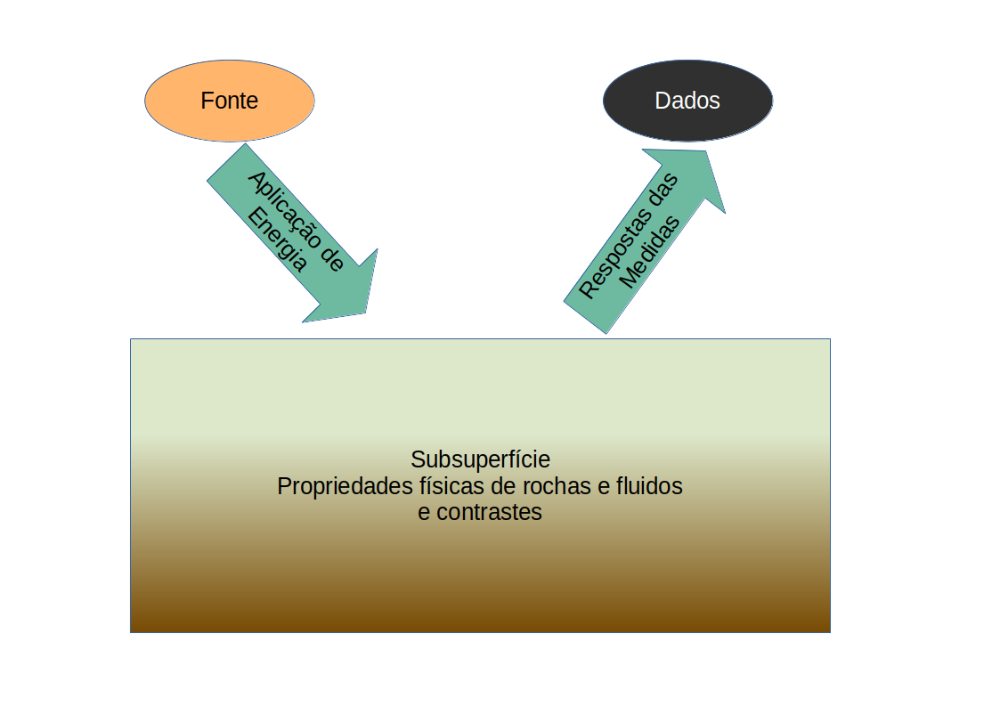

.. _Intro:

Visão Geral
===========

Geofísica
---------

Geofísica é um campo das ciências da terra que usa os métodos da física para investigar as propriedades físicas da Terra e os processos que determinaram e continuam a governar sua evolução. As investigações geofísicas cobrem uma ampla gama de campos de pesquisa, estendendo-se desde mudanças na superfície que podem ser observadas de satélites em órbita da Terra até comportamento invisível no interior profundo da Terra. As propriedades da Terra são complexas, de modo que métodos sofisticados são necessários para estudar seus processos naturais. Em contraste com um experimento de física, que pode ser conduzido em condições de laboratório cuidadosamente controladas, uma investigação geofísica é realizada em circunstâncias que são definidas pela natureza e não podem ser completamente controladas. Esta é uma das razões pelas quais a previsão de terremotos ainda não é possível, apesar do enorme esforço dos sismólogos. Um fator complicador adicional é o tempo: as simulações de processos geológicos que ocorreram ao longo de milhares de anos devem ser computadas em um curto tempo experimental.

A escala de tempo dos processos que ocorrem na Terra é muito ampla. Inclui eventos rápidos como o tremor violento de um terremoto, que pode durar frações de segundo a vários minutos, dependendo da gravidade do terremoto. No entanto, a maioria dos processos geológicos ocorre muito lentamente, em escalas de tempo muito longas. Por exemplo, mudanças lentas no campo magnético da Terra - como reversões de polaridade - acontecem ao longo de milhares de anos, e os movimentos das placas tectônicas ocorrem ao longo de dezenas de milhões de anos. Ainda assim, os processos de longa escala de tempo deixam traços mensuráveis no registro da rocha que podem ser analisados e compreendidos usando métodos geofísicos.

A :numref:`geofisica`, apresenta a grande fígura da Geofísica. Uma fonte fornece energia inicial que excitará a Terra, essa fonte pode ser uma onda acústica, eletrodos de correntes ou fontes eletromagnéticas, essas são ditas fontes ativas ou artificiais Mas podemos ter fontes naturais, que podem ser intrinsecas das formações da subsuperfícies, como por exemplo a densidade característica das rochas, o magnetismo remanescente e potenciais espotâneos das formações. Essas fotes estão presentes no nosso planeta devido a fenômenos no interior da Terra como por exemplo movimento de placasa tectônicas ou no exetrior da Terra como a radiação eletromagnética.

    
    Grande fígura da Geofísica
    
Métodos Eletromagnéticos (EM)
-----------------------------

Particularmente para os métodos eletromagnéticos ou métodos EM **Fontes** artificiais envolvem correntes elétricas que são injetadas na terra ou fluem em um loop de arame. Fontes “naturais” referem-se aos campos de energia que surgem da terra e de seu ambiente. Por exemplo, o vento solar e sua interação com nossa magnetosfera, ou a geração de campos magnéticos devido ao dínamo geomagnético no núcleo da Terra. Os sinais de entrada para a terra podem ser harmônicos ou transitórios. Correspondentemente, as equações que propagam a energia através da terra são FDEM (Frequency Domain ElectroMagnetic) ou TDEM (Time Domain ElectroMagnetic). A maneira como essa energia se propaga depende de como as propriedades físicas variam dentro da Terra.

**Dados:** Os campos eletromagnéticos na superfície da Terra são registrados por "sensores eletromagnéticos" ou "receptores". Os receptores podem estar no ar, na superfície ou subterrâneos. Os dados, que são componentes dos campos magnéticos ou elétricos, contêm informações sobre as propriedades físicas pelas quais eles percorreram desde a excitação da fonte até o registro no receptor.

O livro de :cite:`ward1988` é considerado a principal referência aos Métodos Eletromagnéticos, os autores apresentam toda a Teoria eletromagnética aplicada especificamente à Geofísica
aplicada, mas a Teoria Eletromagnética é uma só, seja aplicada nas Geociências ou nas Telecomunicações ou na geração e transmissão de energia elétrica e esta teoria são funamentadas nas Equações de Maxwell que formalizou e unificou os experimentos da leis fundamentais do eletromagnetismo, como veremos na próxima seção.

