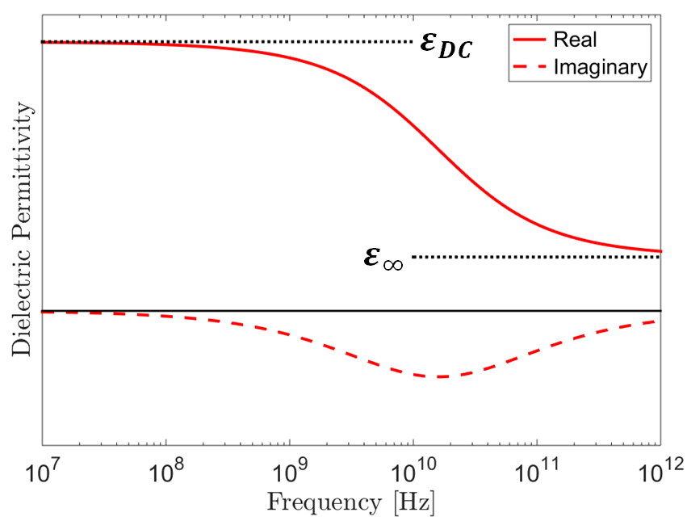

.. _dielectric_permittivity_factors:

Fatores que afetam a permissividade elétrica
============================================

Porosidade e Saturação de Água
------------------------------

De longe, os fatores mais importantes na determinação da permissividade dielétrica de uma rocha são a porosidade e a saturação de água. O ar tem uma permissividade relativa de 1, enquanto os minerais formadores de rocha comum têm permissividade relativa muito mais alta. Isso significa que, para amostras secas, a permissividade dielétrica bruta da rocha diminui à medida que a porosidade aumenta.

Quando as amostras de rocha estão saturadas com água, suas permissividades dielétricas podem aumentar drasticamente.
Isso ocorre porque a água tem uma permissividade relativa de 80, que é muito maior do que as permissividades relativas dos minerais formadores de rocha.
Como resultado, a permissividade dielétrica bruta de uma rocha aumenta à medida que aumenta a saturação de água dos poros.

A relação entre a permissividade dielétrica bruta de uma rocha, porosidade e saturação de água é dada por:

.. math::
    \sqrt{\varepsilon} = (1 - \phi ) \sqrt{\varepsilon_m} + \phi \big [ S_w \sqrt{\varepsilon_w} + (1-S_w) \sqrt{\varepsilon_a} \big ]

onde

- :math:`0 \leq \phi \leq 1` é a porosidade
- :math:`0 \leq S_w \leq 1` é o volume fracional do espaço de poro saturado por água.
- :math:`\varepsilon_m` é a permissividade dielétrica de minerais formadores de rocha.
- :math:`\varepsilon_a` é a permissividade dielétrica do ar (igual ao espaço livre).
- :math:`\varepsilon_w` é a permissividade dielétrica da água.

Frequência
----------

Para rochas duras e amostras sedimentares insaturadas, a permissividade dielétrica pode ser considerada constante para todos os efeitos. Em frequências suficientemente baixas, o mesmo pode ser dito sobre rochas e solos sedimentares saturados de água :cite:`Kaatze1989, Meissner2004`. Em altas frequências, entretanto (> 1 GHz), a polarização elétrica em amostras saturadas de água depende da frequência do campo elétrico. Como resultado, essas amostras às vezes são caracterizadas usando uma permissividade dielétrica dependente da frequência:

.. math::
    \varepsilon (\omega) = \varepsilon^\prime (\omega) + i \varepsilon^{\prime\prime} (\omega)

onde :math:`i = \sqrt{-1}`.
A componente real da permissividade dielétrica (:math:`\varepsilon^\prime`) representa a energia armazenada através da polarização elétrica, enquanto a componente imaginária (:math:`\varepsilon^{\prime\prime}`) representa uma medida de perda de energia.

Um modelo amplamente utilizado para descrever a permissividade dielétrica dependente da frequência é o modelo Cole-Cole:

.. math::
    \varepsilon (\omega) = \varepsilon_\infty + \frac{\varepsilon_{DC} - \varepsilon_\infty}{1 + (i\omega \tau)^\alpha}

onde :math:`\varepsilon_{DC}` é a permissividade de frequência DC ou zero, e :math:`\varepsilon_\infty` representa um limite quando a frequência vai ao infinito. Parâmetros :math:`\tau` e :math:`\alpha` definem o intervalo de frequências em que a permissividade dielétrica muda em relação à frequência.
Como podemos ver neste modelo:

- A dependência de frequência ocorre apenas em um intervalo finito de frequências.
- A magnitude da permissividade dielétrica diminui em relação a um aumento na frequência.
- Em frequências suficientemente baixas, a permissividade dielétrica é constante e com valor real.
    

