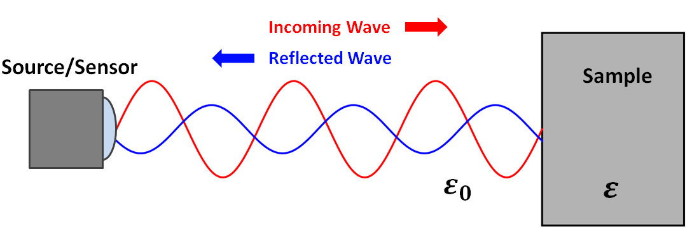

.. _dielectric_permittivity_lab_setup_measurements:

Laboratório e Medidas
=====================

Existem vários métodos para medir a permissividade dielétrica de um material.
Aqui, descreveremos dois experimentos básicos.
Esses experimentos assumem que 1) a amostra é não magnética (ou seja :math:`\mu = \mu_0`) e 2) a condutividade da amostra é suficientemente pequena (:math:`\sigma < 0.01`).

Medidas de Tempo de Transmissão
-------------------------------

A velocidade na qual as ondas eletromagnéticas (EM) de alta frequência se movem através de um material depende da permissividade dielétrica do material. Supondo que o material seja não magnético, essa relação é dada por:

.. math::
    v = \frac{c}{\sqrt{\varepsilon_r}}

onde :math:`\varepsilon_r` é a permissividade relativa e :math:`c = 2.998 \times 10^8` m/s é a constante da velocidade da luz.
No espaço livre, :math:`\varepsilon_r = 1` e as ondas EM viajam à velocidade da luz.
No entanto, dentro de um material dielétrico, as ondas EM se propagam mais lentamente de acordo com a relação acima.

Quando as medições de propriedades físicas, uma fonte envia ondas EM para uma amostra. Uma parte dessas ondas é transmitida através da amostra e atinge um sensor do outro lado. Para amostras com altas permissividades dielétricas, demorará muito mais para o sinal chegar ao sensor. Isso ocorre porque as ondas transmitidas diminuem à medida que se propagam pela amostra. Uma equação para o tempo total de viagem (:math:`\Delta t`) para ondas EM transmitidas à medida que vão da fonte para o receptor é dada por:

.. math::
    \Delta t = \frac{L - \Delta x}{c} + \frac{\Delta x}{v}
    
onde :math:`L` é a distância da fonte ao receptor, :math:`\Delta x` é o comprimento da amostra, :math:`c` é a velocidade da luz e :math:`v` é a velocidade das ondas à medida que se propagam pelo material.
Usando o sinal medido pelo receptor, podemos determinar o tempo total de viagem para as ondas EM transmitidas.
Combinando as duas equações anteriores e resolvendo a permissividade relativa:

.. math::
    \varepsilon_r = \Bigg ( 1 + \frac{c\Delta t - L}{\Delta x} \Bigg )^2

.. figure:: ./images/permittivity_transmission_measurements.png
    :align: center
    :scale: 40%

Medidas do Coeficiente Reflexão
-------------------------------

Quando as ondas EM encontram uma interface, parte de sua energia é refletida e parte de sua energia é transmitida. Para ondas EM de alta frequência, a proporção de energia que é refletida depende das propriedades dielétricas dos materiais que compõem a interface. Esta relação é geralmente caracterizada por um coeficiente de reflexão. O coeficiente de reflexão
:math:`R` define a razão entre a amplitude da onda refletida e a amplitude da onda de entrada ou incidente:

.. math::
    R = \frac{A_{ref}}{A_{inc}}

Abaixo está um diagrama para um experimento simplificado. Neste experimento, uma fonte gera ondas EM que são refletidas devido a uma diferença na permissividade dielétrica. As ondas refletidas são medidas por um sensor. Assumindo que as ondas de entrada têm um ângulo de incidência zero em relação à interface, o coeficiente de reflexão é dado por:

.. math::
    R = \frac{1 - \sqrt{\varepsilon_r}}{1 + \sqrt{\varepsilon_r}}

onde :math:`\varepsilon_r` é a permissividade relativa da amostra. Da fonte, é trivial determinar a amplitude das ondas EM incidentes na interface. Usando o sensor, também podemos determinar a amplitude das ondas EM refletidas na interface. Se ambas as amplitudes são conhecidas, a primeira equação pode ser usada para determinar o coeficiente de reflexão. Uma vez obtida, a segunda equação pode ser usada para resolver a permissividade relativa da amostra.

