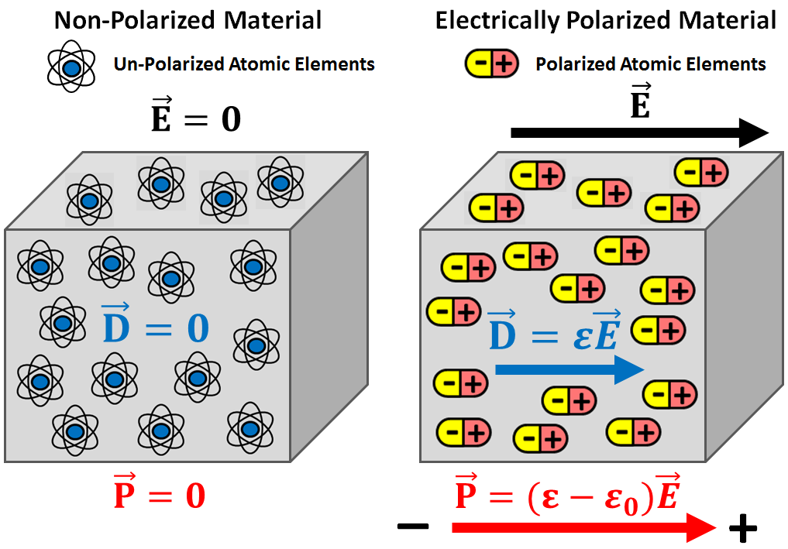

.. _dielectric_permittivity_index:

Permissividade Dielétrica
=========================

A permissividade dielétrica é uma propriedade física diagnóstica que caracteriza o grau de polarização elétrica que um material experimenta sob a influência de um campo elétrico externo. A permissividade dielétrica é a principal propriedade física de diagnóstico no :ref:`radar de penetração no solo<gpr_index>` (GPR).

Relações Constitutivas
----------------------

A permissividade dielétrica (:math:`\varepsilon`) é definida como a razão entre o campo elétrico (:math:`\mathbf E`) dentro de um material e o deslocamento elétrico correspondente (:math:`\mathbf D`):

.. math::
    \mathbf D = \varepsilon \mathbf E
    
Quando expostas a um campo elétrico, cargas elétricas deslocadas de sinais opostos tentarão se separar umas das outras. Por exemplo, as nuvens de elétrons de átomos mudarão de posição em relação a seus núcleos. A extensão da separação das cargas elétricas dentro de um material é representada pela polarização elétrica (:math:`\mathbf P`). O campo elétrico, o deslocamento elétrico e a polarização elétrica estão relacionados pela seguinte expressão:

.. math::
    \mathbf D = \varepsilon_0 \mathbf E + \mathbf P

onde a permissividade do espaço livre (:math:`\varepsilon_0 = 8.8541878176 \times 10^ {-12}` F/m) define a relação entre 
:math:`\mathbf D` e :math:`\mathbf E` se o material não for polarizável. Portanto, a permissividade dielétrica e o deslocamento elétrico definem quão fortemente um material se torna eletricamente polarizado sob a influência de um campo elétrico.

Permissividade Relativa
-----------------------

As propriedades dielétricas dos materiais são geralmente expressas usando a permissividade relativa 
(:math:`\varepsilon_r`). A permissividade relativa define as propriedades dielétricas de um material em relação ao espaço livre:

.. math::
    \varepsilon_r = \frac{\varepsilon}{\varepsilon_0}

A permissividade relativa é positiva e :math:`\geq 1`. A faixa típica de valores para rochas e outros materiais importantes pode ser encontrada :ref:`aqui<dielectric_permittivity_values>`.

Susceptibilidade Dieléctrica
----------------------------

A polarização elétrica dentro de um material pode ser definida em termos do campo elétrico da seguinte forma:

.. math::
    \mathbf P = (\varepsilon - \varepsilon_0 ) \mathbf E = \chi_e \varepsilon_0 \mathbf E

onde :math:`\chi_e` é conhecido como a suscetibilidade elétrica. Observe que a polarização é sempre paralela ao campo elétrico. A suscetibilidade elétrica não deve ser confundida com a suscetibilidade magnética, pois descrevem diferentes processos físicos.

Importância a Geofísica
-----------------------

A permissividade dielétrica é a principal propriedade física de diagnóstico em :ref:`radar de penetração no solo<gpr_index>` (GPR). A permissividade dielétrica afeta a atenuação, o comprimento de onda e a velocidade dos sinais de ondas de rádio à medida que se propagam pela Terra. Ela também determina a reflexão e a refração de sinais de ondas de rádio estão nas interfaces. O impacto da permissividade dielétrica da Terra em sistemas EM é significativo apenas para frequências de operação suficientemente altas. Como resultado, a permissividade dielétrica é geralmente negligenciada ao usar a maioria dos sistemas EM. Estes incluem: :ref:`domínio do tempo EM<airborne_tdem_index>` (TDEM) , :ref:`domínio da frequência EM<airborne_fdem_index>` (FDEM), :ref:`resistividade de corrente direta<dcr_index>` (DCR), :ref:`polarização induzida<ip_index>`(IP) e fonte natural EM ( :ref:`MT<mt_index>` e :ref:`ZTEM <ztem_index>`).

Conteúdo
--------

.. toctree::
    :maxdepth: 1

    dielectric_permittivity_lab_setup_measurements
    dielectric_permittivity_units
    dielectric_permittivity_values
    dielectric_permittivity_factors

