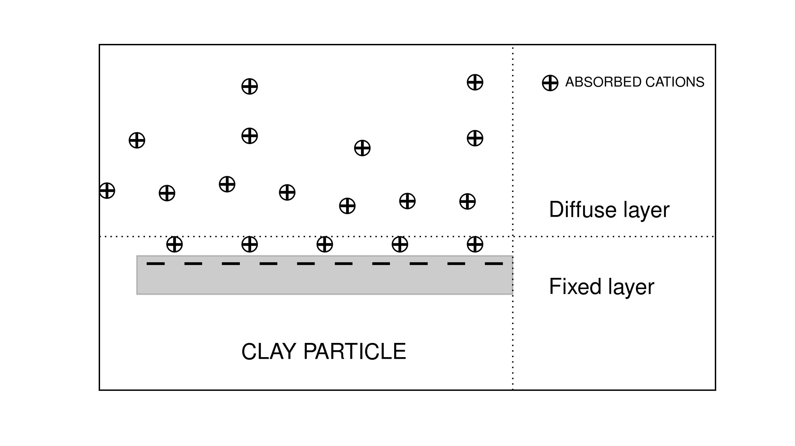

.. _electrical_conductivity_factors:

Fatores que Afetam a Condutividade e a Cargabilidade
====================================================

As propriedades elétricas das rochas são influenciadas por muitos fatores. Os fatores mais comuns incluem:

    - Mineralogia (especificamente a concentração de partículas metálicas e minerais de argila)
    - Porosidade e tortuosidade
    - saturação de poros
    - Salinidade da água de poros

..	- Temperature
..	- Pressure
..	- Grain texture

Fatores que Imapactam a Condutividade
-------------------------------------

Propriedades espaço-poro e água-poro
^^^^^^^^^^^^^^^^^^^^^^^^^^^^^^^^^^^^

A maioria dos minerais formadores de rocha são maus condutores. Como resultado, as propriedades condutoras da maioria das rochas são dominadas pela condução iônica. A eficiência da condução iônica depende do espaço dos poros e das propriedades da água dos poros da rocha. Em geral, a condutividade da rocha é maior quando:

- a salinidade (a concentração de íons dissolvidos) é maior.
- a porosidade e a saturação dos poros são maiores
- a tortuosidade é menor

Lembre-se de uma definição anterior, que a condutividade iônica era proporcional ao número de portadores de carga (:math:`n`), ou seja:

.. math::
	\sigma = e (n^+ \mu_m^+ + n^- \mu_m^-)

onde (+) e (-) foram usados para denotar cátions e ânions, respectivamente. Portanto, à medida que a salinidade aumenta, há mais portadores de carga iônica. Isso é responsável por aumentar a condutividade da rocha. O número de portadores de carga iônica também aumenta à medida que o espaço dos poros e a saturação dos poros aumentam. O espaço dos poros permite que uma parte maior da rocha seja composta de poros-água iônica, em oposição aos minerais resistivos. No entanto, a rocha só será condutiva se a saturação de água dos poros for suficientemente grande. O ar é um resistor perfeito. Por isso, as rochas secas são muito resistentes, pois o único mecanismo de condução é a condução elétrica através dos grãos minerais. Conforme a porcentagem de saturação dos poros aumenta, a condução iônica se torna mais disponível, aumentando assim a condutividade da rocha.

A tortuosidade define o quão complicada é a rede de poros-espaços interconectados dentro de uma rocha. Se a tortuosidade for baixa, as cargas iônicas podem mais livremente e desimpedidas através do espaço dos poros. Para rochas de alta tortuosidade, a polarização da membrana é mais provável e os íons devem seguir caminhos complicados através da rocha. Para rochas sedimentares (assim como outras em alguns casos), a condutividade DC pode ser entendida através da **lei de Archie**.

Archie definiu uma relação empírica que caracteriza as condutividades DC de rochas sedimentares em termos de suas propriedades de água dos poros. A lei de Archie pode ser escrita como:

.. math::
	\sigma = F^{-1} \sigma_w S_w^{n},
	:label: Archies_cond

onde :math:`0 \leq S_w \leq 1` é o percentual fracionário de saturação de água, :math:`\sigma_w` é a
conductividade da água dos poros, e :math:`F` é chamado de fator de formação. Como uma resistividade, a lei de Archie é dada por:

.. math::
	\rho = F \rho_w S_w^{-n},
	:label: Archies_resis

onde :math:`\rho_w` é a resistividade da água dos poros. O fator de formação é definido como:

.. math::
	F = \frac{a}{\phi^m} = \frac{\sigma_w}{\sigma_0} = \frac{\rho_0}{\rho_w},
	:label: Archies_formationfactor

onde :math:`\sigma_0` e :math:`\ rho_0`, respectivamente, são a condutividade e resistividade
da rocha se ela fosse 100% saturada (:math:`S_w = 1`). Aqui :math:`m` é
o fator de cimentação (geralmente na faixa de :math:`1,3 < m <2,3`), :math:`n` é o
expoente de saturação (geralmente próximo a 2), e :math:`a` é o fator de tortuosidade. Como podemos ver na lei de Archie, a resistividade aumenta com o aumento da tortuosidade. O fator de cimentação descreve o quanto a rede de poros diminui a condutividade (assumindo que a rocha em si não seja condutora). Rochas mais consolidadas geralmente têm os maiores fatores de cimentação, o que está efetivamente relacionado
à pressão:

    - Para arenitos ligeiramente consolidados :math:`m = 1,4`
    - Para arenitos consolidados :math:`m = 1,7`

.. note::

    A lei de Archie é puramente empírica com a intenção de descrever o fluxo de íons em
    areias limpas e consolidadas. A condução elétrica é assumida como não
    presente dentro dos grãos de rocha. Portanto, pode não funcionar para uma rocha inclui
    quantidade considerável de minerais de argila porque uma partícula de argila ou xisto age
    como um caminho condutor separado.

Condutividade dos Minerais
^^^^^^^^^^^^^^^^^^^^^^^^^^

A corrente elétrica dentro de uma rocha será dissuadida de fluir através do espaço poroso se os minerais formadores de rocha forem mais condutores; já que a corrente gosta de seguir o caminho de menor resistência. Isso ocorre com frequência em rochas minerais devido à presença de óxidos metálicos (magnetita, ilmenita, hematita especular), sulfuretos metálicos (pirita, pirrotita, galena) e metais nativos (ouro, prata, cobre). Uma exceção é a grafite, que apesar de ser inteiramente composta por carbono, é muito condutiva. Como esperado, a condutividade aumenta conforme a concentração de minerais condutores dentro da rocha aumenta.

Conteúdo de Argila
^^^^^^^^^^^^^^^^^^

Na abordagem clássica da engenharia de petróleo para rochas sedimentares, rochas
contendo partículas de argila são freqüentemente chamadas de “areias sujas”. Uma vez que as partículas de argila são
substancialmente mais condutores do que a maioria dos minerais formadores de rocha, eles representam um
caminho condutor. A lei de Archie geralmente funciona bem para rochas sedimentares, no entanto, deve ser corrigida no caso de areias sujas. A causa fundamental da condutividade anormalmente alta para areias sujas é baseada na capacitância de camada dupla de cátions absorvidos, conforme mostrado em
:numref:`DoubleLayer`.

   Diagrama conceitual de cátions absorvidos na partícula de argila.

Os cátions são necessários para equilibrar a carga devido a substituições dentro do
estrutura de cristal ou partículas de argila e ligações quebradas. O tamanho finito dos cátions impede
a formação de uma única camada. Em vez disso, uma “camada dupla” é criada. A camada dupla é
composto por uma "camada fixa" imediatamente adjacente à superfície da argila e um
"Camada difusa" que diminui na densidade de carga exponencialmente com a distância
da camada fixa. Diferente da camada fixa, a camada difusa não é
fixo, mas livre para se mover sob um campo elétrico aplicado. Esta camada dupla
fenômeno é simplesmente considerado como uma membrana seletiva de cátions. Aqueles
cátions capturados por minerais de argila são adicionados ao íon normal
concentração e, assim, aumentar a densidade dos portadores de carga disponíveis. O resultado líquido
é uma maior "condutividade de superfície" :cite:`ward1990`.

O impacto das argilas disseminadas na condutividade das rochas torna-se cada vez mais
importante à medida que a condutância através dos poros diminui. Hidrotérmico
alteração muda feldspatos para caulinita, montmorilonita e outra argila
minerais, especialmente para rochas siliciosas. Em rochas básicas, clorito e
serpentina pode ser produzida. Todos esses produtos de alteração apresentam alta
condutividade. À medida que a concentração do eletrólito aumenta, o
contribuição relativa do caminho de condução do eletrólito para a argila
o caminho de condução aumenta. A condutividade total :math:`\sigma` de uma rocha pode
ser expresso como

.. math::
	\sigma = \sigma_n + \sigma_s,

onde :math:`\sigma_n` é a condutividade normal da rocha e :math:`\sigma_s` é
a condutividade superficial da argila. Assumindo a rocha totalmente saturada
(:math:`S_w=1`) e com a lei de Archie (:math:`\sigma =
\frac{\sigma_e}{F}S_w^{n}`), obtemos :math:`\sigma_n = \frac{\sigma_e}{F}`.
Então, reescrevemos a equação acima como

.. math::
	\sigma = \frac{\sigma_e}{F} + \sigma_s.

Isso mostra claramente que conforme a concentração do eletrólito aumenta, o
contribuição relativa do caminho de condução de eletrólito (:math:`\ sigma_n`) para
o caminho de condução de argila (:math:`\sigma_s`) aumenta.

:cite:`waxman1968` deu a expressão para a resistividade de uma rocha contendo argila

.. math::
	\rho = \frac{\rho_w F_t}{1+ \rho_w BQ},
	:label: Waxman&Smits

e efetivamente na forma de condutividade

.. math::
	\sigma = \frac{\sigma_w+BQ}{F_t},

onde B é o fator relacionado à mobilidade dos cátions de troca no poro
concentração de água, Q é a capacidade de troca catiônica de argila por unidade de volume,
e :math:`F_t` é o fator de formação em concentrações muito altas onde o
os efeitos das argilas podem ser desprezados (o verdadeiro fator de formação). Da Equação
:eq:`Waxman&Smits` um fator de formação aparente pode ser escrito como

.. math::
	F_a = \frac{\rho_r}{\rho_w} = \frac{F_t}{1+\rho_w BQ}.

Fatores Impactantes na  Cargabilidade
-------------------------------------

A cargabilidade resulta de mecanismos que promovem a polarização do eletrodo e a polarização da membrana.

Mineralização de sulfeto
^^^^^^^^^^^^^^^^^^^^^^^^

.. figure:: ./images/elec_pol_1.gif
		:align: right
		:figwidth: 50%

		Polarização de eletrodo.

Como apresentamos :ref:`anterior <electrical_conductivity_mechanisms_electrode>`, a polarização de eletrodo ocorre quando o caminho dos poros é bloqueado por partículas metálicas. A principal fonte dessas partículas metálicas é a mineralização de sulfeto. À medida que a abundância de minerais de sulfeto dentro de uma rocha aumenta, também aumenta o número de interfaces que promovem a polarização do eletrodo. Portanto, rochas altamente mineralizadas tendem a ser muito carregáveis. Isso pode ser visto na tabela abaixo.

+------------------------+--------------------------+
|  **Tipo do Material**  | **Cargabilidade (msec)** |
+========================+==========================+
| 20% sulfetos           | 2000-3000                |
+------------------------+--------------------------+
| 8-20% sulfetos         | 1000-2000                |
+------------------------+--------------------------+
| 2-8% sulfetos          | 500-1000                 |
+------------------------+--------------------------+

Conteúdo de Argila
^^^^^^^^^^^^^^^^^^

Como apresentamos :ref: `earlier <electrical_conductivity_mechanisms_membrane>`, as argilas têm uma tendência a bloquear parcialmente os caminhos que os íons passam pela água dos poros da rocha e promover a formação de camadas duplas elétricas. Isso resulta em uma polarização de membrana "seletiva de íons", onde ânions e cátions se acumulam em uma extremidade de cada partícula de argila. As argilas representam uma fonte dominante de polarização induzida em rochas sedimentares não mineralizadas. Como esperado, as cargas de rochas ricas em argila aumentam em relação ao conteúdo de argila, pois aumenta o potencial de polarização da membrana.

.. figure:: ./images/memb_pol_2nd_type.gif
	:align: center
	:figwidth: 70 %

Saturação de água de poros, salinidade e tortuosidade
^^^^^^^^^^^^^^^^^^^^^^^^^^^^^^^^^^^^^^^^^^^^^^^^^^^^^

A polarização induzida dentro de uma rocha depende de ter um mecanismo para acumular cargas iônicas. Também depende da salinidade da água dos poros; isto é, a concentração de íons na água dos poros. À medida que aumenta a salinidade da água dos poros, aumenta também a capacidade da rocha de suportar o acúmulo de cargas iônicas. Em última análise, este é o responsável por altas cargabilidades. A abundância total de portadores de carga e a capacidade resultante de polarização induzida também aumentam à medida que aumenta a saturação de água dos poros. Isso se deve ao fato de que, conforme aumenta a saturação da água dos poros, há mais interfaces eletrólito-superfície nas quais pode ocorrer o acúmulo de carga. A tortuosidade também desempenha um papel importante na determinação da capacidade de carga de uma rocha. Para um espaço de poro mais tortuoso, é mais difícil para cargas iônicas fluir através do espaço de poro sem encontrar obstáculos. Quanto mais obstáculos resultarem no acúmulo de cargas iônicas, maior será a capacidade de carga da rocha. É importante notar que, embora tenhamos descrito qualitativamente as relações entre a saturação da água dos poros, salinidade, tortuosidade e capacidade de carga da rocha, essas relações são muito complexas.

