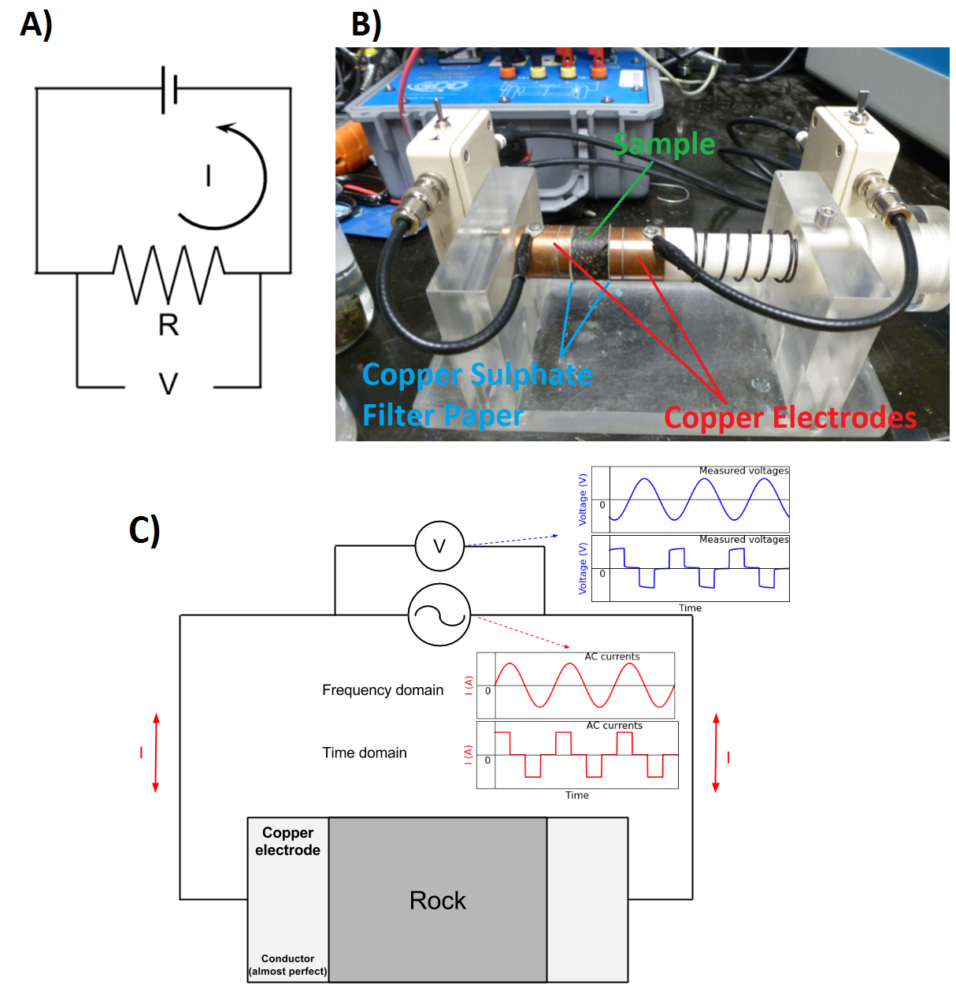
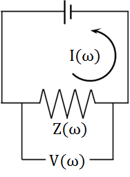
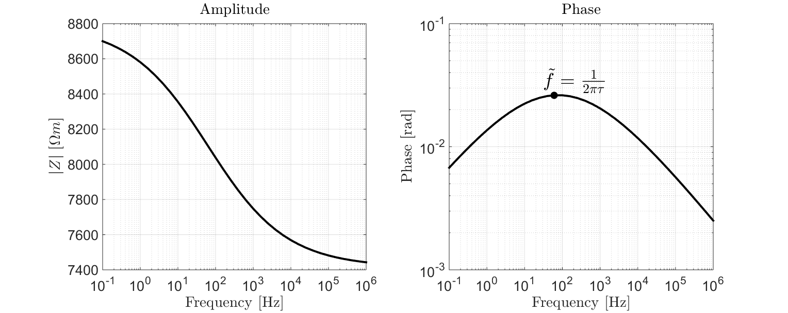
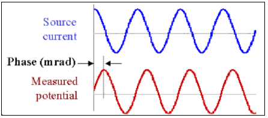

.. _electrical_conductivity_lab_setup_measurements:

Medidas em Laboratório
======================
As medições de condutividade/resistividade elétrica são parte integrante da classificação das propriedades físicas da rocha. Aqui, apresentamos a abordagem geral para medir as propriedades elétricas de uma rocha, incluindo condutividade/resistividade elétrica e cargabilidade. Instrumentação também é discutida.

Configuração de laboratório de dois eletrodos
---------------------------------------------

As medições de resistividade elétrica são mais comumente realizadas usando uma configuração de dois eletrodos. Isso é ilustrado em :numref:`fig_cond_lab_setup`. Para essas medições, um núcleo de rocha de dimensões conhecidas é colocado entre dois eletrodos de cobre ou grafite. A corrente é então forçada através da rocha, que atua como o elemento resistivo para um circuito elétrico. Ao medir a queda de tensão na rocha (:math:`V`), a lei de Ohm para circuitos elétricos pode ser usada para determinar a resistência correspondente. Nesse caso:

.. math::
   V = IR
   :label: phys_prop_ohm_circuit

onde :math:`I` é a corrente sendo forçada através da rocha e :math:`R` é a resistência devida à amostra de rocha. Dado que conhecemos as dimensões da amostra de rocha, a lei de Pouillet pode ser usada para obter a resistividade elétrica da rocha. A lei de Pouillet é dada por:

.. math::
   \rho = \frac{RA}{l}
   :label: phys_prop_pouillet

onde :math:`l` é o comprimento da amostra e :math:`A` é sua área transversal. A condutividade elétrica é obtida simplesmente tomando o recíproco da resistividade, ou seja:

.. math::
   \sigma = \frac{1}{\rho}
   :label: phys_prop_cond_recip

As medições de resistividade elétrica podem ser realizadas no domínio da frequência e no domínio do tempo. Para medições no domínio da frequência, uma corrente senoidal é conduzida através da amostra de rocha. Mostraremos que mudanças devem ser feitas nas equações acima mencionadas no caso de medições no domínio da frequência. No domínio do tempo, uma forma de onda boxcar é usada.

   Configuração básica para medições de resistividade elétrica. (A) Circuito teórico onde a rocha atua como um elemento resistivo. (B) Amostra de rocha entre dois eletrodos. (C) Circuito esquemático para medições no domínio da frequência e no domínio do tempo.
   
.. figure:: ./images/DCcircuit_simple.png
   :figwidth: 25%
   :align: right
   :name: fig_DC_measurements

   Circuit elétrico para medições de resistividade DC.

Resistividade/Condutividade DC
------------------------------

A resistividade DC (ou frequência zero) é obtida forçando a corrente contínua (:math:`I`) através da rocha e medindo a queda de tensão (:math:`V`).
A resistência (:math:`R`) devido à rocha é obtida usando a lei de Ohm Equação. :eq:`phys_prop_ohm_circuit`. A resistividade elétrica é então obtida usando a Equação. :eq:`phys_prop_pouillet`. A resistividade DC é uma quantidade única com valor real e tem unidades Ohm metros (:math:`\Omega m`).

Medições no domínio da frequência
---------------------------------

A resistividade elétrica pode ser dependente da frequência e de valor complexo, que
efetivamente gera efeitos de polarização com o campo elétrico aplicado. Isso geralmente é chamado de efeitos
de polarização induzida (IP). Para medir condutividade complexa de um espécime de rocha, injetamos correntes senoidais 
(isto é, correntes AC) na rocha em frequências espaçadas logaritmicamente e medimos as tensões correspondentes. 
A faixa de frequência típica para essas medições é de 0,01 Hz - 1 MHz.

   Cicuito elétrico para medidas no domínio da frequência.

Neste caso, a impedância atribuída à amostra de rocha e a tensão medida através dela são dependentes da frequência e complexas. Para medições no domínio da frequência, a Equação :eq:`phys_prop_ohm_circuit` (lei de Ohm) é dado por:

.. math::
   Z(\omega) = \frac{V(\omega)}{I(\omega)}

onde :math:`I (\omega)` é a corrente que flui através da amostra de rocha, :math:`V(\omega)` é a voltagem medida através da rocha, e :math:`Z (\omega)` é a impedância elétrica correspondente (resistência complexa). Ao alterar a Equação :eq:`phys_prop_pouillet` consequentemente, a resistividade da rocha é dada por:

.. math::
   \rho (\omega) = \frac{Z(\omega) A}{l}

Representação de Medidas no Domínio na frequência
^^^^^^^^^^^^^^^^^^^^^^^^^^^^^^^^^^^^^^^^^^^^^^^^^

Existem várias maneiras pelas quais as medições no domínio da frequência podem ser representadas. Elas são ilustradas a seguir. Geralmente, plotamos a impedância complexa. No entanto, os valores de impedância podem ser facilmente convertidos em valores de resistividade ou condutividade e plotados.

**Amplitude e Fase**

As medições no domínio da frequência são geralmente plotadas em termos de amplitude e fase. Como podemos ver em :numref:`fig_props_amp_phase`, a amplitude é uma função decrescente monotônica em relação à frequência. De acordo com o gráfico de fases, a frequência correspondente à maior fase ocorre aproximadamente :math:`\tilde f = 1/2 \pi \tau`.

   Gráfico em mmplitude e fase para uma amostra :math:`\rho_0 = 8.8 \times 10^3 \; \Omega \!` m, :math:`\eta=0.157` V/V, :math:`\tau=2.59 \times 10^{-3}` s e :math:`C=0.38`.

.. figure:: ./images/Cole_Cole_plot.png
   :figwidth: 50%
   :align: right
   :name: fig_props_Cole_Cole

   Gráfico Cole-Cole para uma amostra com :math:`\rho_0 = 8.8 \times 10^3 \; \Omega \!` m, :math:`\eta=0.157` V/V, :math:`\tau=2.59 \times 10^{-3}` s e  :math:`C=0.38`.

**Gráfico Cole-Cole**

O gráfico Cole-Cole também é uma escolha popular para visualizar medições no domínio da frequência. Aqui, a componente real da impedância complexa é traçado no eixo X e a componente imaginária negativa é traçado no eixo Y. A maior componente imaginária ocorre em :math:`\tilde f = 1/2 \pi \tau`. Esta é a frequência em que a polarização induzida é mais significativa para a amostra. O comportamento característico mostrado em :numref:`fig_props_Cole_Cole` é freqüentemente referido como um arco de impedância ou "Zarc ".

Medidas de resistividade e cargabilidade DC
^^^^^^^^^^^^^^^^^^^^^^^^^^^^^^^^^^^^^^^^^^^

**Espectropia de Impedância Elétrica**

Recuperar a resistividade DC e cargabilidade de medições no domínio da frequência requer um modelo apropriado para descrever as propriedades elétricas da amostra. Na página anterior, afirmamos que as propriedades das rochas elétricas geralmente podem ser caracterizadas usando o modelo Cole-Cole. Para uma amostra individual:

.. figure:: ./images/Cole_Cole_fit.png
   :figwidth: 50%
   :align: right
   :name: fig_props_Cole_Cole_fit

   Cole-Cole fit showing a sample with :math:`\rho_0 = 8.8 \times 10^3 \; \Omega \!` m, :math:`\eta=0.157` V/V, :math:`\tau=2.59 \times 10^{-3}` s and :math:`C=0.38`.
   
1) A impedância complexa é medida em frequências espaçadas logaritmicamente entre 0,01 Hz e 1 MHz.
2) As dimensões da amostra são então usadas para obter os valores de resistividade correspondentes de acordo com :eq:`phys_prop_pouillet`.
3) Os valores de resistividade são ajustados usando o modelo Cole-Cole, que é subsequentemente usado para obter valores para a resistividade DC (:math:`\ rho_0`) e cargabilidade (:math:`\eta`).

Lembre-se de que o modelo Cole-Cole para resistividade elétrica é dado por:

.. math::
  \rho (\omega) = \rho_0 \Bigg [ 1 - \eta \Bigg ( 1 - \frac{1}{1 + (i\omega \tau)^C} \Bigg ) \Bigg ]

**Efeito de Frequência Percentual**

Uma forma mais simples de medições no domínio da frequência é feita com duas frequências. Se a rocha não for carregável, a dependência da frequência da resistividade da amostra é desprezível; resultando em medições de tensão quase idênticas em cada frequência. Para amostras cada vez mais carregáveis, a diferença na resistividade absoluta torna-se maior. O efeito da frequência percentual é usado para descrever esse efeito. O efeito da porcentagem de frequência é definido como:

.. math::
   PFE = \Bigg ( \frac{V(f_1) - V(f_2)}{V(f_1)} \Bigg ) \times 100 \% = \Bigg ( \frac{\rho (f_1) - \rho (f_2)}{\rho (f_1)} \Bigg ) \times 100 \%

onde :math:`V(f_1)` é a tensão absoluta medida em uma frequência mais baixa e :math:`V(f_2)` é a tensão absoluta medida em uma frequência mais alta. O efeito da porcentagem de frequência também pode ser expresso em termos de resistividade absoluta, onde :math:`\rho(f_1)` é a resistividade absoluta medida em uma frequência mais baixa e :math:`\rho(f_2)` é a resistividade absoluta medido em uma frequência mais alta.

**Diferença de Fase**

   Tensões medidas mostrando uma variação na fase feito pelos efeitos da polarização induzida.

A cargabilidade as vezes é inferida medindo a impedância complexa em uma determinada frequência e determinando sua fase em relação à corrente:

.. math::
   \phi = \textrm{tan}^{-1} \Bigg ( \frac{V (\omega)}{I (\omega)} \Bigg )

Examinando :numref:`fig_props_amp_phase` e :numref:`fig_props_Cole_Cole`, podemos ver que os efeitos da cargabilidade são maiores quando o ângulo de fase está no máximo. Portanto, quanto maior a fase, mais os efeitos de IP dominantes são para a amostra. Esses dados são geralmente fornecidos em unidades de milirradianos [mrad].

Medidas no Domínio do Tempo
---------------------------

A resistividade elétrica e a cargabilidade também podem ser medidas no domínio do tempo. A configuração experimental para medições no domínio do tempo é mais ou menos a mesma que é mostrada em :numref:`fig_cond_lab_setup`. Neste caso, uma forma de onda boxcar é usada para excitar a amostra e as tensões são medidas durante o tempo ligado e desligado (:numref:`cond_volt_tdem`).

.. figure:: ./images/IPonoff.png
   :scale: 100%
   :align: center
   :name: cond_volt_tdem

   Medidas no domínio do tempo. (a) Forma de onda boxcar. (b) Tensão medida através da rocha.

No momento em que a corrente é inicialmente forçada através da amostra de rocha, há um aumento instantâneo na tensão medida (:math:`V_\infty`). Conforme as cargas iônicas se acumulam, há um processo de relaxamento no qual a tensão medida se aproxima de uma tensão de estado estacionário (ou CC) (:math:`V_0`). Após tempo suficiente, a fonte de corrente é desligada e ocorre uma queda instantânea na tensão medida igual a :math:`V_\infty`. Leva tempo para a rocha "descarregar" devido aos efeitos de polarização induzida. Como resultado, há uma tensão mensurável na rocha durante o tempo desligado que denotamos como :math:`V_s(t)`. Na prática, a excitação do vagão é aplicada muitas vezes e os dados são empilhados.

Medindo Resistividade DC
^^^^^^^^^^^^^^^^^^^^^^^^

Para medições no domínio do tempo, a resistividade DC é fácil de medir. A tensão DC é medida aplicando corrente contínua por um período de tempo suficiente. Em 
:numref:`cond_volt_tdem`, esta tensão é dada por :math:`V_0`. Uma vez obtida, a Equação :eq:`phys_prop_ohm_circuit` (lei de Ohm) pode ser usado para obter a resistência DC (:math:`R_ {DC}`):

.. math::
   R_{DC} = \frac{V_0}{I_0}

e Equação :eq:`phys_prop_pouillet` pode ser usada para obter resistividade DC:

.. math::
   \rho_0 = \frac{R_{DC} A}{l}

cargabilidade Cole-Cole
^^^^^^^^^^^^^^^^^^^^^^^
De acordo com o modelo Cole-Cole, a cargabilidade pode ser definida como a diferença fracionária entre a resistividade DC e a resistividade como 
:math:`\omega\rightarrow\infty` (ou :math:`\rho_\infty`):

.. math::
   \eta = \frac{\rho_0 - \rho_\infty}{\rho_0}

No entanto, também pode ser mostrado que a capacidade de carga é a diferença fracionária entre a tensão DC medida (:math:`V_0`) através da amostra de rocha e o aumento instantâneo na tensão (:math:`V_\ infty`) observado quando o a corrente está ligada. Assim:

.. math::
   \eta = \frac{V_0 - V_\infty}{V_0}

Embora a definição formal venha diretamente de nosso modelo para resistividade elétrica, a última definição é mais relevante em um ambiente de laboratório. Em um cenário ideal, seria possível medir :math:`V_0` e :math:`V_\ infty` diretamente e usar a equação anterior para calcular a exigibilidade. Infelizmente, existem fenômenos de alta frequência que afetam significativamente a tensão medida no momento em que a corrente é aplicada ou removida. Esse obstáculo é superado medindo-se valores intrínsecos para a cargabilidade da rocha.

 
Medidas Intrínsecas da Cargabilidade
^^^^^^^^^^^^^^^^^^^^^^^^^^^^^^^^^^^^

As medições de capacidade intrínseca são realizadas medindo a tensão fora do tempo (:math:`V_s(t)` in :numref:`cond_volt_tdem`) e integrando ao longo de um intervalo especificado de canais de tempo [:math:`t_1, t_2`]. Isso se destina a caracterizar a polarização induzida que ocorre ao longo do tempo em canais relevantes para métodos de levantamento geofísico. A cargabilidade intrínseca é frequentemente referida como a *cargabilidade  aparente* (:math:`\eta_{app}`). Existem duas maneiras comuns de definir a cargabilidade aparente. Ou a tensão de desligamento é integrada entre :math:`t_1` e :math:`t_2`:

.. math::
   \eta_{app} = \int_{t_1}^{t_2} \frac{V_s(t)}{V_0} dt
   
e a cargabilidade aparente é dada em unidades de milissegundos [ms]. Ou a tensão "off-time" é integrada entre :math:`t_1` e :math:`t_2` e normalizada pelo intervalo de tempo:

.. math::
   \eta_{app} = \frac{1}{t_2 - t_1} \int_{t_1}^{t_2} \frac{V_s(t)}{V_0} dt

Nesse caso, a caragabilidade aparente é dada em unidades de mili-Volts por Volt [mV/V], ou como uma quantidade sem unidade. Os valores de cargabilidade intrínseca dependem muito da definição, bem como do tempo de integração. Existem várias convenções comuns. Uma escolha bem estabelecida é a cargabilidade Newmont Standard, que integra entre 0,15 s e 1,1 s.

