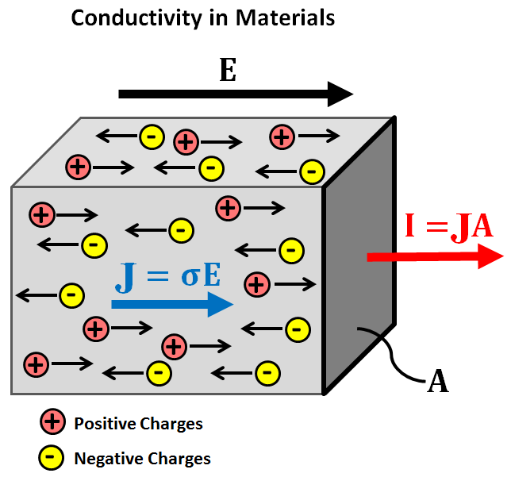
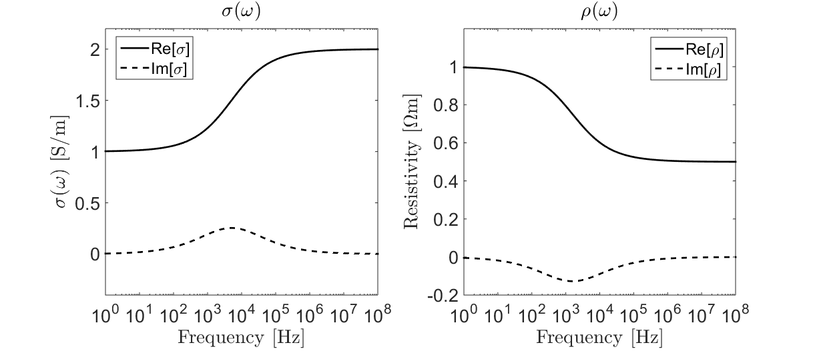

.. _electrical_conductivity_index:

Condutividade Elétrica
======================

A condutividade elétrica é uma propriedade física diagnóstica que quantifica o quanto facilmente as cargas elétricas se movem através de um determinado material quando submetidas a um campo elétrico aplicado. No desenvolvimento matemático e em referências que descrevem rochas ou fluidos, é comum usar sua propriedade
recíproca  a resistividade elétrica. Para a maioria dos levantamentos geofísicos dos métodos EM, a condutividade elétrica é a principal propriedade física de interesse.

Relações Constitutivas
----------------------
Quando um campo elétrico é aplicado a um material, cargas livres dentro do material experimentam uma força elétrica (Coulomb). Esta força faz com que as cargas livres se movam através do material ao longo da direção do campo aplicado (isto é, corrente elétrica). A facilidade com que as cargas elétricas se movem através de um material sob a influência de um campo elétrico depende da condutividade elétrica do material.

   Fluxo de cargas elétricas sob um campo elétrico aplicado.

Condutividade elétrica :math:`\sigma` define a razão entre densidade de corrente :math:`\mathbf{J}` dentro de um material e o campo elétrico :math:`\mathbf{E}`. Esta relação é conhecida como lei de Ohm vetorial e é dado por:

.. math::
  \mathbf{J} = \sigma \mathbf{E}

onde a densidade de corrente é definida como a corrente elétrica :math:`\mathbf{I}` por área de seção unitária :math:`A` (:numref:`fig_conductivity_physics_diagram`):

.. math::
  \mathbf{J} = \lim_{A \rightarrow 0} \frac{\mathbf{I}(A)}{A}

Resistividade Elétrica
----------------------
Em muitos casos, as propriedades elétricas de um material são caracterizadas usando a resistividade elétrica :math:`\rho`. A resistividade elétrica é definida como o recíproco da condutividade elétrica:

.. math::
  \rho = \frac{1}{\sigma}

Assim, a relação constitutiva pode ser re-expressa da seguinte forma:

.. math::
  \mathbf{E} = \rho \mathbf{J}

.. _electrical_conductivity_index_chargeability:

Cargabilidade dependente da frequência
--------------------------------------

Sob a influência de um campo elétrico, cargas livres (como íons) fluem através dos materiais ao longo da direção do campo aplicado. Para a maioria das aplicações práticas, o fluxo de cargas elétricas está em fase com o campo elétrico aplicado. No entanto, quando as cargas iônicas atingem uma barreira impermeável, elas começam a se acumular. Como resultado, certos materiais podem atuar como capacitores para cargas iônicas; um fenômeno conhecido como polarização induzida. Abaixo estão dois exemplos de polarização induzida em rochas. À esquerda, as cargas iônicas se acumulam porque o caminho dos poros é bloqueado por partículas metálicas (polarização do eletrodo). À direita, as cargas iônicas se acumulam porque a garganta dos poros é insuficientemente grande (polarização da membrana).

.. figure:: ./images/fig_polarization_example.png
   :align: center
   :figwidth: 60%
   :name: fig_polarization_example

O grau de acumulação de carga (capacitância) sob a influência de um campo elétrico externo é descrito como **cargabilidade**. A capacidade de carga é frequentemente considerada uma propriedade física separada da condutividade, embora as duas estejam relacionadas. Para materiais com essa caracerística, a relação constitutiva (lei de Ohm) torna-se dependente da frequência:

.. math::
  \mathbf{J}(\omega) = \sigma (\omega) \mathbf{E}(\omega) 

Um modelo comumente usado para descrever a condutividade dependente da frequência é o modelo Cole-Cole:

.. math::
  \sigma (\omega) = \sigma_{\infty} \Bigg [ 1 - \frac{\eta}{1 + (1-\eta)(i \omega \tau)^C} \Bigg ]

onde :math:`\sigma_{\infty}` é o limite de frequência infinito, :math:`0 \leq \eta \leq 1` é a **cargabilidade**, e :math:`\tau` e :math: `0 \leq C \leq 1` define a taxa de acumulação de carga. Depois de tomar o recíproco, a resistividade elétrica é comumente expressa como:

.. math::
  \rho (\omega) = \rho_0 \Bigg [ 1 - \eta \Bigg ( 1 - \frac{1}{1 + (i\omega \tau)^C} \Bigg ) \Bigg ]

onde :math:`\rho_0` defines a frequência 0, or resistividade DC. Condutividade e resistividade elétrica como uma função da frequênciasão ilustradas abaixo.

   Condutividade Cole-Cole (esquerdo) e resistividade (direito) para :math:`\sigma_\infty` = 2 S/m, :math:`\rho_0` = 1 :math:`\Omega m`, :math:`\eta` = 0.5, :math:`\tau` = :math:`10^{-4}` s e :math:`C` = 0.5.

Importância na Geofísica
------------------------

**Condutividade Elétrica**

A maioria das pesquisas EM explora contrastes na condutividade elétrica para obter imagens do subsolo. Para resistividade elétrica de corrente contínua, levantamentos por exemplo, a corrente elétrica é forçada através da Terra. O caminho percorrido pela corrente, assim como os dados medidos, dependem da distribuição de condutividade do subsolo.

Muitos sistemas EM operam com base nos princípios da indução EM. Estes incluem *Levantamento EM aéreo no domínio de frequência* (FDEM), *Levantamento EM aéreo no domínio do tempo* (TDEM), *fonte controlada EM marinho* (MCSEM) e *levantamentos de material bélico não detonado* (UXO). Durante essas pesquisas, um transmissor envia sinais EM com variação de tempo para o solo, que subsequentemente induzem correntes elétricas. A força das correntes induzidas e os campos secundários que elas produzem dependem da distribuição das condutividades subterrâneas.

Os dados coletados durante os levantamentos magnetotelúricos (MT) e (ZTEM) também dependem da condutividade da Terra. Esses métodos contam com fontes naturais para gerar respostas EM. Para MT, as relações entre os componentes medidos dos campos elétricos e magnéticos fornecem uma visão sobre a impedância eletromagnética da Terra e, indiretamente, sua condutividade elétrica.

**Cargabilidade**

Em comparação com a maioria dos outros tipos de rocha, as rochas contendo sulfeto são altamente carregáveis; uma exceção são as rochas com alto teor de argila. Em abundância suficiente, as rochas contendo sulfeto podem ter um valor econômico significativo. Ao contrário de pesquisas em resistividades, levantamentos IP podem ser usadas para distinguir corpos com cargabilidade e sem cargabilidade, mesmo se ambos forem similarmente condutores. Sistemas TDEM também podem ser usados para reconhecer a presença de corpos com caragabilidades, já que eles produzem respostas distintas no domínio do tempo. Como resultado, a capacidade de carga tornou-se uma propriedade física única de diagnóstico usada para localizar depósitos de minério contendo sulfeto.

Conteúdo
--------

.. toctree::
    :maxdepth: 1

    electrical_conductivity_lab_setup_measurements
    electrical_conductivity_units
    electrical_conductivity_values
    electrical_conductivity_mechanisms
    electrical_conductivity_factors
    

