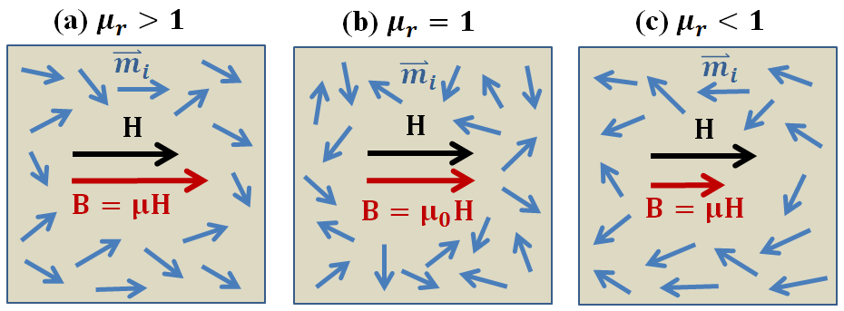

.. _magnetic_permeability_index:

Permeabilidade Magnética
========================

A permeabilidade magnética é uma propriedade física diagnóstica que caracteriza o grau de magnetismo induzido que um material 
experimenta sob a influência de um campo magnético externo. A permeabilidade magnética é relevante para uma variedade de levantamentos 
geofísicos, incluindo: :ref:`EM no domínio da frequência<airborne_fdem_index>` (FDEM), :ref:`EM no domínio do tempo<airborne_tdem_index>` (TDEM), 
:ref:`levantamento de munição não detonadas<uxo_index>` (unexploded ordnance - UXO) e  :ref:`radar de penetração no solo<gpr_index>`(GPR).

Relações Constitutivas
----------------------

Quando exposto a um campo magnético aplicado, a coleção de momentos dipolo magnéticos individuais dentro da maioria dos materiais tentarão 
reorientar-se ao longo da direção do campo. Isso gera uma magnetização induzido, que contribui para a densidade de fluxo magnético efetiva dentro
do material. O grau em que a magnetização induzida impacta a densidade do fluxo magnético depende da permeabilidade magnética do material.

    
    Densidade de fluxo magnético em função da intensidade do campo magnético para 
    várias classificações de tipos de rochas permeáveis: diamagnética, vácuo,
    paramagnética e ferromagnética.

A permeabilidade magnética :math:`\mu` define a razão entre a densidade de fluxo magnético 
:math:`{\bf B}` dentro de um material, e a intensidade de um campo magnético aplicado 
:math:`{\bf H}`; desde que os campos sejam suficientemente fracos:

.. math::
    {\bf B}(\omega) = \mu \, {\bf H}(\omega)
    :label: Const_Rel_Flux

No vácuo, a relação entre :math:`{\bf B}` e :math:`{\bf H}` é dada pela permeabilidade do espaço livre :math:`\mu_0 = 4 \pi \times 10^{- 7}` H / m.  Uma ilustração que representa a densidade de fluxo magnético em função da intensidade do campo aplicado para várias classificações de rocha é mostrada aqui.

Permeabilidade Relativa
-----------------------

Além da permeabilidade magnética, as propriedades magnéticas são frequentemente representadas usando a permeabilidade relativa. A permeabilidade relativa caracteriza se a magnetização induzida aumenta ou reduz a densidade do fluxo magnético dentro de um material. A permeabilidade relativa 
:math:`\mu_r` é a razão entre a permeabilidade magnética de um material e a permeabilidade do espaço livre:

.. math::
    \mu_r = \frac{\mu}{\mu_0}
    :label: Rel_Permeability
    
Para a maioria das rochas, a magnetização induzida é paralela ao campo aplicado, aumentando assim a densidade do fluxo magnético. Essas rochas são caracterizadas por permeabilidades relativas :math:`\mu_r> 1`. Uma permeabilidade relativa de :math:`\mu_r = 1` é usada para caracterizar materiais que são incapazes de suportar magnetização induzida. Em casos raros, uma magnetização muito pequena pode ser induzida nas rochas, o que se opõe ao campo aplicado e reduz a densidade do fluxo magnético. Essas rochas são caracterizadas por permeabilidades magnéticas :math:`\mu_r < 1`.

O alinhamento parcial dos momentos dipolares magnéticos sob um campo aplicado e as densidades de fluxo magnético resultantes em todos os três casos são representados na figura abaixo.

    
    Alinhamento parcial de momentos dipolares magnéticos sob a influência de um campo magnético 
    aplicado para vários casos. (a) Paramagnético (:math:`\mu_r > 1`). A magnetização é paralela 
    ao campo aplicado e aumenta a densidade do fluxo magnético. (b) Não permeável (:math:`\mu_r = 1`). 
    Não suporta magnetização induzida. (c) Diamagnético (:math:`\mu_r < 1`). A magnetização é fraca e 
    se opõe ao campo magnético aplicado, reduzindo assim a densidade do fluxo magnético.

Importância para a Geofísica
----------------------------

**Sistemas EM de Fontes Indutivas**

Na maioria dos ambientes geológicos, as variações na permeabilidade magnética da Terra são insignificantes (:math:`\mu\sim \mu_0`) e os levantamentos  são sensíveis apenas a contrastes na condutividade elétrica da Terra. No entanto, há uma variedade de casos em que a permeabilidade magnética se torna uma propriedade física diagnóstica importante. Por exemplo, algumas rochas contendo minério (magnetita, pirrotita) têm permeabilidades magnéticas muito altas. Ao usar :ref:`levantamentos no domínio da frequência<airborne_fdem_index>` (FDEM) e :ref:`levantamentos no domínio do tempo<airborne_tdem_index>` de sistemas eletromagnéticos (TDEM), grandes permeabilidades magnéticas foram mostradas impactar a resposta medida. Assim, deixar de levar em consideração as propriedades magnéticas da Terra pode resultar em uma caracterização incorreta das estruturas subterrâneas em certos ambientes.

**Levantamentos de Munição Não Detonandos**

A permeabilidade magnética também é uma propriedade física de diagnóstico para :ref:`levantamentos de munições não detonadas<uxo_index>` (unexploded ordnance - UXO). Um engenho não detonado (UXO) é uma munição que foi armada, disparada e permanece não detonada devido a um mau funcionamento. Os invólucros UXO são extremamente permeáveis em comparação ao meio hospedeiro. Esse contraste pode ser explorado para localizar e remover UXOs de áreas contaminadas. As propriedades magnéticas do UXO também são responsáveis por produzir respostas TDEM distintas.

**Radar de Penetração no Solo - Ground Penetrating Radar (GPR)**

A permeabilidade magnética atua como uma propriedade física de diagnóstico secundária no :ref:`radar de penetração no solo <gpr_index>` (GPR). A permeabilidade magnética afeta a reflexão, a refração e a velocidade dos sinais de ondas de rádio à medida que se propagam pela Terra.

**Viscosidade Magnética**

:ref:`Viscosidade magnética<magnetic_permeability_frequency_dependent>` refere-se a uma permeabilidade magnética dispersiva que é exibida por solos lateríticos e basaltos rapidamente resfriados. Ao usar sistemas TDEM, essas rochas produzem uma resposta que mascara as respostas de UXOs e condutores profundamente enterrados. Atualmente, métodos estão sendo desenvolvidos para modelar este fenômeno e sua resposta a partir de dados coletados em campo.

Conteúdo
--------

 .. toctree::
    :maxdepth: 1

    magnetic_permeability_lab_measurements
    magnetic_permeability_units
    magnetic_permeability_values
    magnetic_permeability_magnetism
    magnetic_permeability_factors
    magnetic_permeability_frequency_dependent

