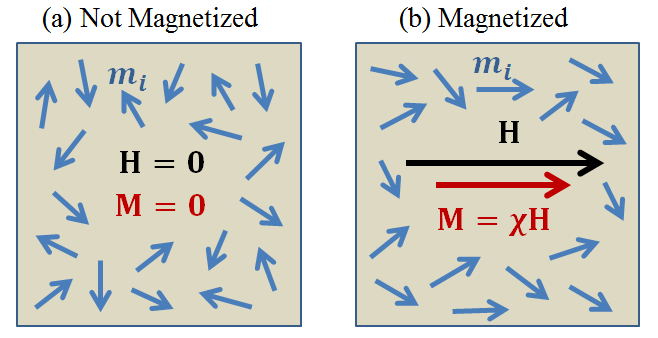

.. _magnetic_permeability_magnetism:

Magnetismo nas Rochas
=====================

A permeabilidade magnética de uma rocha é determinada pela natureza da
magnetização induzida que ela experimenta em resposta a um campo magnético aplicado. 
Aqui, definimos magnetização induzida considerando uma coleção de momentos de dipolos magnéticos. 
Uma relação matemática entre magnetização induzida e a permeabilidade magnética é então apresentada.

Teoria do Magnetismo
--------------------

O magnetismo é atribuído ao movimento de cargas elétricas. Dentro de um material, o movimento e o giro de elétrons individuais são responsáveis por gerar uma coleção de momentos magnéticos :math:`\{{\bf m_i}\}`. O momento magnético total para o material :math:`{\bf m}`, é igual à soma vetorial de todos os momentos magnéticos dos elétrons:

.. math::
    {\bf m} = \sum_i {\bf m_i}
    :label: Sum_Dipoles

Magnetização :math:`{\bf M}` é definida como o momento magnético por unidade de volume:

.. math::
    {\bf M} = \frac{d {\bf m}}{d V}
    :label: Mag_Definition
    
A maioria das rochas são paramagnéticas. Na ausência de um campo magnético, os momentos magnéticos dentro das rochas paramagnéticas são frequentemente desordenados. Nesse caso, os momentos magnéticos individuais se cancelam, resultando em uma magnetização efetiva iguala a zero. Quando expostos a um campo magnético, os momentos magnéticos dentro das rochas paramagnéticas sofrem um torque. Esse torque tenta alinhar os momentos magnéticos individuais ao longo da direção do campo. Como resultado, a rocha experimenta uma magnetização efetiva paralela ao campo aplicado. Este processo é ilustrado em :numref:`figDipoleAlign`.

    Magnetização :math:`{\bf M}` na matéria, quando representado pelo alinhamento parcial
    dos momentos dos dipolos magnéticos :math:`{\bf m_i}` em resposta a um campo 
    magnético aplicado :math:`{\bf H}`.

A susceptibilidade magnética é definida como a razão entre a magnetização induzida e a força de um campo magnético aplicado. Desde que o campo magnético não seja muito forte, essa relação é linear (:cite:`griffiths1999`):

.. math::
    {\bf M} = \chi {\bf H}
    :label: Const_Rel_Mag
    
onde :math:`\chi` é a susceptibilidade magnética da rocha, :math:`{\bf H}` é a intensidade do campo magnético, e :math:`{\bf M}` é a magnetização induzida. Como a maioria das rochas são paramagnéticas, quase sempre são caracterizadas por suscetibilidades magnéticas maiores que 0. No entanto, algumas rochas são diamagnéticas, uma magnetização induzida por experiência que se opõe ao campo magnético aplicado. Essas rochas são caracterizadas por suscetibilidades magnéticas menores que 0.

Relação entre Magnetização e Permeabilidade Magnética
-----------------------------------------------------

De acordo com a :ref:`relação magnética constitutiva<magnetic_permeability_index>`, a relação entre a susceptibilidade magnética e a permeabilidade magnética é dada por (:cite:`griffiths1999`):

.. math::
    {\bf B} = \mu {\bf H} = \mu_0 \big [1 +\chi \, ] {\bf H} = \mu_0 \big [ {\bf H + M} \big ]
    :label: Rel_BMH

onde :math:`\mu_0 = 4\pi \times 10^{- 7}` H/m é a permeabilidade do espaço livre. A Equação :eq:`Rel_BMH` implica que a magnetização induzida contribui para a densidade do fluxo magnético efetivo dentro da rocha. Além disso, a natureza dessa contribuição pode ser representada pela permeabilidade magnética da rocha.

