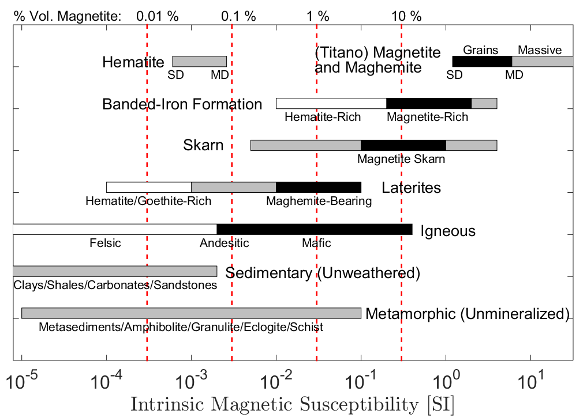

.. _magnetic_permeability_values:

Valores Típicos para Rochas
===========================

A gama de susceptibilidades magnéticas (em SI) para rochas é ilustrada no
figura abaixo (adaptado de :cite:`ClarkEmerson1991`). Lembre-se de que um
relação entre a permeabilidade magnética e a susceptibilidade magnética é
definido na :ref:`seção unidades <unidades_permeabilidade magnética>`.

    
    Suscetibilidades magnéticas intrínsecas para tipos de rochas comuns. Adaptado de
    Clark e Emerson (:cite:`ClarkEmerson1991`). Barras pretas e brancas são usadas para fornecer
    gama de valores de susceptibilidade magnética para tipos de rocha mais distintas.
    Linhas vermelhas tracejadas verticais são usadas para representar o valor magnético da
    suscetibilidade aproximada das rochas, com base em \% do volume da magnetita.
