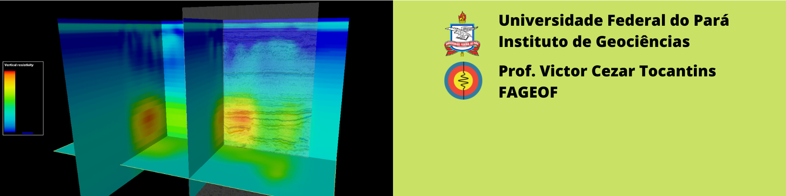

.. Física da Terra documentation master file, created by
   sphinx-quickstart on Sat Mar 13 16:53:59 2021.
   You can adapt this file completely to your liking, but it should at least
   contain the root `toctree` directive.

Métodos Eletromagnéticos
========================

.. toctree::
   :maxdepth: 2
   :caption: Conteúdo:

   ./content/introducao/index
   ./content/fundamentos/index
   ./content/referencias
   
   

Indices e tabelas
=================

* :ref:`genindex`
* :ref:`modindex`
* :ref:`search`
